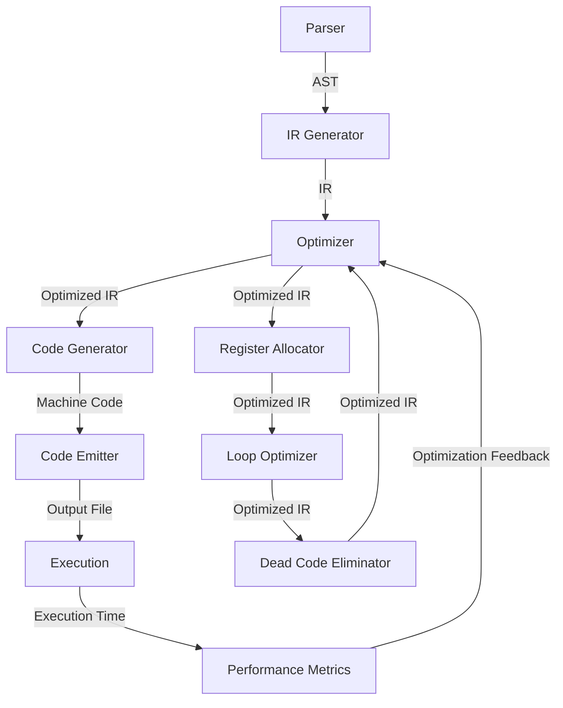

## Introduction
**Comparative Compiler Optimizations** is a crucial aspect of software development that enables developers to write efficient and high-performance code. In today's world, compilers play a vital role in translating source code into machine code that can be executed by the computer's processor. The primary goal of compiler optimizations is to reduce the execution time and memory usage of the compiled code. This is achieved by applying various techniques such as **loop unrolling**, **dead code elimination**, and **register allocation**. In this guide, we will delve into the world of comparative compiler optimizations, exploring the core concepts, internal workings, and real-world applications.

> **Note:** Compiler optimizations can significantly impact the performance of an application. A well-optimized compiler can result in substantial improvements in execution time and memory usage, making it an essential aspect of software development.

## Core Concepts
To understand comparative compiler optimizations, it's essential to grasp the following key concepts:
* **Intermediate Representation (IR)**: a platform-agnostic representation of the source code that is used as input for the optimization process.
* **Control Flow Graph (CFG)**: a graph that represents the control flow of the program, including loops, conditional statements, and function calls.
* **Data Flow Analysis**: a technique used to analyze the flow of data through the program, including **liveness analysis** and **reaching definitions**.
* **Optimization Techniques**: various methods used to improve the performance of the compiled code, such as **constant folding**, **constant propagation**, and **loop optimization**.

> **Warning:** Incorrectly applying optimization techniques can lead to bugs, performance issues, or even security vulnerabilities. It's crucial to thoroughly test and validate optimized code.

## How It Works Internally
The compiler optimization process involves the following steps:
1. **Parsing**: the source code is parsed into an **Abstract Syntax Tree (AST)**, which represents the syntactic structure of the program.
2. **IR Generation**: the AST is converted into an **Intermediate Representation (IR)**, which is a platform-agnostic representation of the source code.
3. **Optimization**: the IR is optimized using various techniques, such as **dead code elimination**, **constant folding**, and **loop unrolling**.
4. **Code Generation**: the optimized IR is converted into machine code, which is specific to the target platform.
5. **Code Emission**: the machine code is emitted to the output file.

```java
// Example of a simple compiler optimization: dead code elimination
public class DeadCodeElimination {
    public static void main(String[] args) {
        int x = 5; // This code is not eliminated
        if (false) { // This code is eliminated
            x = 10;
        }
        System.out.println(x); // This code is not eliminated
    }
}
```

## Code Examples
Here are three examples of comparative compiler optimizations:
### Example 1: Basic Loop Unrolling
```c
// Loop unrolling example in C
for (int i = 0; i < 100; i++) {
    // Original loop body
    arr[i] = i * 2;
}

// Unrolled loop
for (int i = 0; i < 100; i += 4) {
    arr[i] = i * 2;
    arr[i + 1] = (i + 1) * 2;
    arr[i + 2] = (i + 2) * 2;
    arr[i + 3] = (i + 3) * 2;
}
```

### Example 2: Real-World Pattern: Register Allocation
```typescript
// Register allocation example in TypeScript
function add(a: number, b: number): number {
    // Original code
    let result = a + b;
    return result;
}

// Optimized code with register allocation
function addOptimized(a: number, b: number): number {
    // Allocate registers for a and b
    let ax = a;
    let bx = b;
    // Perform addition using registers
    let result = ax + bx;
    return result;
}
```

### Example 3: Advanced Optimization: Loop Fusion
```python
# Loop fusion example in Python
def loop_fusion(arr1, arr2):
    # Original code with two separate loops
    for i in range(len(arr1)):
        arr1[i] += 1
    for i in range(len(arr2)):
        arr2[i] += 1

    # Optimized code with loop fusion
    for i in range(len(arr1)):
        arr1[i] += 1
        arr2[i] += 1
```

## Visual Diagram


The above diagram illustrates the internal workings of a compiler optimizer, including the parser, IR generator, optimizer, code generator, and code emitter. The optimizer is responsible for applying various optimization techniques, such as register allocation, loop optimization, and dead code elimination.

## Comparison
| Optimization Technique | Time Complexity | Space Complexity | Pros | Cons | Best For |
| --- | --- | --- | --- | --- | --- |
| Dead Code Elimination | O(n) | O(1) | Reduces code size, improves performance | May not always eliminate all dead code | Small to medium-sized programs |
| Loop Unrolling | O(n) | O(1) | Improves performance by reducing loop overhead | May increase code size | Loops with small iteration counts |
| Register Allocation | O(n) | O(1) | Improves performance by reducing memory accesses | May increase code complexity | Programs with frequent memory accesses |
| Loop Fusion | O(n) | O(1) | Improves performance by reducing loop overhead | May increase code complexity | Loops with similar iteration counts |

> **Tip:** When choosing an optimization technique, consider the trade-offs between time complexity, space complexity, and code complexity. The best technique will depend on the specific use case and performance requirements.

## Real-world Use Cases
1. **Google's V8 JavaScript Engine**: uses a combination of optimization techniques, including dead code elimination, loop unrolling, and register allocation, to improve the performance of JavaScript code.
2. **Intel's C++ Compiler**: uses advanced optimization techniques, such as loop fusion and dead code elimination, to improve the performance of C++ code on Intel processors.
3. **Apple's Swift Compiler**: uses a combination of optimization techniques, including dead code elimination, loop unrolling, and register allocation, to improve the performance of Swift code on Apple devices.

## Common Pitfalls
1. **Incorrectly Applying Optimization Techniques**: may lead to bugs, performance issues, or security vulnerabilities.
2. **Over-Optimization**: may lead to increased code complexity and decreased maintainability.
3. **Ignoring Performance Metrics**: may lead to suboptimal performance and poor user experience.
4. **Not Considering Hardware Constraints**: may lead to poor performance on specific hardware platforms.

> **Interview:** When asked about comparative compiler optimizations, be prepared to discuss the different techniques, their trade-offs, and real-world applications. Show a deep understanding of the internal workings of a compiler optimizer and the importance of considering performance metrics and hardware constraints.

## Key Takeaways
* Comparative compiler optimizations are essential for improving the performance of compiled code.
* Different optimization techniques have varying time and space complexities, and the best technique will depend on the specific use case and performance requirements.
* Register allocation, loop unrolling, and dead code elimination are common optimization techniques used in compilers.
* Loop fusion and dead code elimination can be used to improve the performance of loops.
* Incorrectly applying optimization techniques can lead to bugs, performance issues, or security vulnerabilities.
* Over-optimization can lead to increased code complexity and decreased maintainability.
* Ignoring performance metrics can lead to suboptimal performance and poor user experience.
* Not considering hardware constraints can lead to poor performance on specific hardware platforms.