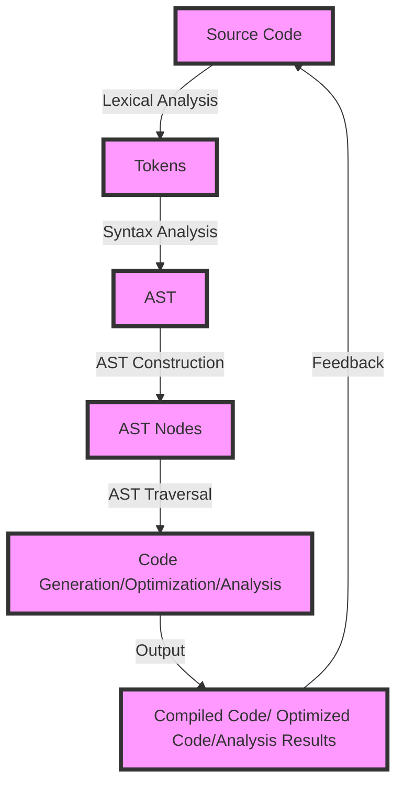

## Introduction
**Abstract Syntax Trees (ASTs)** are a fundamental concept in computer science, representing the source code of a programming language as a tree-like data structure. AST parsing is the process of analyzing the source code and constructing the corresponding AST. This process is crucial for various applications, including **compiler design**, **static analysis**, and **code optimization**. As a senior engineer, understanding AST parsing is essential for working with modern programming languages and building efficient software systems. In this guide, we will delve into the world of system-level AST parsing, exploring its core concepts, internal mechanics, and practical applications.

## Core Concepts
To grasp AST parsing, it's essential to understand the following key concepts:
* **Lexical analysis**: the process of breaking the source code into individual tokens, such as keywords, identifiers, and literals.
* **Syntax analysis**: the process of analyzing the tokens to identify the syntactic structure of the program, including the relationships between tokens.
* **AST construction**: the process of building the AST from the parsed syntactic structure.
* **Node types**: the different types of nodes in the AST, such as **expression nodes**, **statement nodes**, and **declaration nodes**.
> **Note:** Understanding the differences between these concepts is crucial for effective AST parsing.

## How It Works Internally
The AST parsing process typically involves the following steps:
1. **Lexical analysis**: the source code is fed into a **lexer**, which breaks it into individual tokens.
2. **Syntax analysis**: the tokens are then fed into a **parser**, which analyzes the tokens to identify the syntactic structure of the program.
3. **AST construction**: the parsed syntactic structure is then used to build the AST.
4. **AST traversal**: the AST is traversed to perform various operations, such as **code generation**, **optimization**, and **analysis**.
The time complexity of AST parsing depends on the parser algorithm used, but common algorithms like **recursive descent parsing** and **LL parsing** have a time complexity of O(n), where n is the number of tokens in the source code.
> **Warning:** Inefficient AST parsing can lead to significant performance overhead, so it's essential to choose the right parser algorithm for your use case.

## Code Examples
### Example 1: Basic AST Parsing in Python
```python
import ast

# Define a simple source code string
source_code = "x = 5"

# Parse the source code into an AST
tree = ast.parse(source_code)

# Print the AST
print(ast.dump(tree))
```
This example demonstrates basic AST parsing using the `ast` module in Python.
### Example 2: AST Parsing with Syntax Analysis in JavaScript
```javascript
const esprima = require("esprima");

// Define a simple source code string
const sourceCode = "let x = 5;";

// Parse the source code into an AST
const tree = esprima.parseScript(sourceCode);

// Print the AST
console.log(JSON.stringify(tree, null, 2));
```
This example demonstrates AST parsing with syntax analysis using the `esprima` library in JavaScript.
### Example 3: Advanced AST Parsing with AST Transformation in Java
```java
import com.github.javaparser.ast.*;
import com.github.javaparser.ast.body.*;
import com.github.javaparser.ast.expr.*;
import com.github.javaparser.ast.stmt.*;

// Define a simple source code string
String sourceCode = "int x = 5;";

// Parse the source code into an AST
CompilationUnit cu = StaticJavaParser.parse(sourceCode);

// Transform the AST
cu.accept(new VoidVisitorAdapter<Void>() {
    @Override
    public void visit(VariableDeclarator n, Void arg) {
        super.visit(n, arg);
        // Transform the variable declarator
        n.setName("y");
    }
}, null);

// Print the transformed AST
System.out.println(cu.toString());
```
This example demonstrates advanced AST parsing with AST transformation using the `javaparser` library in Java.
> **Tip:** When working with ASTs, it's essential to understand the node types and their relationships to perform effective transformations.

## Visual Diagram

This diagram illustrates the AST parsing process, from source code to AST construction and traversal.

## Comparison
| Approach | Time Complexity | Space Complexity | Pros | Cons | Best For |
| --- | --- | --- | --- | --- | --- |
| Recursive Descent Parsing | O(n) | O(n) | Simple to implement, efficient | Limited to LL(1) grammars | Small to medium-sized languages |
| LL Parsing | O(n) | O(n) | Efficient, supports LL(k) grammars | More complex to implement | Medium to large-sized languages |
| LR Parsing | O(n) | O(n) | Efficient, supports LR(k) grammars | Most complex to implement | Large-sized languages |
| Parser Combinators | O(n) | O(n) | Flexible, modular | Can be slow, complex to implement | Experimental languages, research projects |
> **Interview:** When asked about AST parsing, be prepared to discuss the trade-offs between different parser algorithms and their applications.

## Real-world Use Cases
* **Google's JavaScript Engine (V8)**: uses a combination of recursive descent parsing and LL parsing to parse JavaScript source code.
* **Eclipse JDT**: uses a combination of LL parsing and parser combinators to parse Java source code.
* **Microsoft's Roslyn**: uses a combination of recursive descent parsing and LR parsing to parse C# and Visual Basic source code.
> **Note:** These projects demonstrate the importance of AST parsing in real-world applications.

## Common Pitfalls
* **Inefficient parser algorithms**: using an inefficient parser algorithm can lead to significant performance overhead.
* **Incorrect AST construction**: incorrect AST construction can lead to errors in code generation, optimization, and analysis.
* **Insufficient error handling**: insufficient error handling can lead to crashes or unexpected behavior when encountering errors in the source code.
* **Inadequate testing**: inadequate testing can lead to bugs and errors in the AST parser.
> **Warning:** Be aware of these common pitfalls when implementing an AST parser.

## Interview Tips
* **What is the difference between lexical analysis and syntax analysis?**: Be prepared to explain the difference between these two concepts and how they relate to AST parsing.
* **How do you implement a parser for a given grammar?**: Be prepared to discuss the steps involved in implementing a parser for a given grammar, including the choice of parser algorithm and error handling.
* **What are the trade-offs between different parser algorithms?**: Be prepared to discuss the trade-offs between different parser algorithms, including their time and space complexity, and their applications.
> **Tip:** Practice explaining these concepts and be prepared to provide examples from your experience.

## Key Takeaways
* **AST parsing is a crucial step in the compilation process**: AST parsing is essential for building efficient software systems.
* **Choose the right parser algorithm for your use case**: different parser algorithms have different time and space complexity, and are suited for different use cases.
* **Error handling is essential**: insufficient error handling can lead to crashes or unexpected behavior when encountering errors in the source code.
* **Testing is crucial**: inadequate testing can lead to bugs and errors in the AST parser.
* **Understand the trade-offs between different parser algorithms**: be aware of the trade-offs between different parser algorithms, including their time and space complexity, and their applications.
* **Practice explaining AST parsing concepts**: be prepared to explain AST parsing concepts, including lexical analysis, syntax analysis, and AST construction.
* **Be familiar with real-world applications of AST parsing**: be aware of real-world applications of AST parsing, including compiler design, static analysis, and code optimization.
> **Note:** These key takeaways will help you become proficient in AST parsing and build efficient software systems.