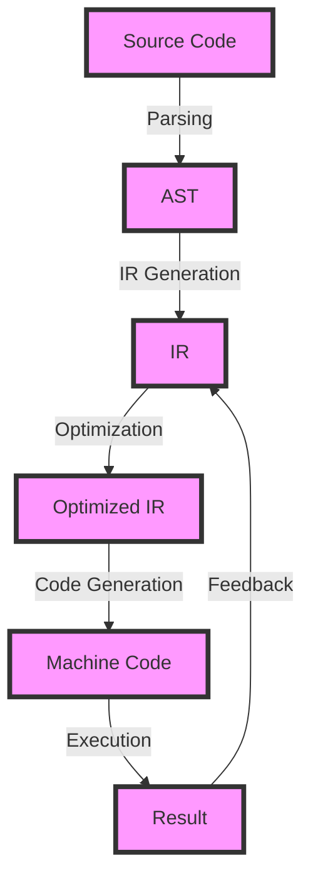

## Introduction
Static compiler optimizations are a crucial aspect of modern programming languages, as they enable developers to write efficient and scalable code. **Static compiler optimizations** refer to the process of analyzing and transforming code at compile-time to improve its performance, readability, and maintainability. This technique is essential in production environments, where every millisecond counts, and poor code quality can lead to significant losses. In this section, we will explore the importance of static compiler optimizations, their real-world relevance, and why every engineer needs to understand this concept.

> **Note:** Static compiler optimizations are different from dynamic optimizations, which occur at runtime. While dynamic optimizations can provide significant performance improvements, they often come with a higher overhead and may not be suitable for all use cases.

## Core Concepts
To understand static compiler optimizations, it's essential to grasp the following core concepts:
* **Intermediate Representation (IR)**: an abstract representation of the source code that is used as input for the optimization process.
* **Control Flow Graph (CFG)**: a graphical representation of the program's control flow, which helps identify optimization opportunities.
* **Data Flow Analysis**: a technique used to analyze the flow of data through the program and identify potential optimizations.
* **Optimization Passes**: a series of transformations applied to the IR to improve the code's performance and quality.

> **Tip:** Understanding the core concepts of static compiler optimizations can help developers write more efficient code and take advantage of compiler optimizations.

## How It Works Internally
The static compiler optimization process involves the following steps:
1. **Parsing**: the source code is parsed into an Abstract Syntax Tree (AST).
2. **IR Generation**: the AST is converted into an Intermediate Representation (IR).
3. **Optimization**: the IR is analyzed and transformed using various optimization passes.
4. **Code Generation**: the optimized IR is converted into machine code.

> **Warning:** Over-optimization can lead to code that is difficult to maintain and debug. It's essential to strike a balance between optimization and code readability.

## Code Examples
### Example 1: Basic Optimization
```java
// Original code
public int calculateSum(int[] array) {
    int sum = 0;
    for (int i = 0; i < array.length; i++) {
        sum += array[i];
    }
    return sum;
}

// Optimized code
public int calculateSum(int[] array) {
    int sum = 0;
    for (int value : array) {
        sum += value;
    }
    return sum;
}
```
In this example, the optimized code uses an enhanced for loop, which is more efficient and readable than the original code.

### Example 2: Real-world Pattern
```python
# Original code
def calculate_average(numbers):
    sum = 0
    for num in numbers:
        sum += num
    return sum / len(numbers)

# Optimized code
import numpy as np

def calculate_average(numbers):
    return np.mean(numbers)
```
In this example, the optimized code uses the NumPy library, which provides an efficient and optimized implementation of the mean calculation.

### Example 3: Advanced Optimization
```c
// Original code
int calculateSum(int* array, int length) {
    int sum = 0;
    for (int i = 0; i < length; i++) {
        sum += array[i];
    }
    return sum;
}

// Optimized code
int calculateSum(int* array, int length) {
    int sum = 0;
    #pragma omp parallel for reduction(+:sum)
    for (int i = 0; i < length; i++) {
        sum += array[i];
    }
    return sum;
}
```
In this example, the optimized code uses OpenMP to parallelize the calculation, which can significantly improve performance on multi-core systems.

## Visual Diagram

This diagram illustrates the static compiler optimization process, from source code to machine code.

> **Interview:** Can you explain the difference between static and dynamic compiler optimizations? How do they impact code performance and maintainability?

## Comparison
| Optimization Technique | Time Complexity | Space Complexity | Pros | Cons |
| --- | --- | --- | --- | --- |
| Loop Unrolling | O(n) | O(1) | Improves performance by reducing loop overhead | Increases code size |
| Dead Code Elimination | O(n) | O(1) | Removes unnecessary code, improving performance and readability | May not always be effective |
| Register Allocation | O(n) | O(1) | Improves performance by reducing memory accesses | Increases code complexity |
| Parallelization | O(n/p) | O(p) | Improves performance by utilizing multiple cores | Increases code complexity and synchronization overhead |

## Real-world Use Cases
1. **Google's Compiler**: Google's compiler uses various static compiler optimizations, such as loop unrolling and dead code elimination, to improve the performance of Android apps.
2. **Intel's C++ Compiler**: Intel's C++ compiler uses advanced static compiler optimizations, such as parallelization and register allocation, to improve the performance of scientific simulations.
3. **Facebook's HHVM**: Facebook's HHVM uses static compiler optimizations, such as just-in-time compilation and caching, to improve the performance of PHP applications.

## Common Pitfalls
1. **Over-Optimization**: Over-optimizing code can lead to decreased readability and maintainability.
2. **Incorrect Assumptions**: Making incorrect assumptions about the input data or execution environment can lead to optimized code that performs poorly in practice.
3. **Insufficient Testing**: Failing to thoroughly test optimized code can lead to bugs and performance issues.
4. **Ignoring Compiler Warnings**: Ignoring compiler warnings can lead to optimized code that contains errors or undefined behavior.

> **Warning:** Optimized code can be more difficult to debug and maintain. It's essential to balance optimization with code readability and maintainability.

## Interview Tips
1. **What is the difference between static and dynamic compiler optimizations?**: A strong answer should explain the difference between static and dynamic optimizations, including their advantages and disadvantages.
2. **How do you optimize code for performance?**: A strong answer should describe various optimization techniques, such as loop unrolling, dead code elimination, and parallelization.
3. **What are some common pitfalls when optimizing code?**: A strong answer should identify common pitfalls, such as over-optimization, incorrect assumptions, and insufficient testing.

## Key Takeaways
* Static compiler optimizations are essential for improving code performance and scalability.
* Understanding core concepts, such as IR, CFG, and data flow analysis, is crucial for effective optimization.
* Balancing optimization with code readability and maintainability is essential.
* Over-optimization can lead to decreased readability and maintainability.
* Insufficient testing can lead to bugs and performance issues.
* Ignoring compiler warnings can lead to optimized code that contains errors or undefined behavior.
* Using advanced optimization techniques, such as parallelization and register allocation, can significantly improve performance.
* Thoroughly testing optimized code is essential to ensure correct behavior and performance.