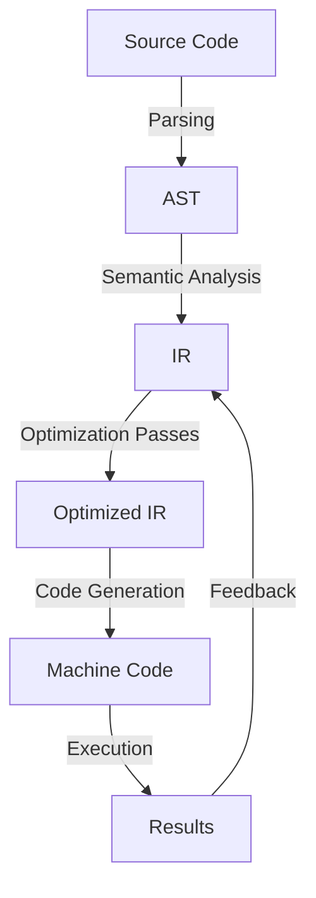

## Introduction
Compiler optimizations are a crucial aspect of programming languages, as they significantly impact the performance and efficiency of the generated code. **Compiler optimizations** refer to the techniques used by compilers to improve the execution speed, reduce memory usage, and enhance the overall quality of the compiled code. In this section, we will delve into the world of compiler optimizations, exploring their importance, real-world relevance, and the common pitfalls that engineers encounter when analyzing them.

> **Note:** Compiler optimizations are not limited to just performance improvements; they also play a critical role in ensuring the security and reliability of the compiled code.

Compiler optimizations are essential in modern programming, as they enable developers to write efficient, scalable, and maintainable code. Real-world examples of compiler optimizations can be found in various domains, such as:

* **Google's Chrome browser**, which uses a Just-In-Time (JIT) compiler to optimize JavaScript execution
* **Facebook's HipHop Virtual Machine (HHVM)**, which employs a dynamic compiler to optimize PHP execution
* **Apple's Swift compiler**, which uses a combination of static and dynamic analysis to optimize Swift code

Every engineer should have a deep understanding of compiler optimizations, as they are a fundamental aspect of programming languages. By grasping the concepts and techniques involved in compiler optimizations, developers can write more efficient, scalable, and maintainable code.

## Core Concepts
To understand compiler optimizations, it's essential to grasp the following core concepts:

* **Static analysis**: The process of analyzing the source code without executing it, to identify potential optimizations and errors.
* **Dynamic analysis**: The process of analyzing the code at runtime, to identify performance bottlenecks and optimization opportunities.
* **Intermediate Representation (IR)**: A platform-agnostic representation of the source code, used by compilers to analyze and optimize the code.
* **Optimization passes**: A series of transformations applied to the IR to improve the code's performance, scalability, and maintainability.

> **Tip:** Understanding the IR is crucial for analyzing compiler optimizations, as it provides a platform-agnostic view of the code.

Key terminology in compiler optimizations includes:

* **Inlining**: The process of replacing a function call with the actual function body.
* **Dead code elimination**: The process of removing unreachable code.
* **Register allocation**: The process of assigning registers to variables to minimize memory accesses.

## How It Works Internally
Compiler optimizations involve a series of complex transformations, which can be broken down into the following steps:

1. **Parsing**: The compiler reads the source code and generates an Abstract Syntax Tree (AST).
2. **Semantic analysis**: The compiler analyzes the AST to identify the code's semantics and generate the IR.
3. **Optimization passes**: The compiler applies a series of optimization passes to the IR, including inlining, dead code elimination, and register allocation.
4. **Code generation**: The compiler generates the optimized machine code from the IR.

> **Warning:** Compiler optimizations can sometimes introduce bugs or performance regressions, if not carefully implemented.

The under-the-hood mechanics of compiler optimizations involve a deep understanding of the IR, optimization passes, and code generation. By grasping these concepts, developers can better analyze and optimize their code.

## Code Examples
Here are three complete, runnable examples of compiler optimizations:

### Example 1: Basic Inlining
```c
// Example 1: Basic inlining
int add(int a, int b) {
    return a + b;
}

int main() {
    int result = add(2, 3);
    return result;
}
```
In this example, the `add` function can be inlined, replacing the function call with the actual function body.

### Example 2: Dead Code Elimination
```c
// Example 2: Dead code elimination
int foo() {
    int x = 5;
    if (x > 10) {
        // Dead code
        return 10;
    }
    return x;
}

int main() {
    int result = foo();
    return result;
}
```
In this example, the dead code can be eliminated, as the condition `x > 10` is never true.

### Example 3: Register Allocation
```c
// Example 3: Register allocation
int bar() {
    int x = 5;
    int y = 10;
    int result = x + y;
    return result;
}

int main() {
    int result = bar();
    return result;
}
```
In this example, the registers can be allocated to minimize memory accesses, improving the code's performance.

## Visual Diagram

This diagram illustrates the compiler optimization process, from parsing to code generation.

> **Note:** The diagram shows a simplified view of the compiler optimization process, omitting some details for clarity.

## Comparison
The following table compares different compiler optimization techniques:

| Technique | Time Complexity | Space Complexity | Pros | Cons | Best For |
| --- | --- | --- | --- | --- | --- |
| Inlining | O(1) | O(1) | Improves performance | Increases code size | Small functions |
| Dead Code Elimination | O(n) | O(1) | Reduces code size | May introduce bugs | Dead code |
| Register Allocation | O(n) | O(1) | Improves performance | Increases code complexity | Register-intensive code |
| Loop Unrolling | O(n) | O(1) | Improves performance | Increases code size | Loops with small bodies |

## Real-world Use Cases
Here are three real-world examples of compiler optimizations:

* **Google's Chrome browser**: Uses a JIT compiler to optimize JavaScript execution, improving web page loading times.
* **Facebook's HipHop Virtual Machine (HHVM)**: Employs a dynamic compiler to optimize PHP execution, improving performance and reducing memory usage.
* **Apple's Swift compiler**: Uses a combination of static and dynamic analysis to optimize Swift code, improving performance and reducing memory usage.

## Common Pitfalls
Here are four common pitfalls when analyzing compiler optimizations:

* **Incorrect inlining**: Inlining a function that is not frequently called can increase code size and reduce performance.
* **Insufficient dead code elimination**: Failing to eliminate dead code can result in larger code size and reduced performance.
* **Inefficient register allocation**: Poor register allocation can reduce performance and increase code complexity.
* **Over-optimization**: Over-optimizing code can introduce bugs and reduce maintainability.

> **Warning:** Compiler optimizations can sometimes introduce bugs or performance regressions, if not carefully implemented.

## Interview Tips
Here are three common interview questions on compiler optimizations, along with weak and strong answers:

* **Question 1: What is the difference between static and dynamic analysis?**
	+ Weak answer: "Static analysis is done before runtime, and dynamic analysis is done at runtime."
	+ Strong answer: "Static analysis involves analyzing the source code without executing it, to identify potential optimizations and errors. Dynamic analysis involves analyzing the code at runtime, to identify performance bottlenecks and optimization opportunities."
* **Question 2: How does inlining improve performance?**
	+ Weak answer: "Inlining replaces a function call with the actual function body."
	+ Strong answer: "Inlining replaces a function call with the actual function body, reducing the overhead of function calls and improving performance. However, it can also increase code size and reduce maintainability if not carefully implemented."
* **Question 3: What is the purpose of register allocation?**
	+ Weak answer: "Register allocation assigns registers to variables."
	+ Strong answer: "Register allocation assigns registers to variables to minimize memory accesses, improving performance and reducing code complexity. However, it can also increase code complexity if not carefully implemented."

## Key Takeaways
Here are ten key takeaways on compiler optimizations:

* **Compiler optimizations are essential for improving performance and efficiency**.
* **Static analysis involves analyzing the source code without executing it**.
* **Dynamic analysis involves analyzing the code at runtime**.
* **Inlining can improve performance but increase code size**.
* **Dead code elimination can reduce code size but introduce bugs**.
* **Register allocation can improve performance but increase code complexity**.
* **Loop unrolling can improve performance but increase code size**.
* **Over-optimization can introduce bugs and reduce maintainability**.
* **Compiler optimizations should be carefully implemented and tested**.
* **Understanding the IR is crucial for analyzing compiler optimizations**.

> **Tip:** Compiler optimizations are a complex and nuanced topic, requiring a deep understanding of the IR, optimization passes, and code generation. By grasping these concepts, developers can better analyze and optimize their code.