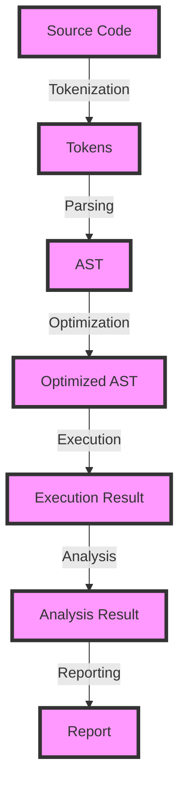

## Introduction
**Abstract Syntax Tree (AST) parsing** is a fundamental component of programming languages, as it enables the conversion of source code into a structured representation that can be analyzed, optimized, and executed. Benchmarking AST parsing is crucial to ensure that the parsing process is efficient, scalable, and reliable. However, benchmarking AST parsing can be challenging due to various pitfalls that can lead to inaccurate or misleading results. In this article, we will explore the common pitfalls when benchmarking AST parsing, discuss the core concepts, and provide code examples to illustrate the best practices.

## Core Concepts
AST parsing involves several key concepts, including:
* **Lexical analysis**: breaking the source code into individual tokens, such as keywords, identifiers, and symbols.
* **Syntax analysis**: analyzing the tokens to identify the structure of the program, including the relationships between tokens.
* **AST construction**: building a tree-like data structure that represents the program's structure.

> **Note:** Understanding these concepts is essential for effective benchmarking of AST parsing, as they can impact the performance and accuracy of the parsing process.

## How It Works Internally
The AST parsing process typically involves the following steps:
1. **Tokenization**: breaking the source code into individual tokens.
2. **Parsing**: analyzing the tokens to identify the structure of the program.
3. **AST construction**: building the AST data structure.
4. **Optimization**: optimizing the AST for execution or analysis.

The internal mechanics of AST parsing can vary depending on the programming language and the parsing algorithm used. However, most parsing algorithms have a time complexity of O(n), where n is the size of the input source code.

## Code Examples
### Example 1: Basic AST Parsing
```python
import ast

# Define a simple Python program
program = """
x = 5
y = x * 2
"""

# Parse the program into an AST
tree = ast.parse(program)

# Print the AST
print(ast.dump(tree))
```
This example demonstrates the basic AST parsing process using the `ast` module in Python.

### Example 2: Real-World AST Parsing
```javascript
const esprima = require('esprima');

// Define a JavaScript program
const program = `
function add(x, y) {
  return x + y;
}
`;

// Parse the program into an AST
const tree = esprima.parseScript(program);

// Print the AST
console.log(tree);
```
This example demonstrates the use of the `esprima` library to parse a JavaScript program into an AST.

### Example 3: Advanced AST Parsing with Optimization
```java
import org.eclipse.jdt.core.dom.AST;
import org.eclipse.jdt.core.dom.ASTParser;
import org.eclipse.jdt.core.dom.CompilationUnit;

// Define a Java program
String program = "
public class Example {
  public static void main(String[] args) {
    int x = 5;
    int y = x * 2;
  }
}
";

// Parse the program into an AST
ASTParser parser = ASTParser.newParser(AST.JLS8);
parser.setSource(program.toCharArray());
CompilationUnit unit = (CompilationUnit) parser.createAST(null);

// Optimize the AST
unit.accept(new ASTOptimizer());

// Print the optimized AST
System.out.println(unit);
```
This example demonstrates the use of the Eclipse JDT library to parse a Java program into an AST and optimize it using a custom `ASTOptimizer` class.

## Visual Diagram

This diagram illustrates the AST parsing process, including tokenization, parsing, AST construction, optimization, execution, analysis, and reporting.

## Comparison
| Approach | Time Complexity | Space Complexity | Pros | Cons | Best For |
| --- | --- | --- | --- | --- | --- |
| Recursive Descent Parsing | O(n) | O(n) | Simple to implement, easy to understand | Can be slow for large inputs, may not handle errors well | Small to medium-sized programs |
| Top-Down Parsing | O(n) | O(n) | Efficient, scalable | Can be complex to implement, may require additional memory | Large programs, performance-critical applications |
| Bottom-Up Parsing | O(n) | O(n) | Efficient, scalable | Can be complex to implement, may require additional memory | Large programs, performance-critical applications |
| Parser Generators | O(n) | O(n) | Efficient, scalable, easy to use | May require additional dependencies, can be slow for small inputs | Large programs, performance-critical applications |

> **Tip:** When choosing an AST parsing approach, consider the size and complexity of the input program, as well as the performance and scalability requirements of the application.

## Real-world Use Cases
1. **Google's JavaScript Engine**: Google's JavaScript engine uses a combination of recursive descent parsing and parser generators to parse JavaScript programs.
2. **Eclipse JDT**: The Eclipse JDT library uses a top-down parsing approach to parse Java programs.
3. **Microsoft's Roslyn**: Microsoft's Roslyn compiler uses a bottom-up parsing approach to parse C# programs.

## Common Pitfalls
1. **Insufficient Input Validation**: Failing to validate the input program can lead to errors or security vulnerabilities.
```python
# Wrong
tree = ast.parse(program)

# Right
try:
    tree = ast.parse(program)
except SyntaxError as e:
    print(f"Error parsing program: {e}")
```
2. **Inefficient Parsing Algorithms**: Using inefficient parsing algorithms can lead to performance issues or slow parsing times.
```javascript
// Wrong
const tree = esprima.parseScript(program);

// Right
const tree = esprima.parseScript(program, { tolerant: true });
```
3. **Inadequate Error Handling**: Failing to handle errors properly can lead to crashes or unexpected behavior.
```java
// Wrong
CompilationUnit unit = (CompilationUnit) parser.createAST(null);

// Right
try {
    CompilationUnit unit = (CompilationUnit) parser.createAST(null);
} catch (Exception e) {
    System.out.println("Error parsing program: " + e.getMessage());
}
```
4. **Inconsistent AST Representation**: Using inconsistent AST representations can lead to difficulties in analyzing or optimizing the AST.
```python
# Wrong
tree = ast.parse(program)

# Right
tree = ast.parse(program, mode=ast.PyCF_ONLY_AST)
```

> **Warning:** When benchmarking AST parsing, it is essential to consider the potential pitfalls and take steps to mitigate them.

## Interview Tips
1. **What is the difference between recursive descent parsing and top-down parsing?**
	* Weak answer: "They are both parsing approaches, but I'm not sure what the difference is."
	* Strong answer: "Recursive descent parsing is a top-down approach that uses recursive functions to parse the input program, while top-down parsing is a more general term that refers to any parsing approach that starts with the overall structure of the program and works its way down to the individual tokens."
2. **How do you optimize AST parsing for performance?**
	* Weak answer: "I'm not sure, but I think it involves using a faster parsing algorithm."
	* Strong answer: "To optimize AST parsing for performance, you can use techniques such as caching, memoization, and parallel processing, as well as selecting the most efficient parsing algorithm for the specific use case."
3. **What are some common pitfalls when benchmarking AST parsing?**
	* Weak answer: "I'm not sure, but I think it involves not validating the input program."
	* Strong answer: "Some common pitfalls when benchmarking AST parsing include insufficient input validation, inefficient parsing algorithms, inadequate error handling, and inconsistent AST representation."

## Key Takeaways
* **AST parsing is a critical component of programming languages**: Understanding AST parsing is essential for building efficient, scalable, and reliable programming languages.
* **There are several AST parsing approaches**: Recursive descent parsing, top-down parsing, bottom-up parsing, and parser generators are all common AST parsing approaches, each with their own strengths and weaknesses.
* **Benchmarking AST parsing requires careful consideration**: When benchmarking AST parsing, it is essential to consider the potential pitfalls, such as insufficient input validation, inefficient parsing algorithms, inadequate error handling, and inconsistent AST representation.
* **Optimizing AST parsing for performance is crucial**: Techniques such as caching, memoization, and parallel processing can be used to optimize AST parsing for performance.
* **Choosing the right AST parsing approach depends on the use case**: The choice of AST parsing approach depends on the size and complexity of the input program, as well as the performance and scalability requirements of the application.
* **Error handling is essential**: Proper error handling is critical to ensure that the AST parsing process is robust and reliable.
* **Consistent AST representation is important**: Using a consistent AST representation can simplify the analysis and optimization of the AST.
* **Parser generators can simplify AST parsing**: Parser generators can be used to generate efficient and scalable parsing code, reducing the complexity of AST parsing.
* **AST parsing is a fundamental component of compiler design**: Understanding AST parsing is essential for building efficient, scalable, and reliable compilers.