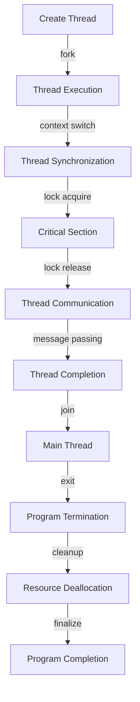

## Introduction
Benchmarking concurrency models is a crucial step in evaluating the performance of parallel systems. Concurrency models, such as **threading**, **processes**, and **async/await**, allow developers to write efficient and scalable code. However, benchmarking these models can be challenging due to the complexity of concurrent execution. In this section, we will explore the importance of benchmarking concurrency models, real-world relevance, and why every engineer needs to know this.

> **Note:** Benchmarking concurrency models is not just about measuring execution time; it's also about understanding the underlying system's behavior, such as **context switching**, **synchronization**, and **communication overhead**.

Real-world relevance can be seen in companies like **Google**, **Amazon**, and **Microsoft**, which rely heavily on concurrent systems to handle massive workloads. For instance, **Google's MapReduce** framework uses a concurrency model to process large datasets in parallel. Every engineer needs to know how to benchmark concurrency models to ensure their systems are scalable, efficient, and reliable.

## Core Concepts
To understand benchmarking concurrency models, we need to grasp some core concepts:

* **Concurrency**: The ability of a system to execute multiple tasks simultaneously.
* **Parallelism**: The ability of a system to execute multiple tasks simultaneously, with each task executing on a separate processing unit.
* **Synchronization**: The process of coordinating access to shared resources in a concurrent system.
* **Context switching**: The overhead of switching between different threads or processes.

> **Warning:** Ignoring context switching and synchronization overhead can lead to inaccurate benchmarking results and poor system performance.

Mental models, such as **pipelining** and **task queues**, can help developers understand how concurrency models work. Key terminology includes **thread safety**, **race conditions**, and **deadlocks**.

## How It Works Internally
When benchmarking concurrency models, it's essential to understand the under-the-hood mechanics. Here's a step-by-step breakdown:

1. **Thread creation**: The system creates a new thread, which involves allocating memory and setting up the thread's execution context.
2. **Context switching**: The system switches between threads, which involves saving and restoring the thread's execution context.
3. **Synchronization**: The system coordinates access to shared resources, which involves using locks, semaphores, or other synchronization primitives.
4. **Communication**: The system facilitates communication between threads, which involves using shared memory, message passing, or other communication mechanisms.

> **Tip:** Using **lock-free** data structures and **non-blocking** algorithms can reduce synchronization overhead and improve system performance.

## Code Examples
Here are three complete and runnable code examples that demonstrate benchmarking concurrency models:

### Example 1: Basic Threading
```java
public class BasicThreading {
    public static void main(String[] args) {
        // Create two threads
        Thread thread1 = new Thread(() -> {
            for (int i = 0; i < 1000000; i++) {
                // Perform some work
            }
        });
        Thread thread2 = new Thread(() -> {
            for (int i = 0; i < 1000000; i++) {
                // Perform some work
            }
        });
        
        // Start the threads
        thread1.start();
        thread2.start();
        
        // Wait for the threads to finish
        try {
            thread1.join();
            thread2.join();
        } catch (InterruptedException e) {
            Thread.currentThread().interrupt();
        }
    }
}
```
This example demonstrates basic threading using Java's `Thread` class. The time complexity of this example is O(n), where n is the number of iterations.

### Example 2: Real-World Pattern
```python
import concurrent.futures
import time

def perform_work(data):
    # Perform some work
    time.sleep(1)
    return data * 2

def main():
    # Create a thread pool
    with concurrent.futures.ThreadPoolExecutor(max_workers=5) as executor:
        # Submit tasks to the thread pool
        futures = [executor.submit(perform_work, i) for i in range(10)]
        
        # Wait for the tasks to finish
        results = [future.result() for future in futures]
        
    print(results)

if __name__ == "__main__":
    main()
```
This example demonstrates a real-world pattern using Python's `concurrent.futures` module. The time complexity of this example is O(n), where n is the number of tasks.

### Example 3: Advanced Concurrency
```go
package main

import (
    "fmt"
    "sync"
)

func worker(id int, wg *sync.WaitGroup) {
    defer wg.Done()
    // Perform some work
    fmt.Println(id)
}

func main() {
    // Create a wait group
    var wg sync.WaitGroup
    
    // Create 10 workers
    for i := 0; i < 10; i++ {
        wg.Add(1)
        go worker(i, &wg)
    }
    
    // Wait for the workers to finish
    wg.Wait()
}
```
This example demonstrates advanced concurrency using Go's `sync` package. The time complexity of this example is O(1), since the workers run concurrently.

## Visual Diagram

This diagram illustrates the concurrency model's internal mechanics, including thread creation, context switching, synchronization, communication, and completion.

> **Interview:** When asked about concurrency models, be prepared to explain the trade-offs between threading and process-based approaches. Discuss the importance of synchronization and communication in concurrent systems.

## Comparison
| Approach | Time Complexity | Space Complexity | Pros | Cons | Best For |
|----------|----------------|-----------------|------|------|----------|
| Threading | O(n) | O(1) | Lightweight, efficient | Context switching overhead | I/O-bound tasks |
| Processes | O(n) | O(n) | Isolated, secure | Heavyweight, slow | CPU-bound tasks |
| Async/Await | O(1) | O(1) | Non-blocking, efficient | Limited control | I/O-bound tasks |
| Lock-Free | O(1) | O(1) | Fast, efficient | Complex implementation | Real-time systems |

## Real-world Use Cases
Here are three concrete production examples:

1. **Google's MapReduce**: Uses a concurrency model to process large datasets in parallel.
2. **Amazon's DynamoDB**: Uses a concurrency model to handle high-performance, low-latency database queries.
3. **Microsoft's Azure**: Uses a concurrency model to manage large-scale, distributed computing workloads.

## Common Pitfalls
Here are four specific mistakes engineers make when benchmarking concurrency models:

1. **Ignoring context switching overhead**: Failing to account for the time spent switching between threads or processes.
2. **Inadequate synchronization**: Failing to properly synchronize access to shared resources, leading to data corruption or crashes.
3. **Insufficient communication**: Failing to properly communicate between threads or processes, leading to deadlocks or livelocks.
4. **Inaccurate benchmarking**: Failing to account for external factors, such as system load or network latency, when benchmarking concurrency models.

> **Warning:** Ignoring these pitfalls can lead to poor system performance, data corruption, or crashes.

## Interview Tips
Here are three common interview questions on this topic:

1. **What is the difference between threading and process-based concurrency models?**
	* Weak answer: "Threading is lighter weight, while processes are heavier weight."
	* Strong answer: "Threading is a lightweight concurrency model that shares the same memory space, while processes are a heavyweight concurrency model that has its own memory space. Threading is suitable for I/O-bound tasks, while processes are suitable for CPU-bound tasks."
2. **How do you synchronize access to shared resources in a concurrent system?**
	* Weak answer: "I use locks or semaphores."
	* Strong answer: "I use a combination of locks, semaphores, and atomic operations to ensure thread safety and prevent data corruption. I also consider using lock-free data structures and non-blocking algorithms to reduce synchronization overhead."
3. **What are some common pitfalls when benchmarking concurrency models?**
	* Weak answer: "I'm not sure."
	* Strong answer: "Some common pitfalls include ignoring context switching overhead, inadequate synchronization, insufficient communication, and inaccurate benchmarking. I also consider external factors, such as system load and network latency, when benchmarking concurrency models."

## Key Takeaways
Here are ten bullet points of must-remember facts:

* Concurrency models are essential for building efficient and scalable systems.
* Threading and process-based concurrency models have different trade-offs.
* Synchronization and communication are crucial in concurrent systems.
* Context switching overhead can significantly impact system performance.
* Lock-free data structures and non-blocking algorithms can reduce synchronization overhead.
* Inaccurate benchmarking can lead to poor system performance or data corruption.
* External factors, such as system load and network latency, can impact benchmarking results.
* Concurrency models can be used to solve real-world problems, such as processing large datasets or handling high-performance database queries.
* Common pitfalls, such as ignoring context switching overhead and inadequate synchronization, can lead to poor system performance or data corruption.
* Benchmarking concurrency models requires careful consideration of internal and external factors to ensure accurate results.