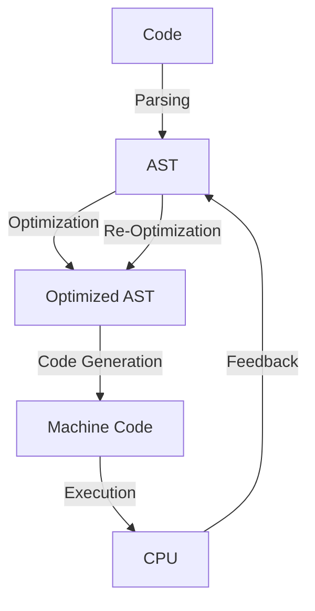

## Introduction
Just-In-Time (JIT) compilation is a technique used by modern programming languages to improve the performance of their code. It involves translating the code into machine code at runtime, rather than beforehand. This allows the JIT compiler to optimize the code based on the specific runtime environment and the actual usage patterns of the code. **JIT compilation** is a crucial component of many modern languages, including Java, .NET, and JavaScript. In this article, we will explore the common pitfalls that developers face when working with JIT compilation, and provide guidance on how to avoid them.

> **Note:** JIT compilation is not a new concept, but its importance has grown in recent years with the increasing demand for high-performance and efficient code.

## Core Concepts
To understand the pitfalls of JIT compilation, it's essential to have a solid grasp of the underlying concepts. Here are some key terms and definitions:

* **Just-In-Time (JIT) compilation**: The process of translating code into machine code at runtime.
* **Ahead-Of-Time (AOT) compilation**: The process of translating code into machine code beforehand.
* **Interpreter**: A program that executes code line by line, without compiling it into machine code.
* **Compiler**: A program that translates code into machine code.

> **Tip:** When working with JIT compilation, it's essential to understand the trade-offs between compilation time and execution time. JIT compilation can improve execution time, but it can also increase compilation time.

## How It Works Internally
JIT compilation involves several steps:

1. **Parsing**: The code is parsed into an abstract syntax tree (AST).
2. **Optimization**: The AST is optimized based on the runtime environment and usage patterns.
3. **Code generation**: The optimized AST is translated into machine code.
4. **Execution**: The machine code is executed by the CPU.

> **Warning:** JIT compilation can introduce additional overhead, such as compilation time and memory usage. It's essential to monitor these metrics to ensure that JIT compilation is not negatively impacting performance.

## Code Examples
Here are three examples of JIT compilation in action:

### Example 1: Basic JIT Compilation
```java
public class HelloWorld {
    public static void main(String[] args) {
        System.out.println("Hello, World!");
    }
}
```
This example demonstrates a simple Java program that is compiled just-in-time by the Java Virtual Machine (JVM).

### Example 2: JIT Compilation with Optimization
```java
public class OptimizedHelloWorld {
    public static void main(String[] args) {
        // Loop that is optimized by the JIT compiler
        for (int i = 0; i < 1000000; i++) {
            System.out.println("Hello, World!");
        }
    }
}
```
This example demonstrates a Java program that is optimized by the JIT compiler. The loop is optimized to reduce execution time.

### Example 3: Advanced JIT Compilation with Dynamic Method Invocation
```java
public class DynamicHelloWorld {
    public static void main(String[] args) {
        // Dynamic method invocation that is optimized by the JIT compiler
        Object obj = new Object();
        for (int i = 0; i < 1000000; i++) {
            obj.toString();
        }
    }
}
```
This example demonstrates a Java program that uses dynamic method invocation. The JIT compiler optimizes the dynamic method invocation to reduce execution time.

## Visual Diagram

This diagram illustrates the JIT compilation process, including parsing, optimization, code generation, execution, and feedback.

## Comparison
Here is a comparison of different compilation strategies:

| Approach | Time Complexity | Space Complexity | Pros | Cons | Best For |
| --- | --- | --- | --- | --- | --- |
| JIT Compilation | O(n) | O(n) | Fast execution time, optimized code | Additional overhead, compilation time | Real-time systems, high-performance applications |
| AOT Compilation | O(1) | O(1) | Fast compilation time, predictable performance | Limited optimization, larger binary size | Embedded systems, resource-constrained environments |
| Interpretation | O(n) | O(1) | Fast development time, flexible | Slow execution time, no optimization | Scripting languages, rapid prototyping |

## Real-world Use Cases
Here are three real-world examples of JIT compilation in action:

1. **Java Virtual Machine (JVM)**: The JVM uses JIT compilation to optimize Java code at runtime.
2. **.NET Common Language Runtime (CLR)**: The CLR uses JIT compilation to optimize .NET code at runtime.
3. **V8 JavaScript Engine**: The V8 engine uses JIT compilation to optimize JavaScript code at runtime.

> **Interview:** Can you explain the difference between JIT compilation and AOT compilation? How do you choose between the two approaches?

## Common Pitfalls
Here are four common pitfalls to watch out for when working with JIT compilation:

1. **Over-Optimization**: Over-optimizing code can lead to slower execution times due to increased compilation time.
2. **Under-Optimization**: Under-optimizing code can lead to slower execution times due to lack of optimization.
3. **Incorrect Assumptions**: Making incorrect assumptions about the runtime environment or usage patterns can lead to suboptimal optimization.
4. **Lack of Monitoring**: Failing to monitor compilation time and execution time can lead to performance issues.

> **Tip:** Use profiling tools to monitor compilation time and execution time, and adjust optimization levels accordingly.

## Interview Tips
Here are three common interview questions related to JIT compilation, along with sample answers:

1. **What is JIT compilation, and how does it work?**
	* Weak answer: JIT compilation is a technique that translates code into machine code at runtime.
	* Strong answer: JIT compilation is a technique that translates code into machine code at runtime, using a combination of parsing, optimization, code generation, and execution. It's used in many modern languages, including Java, .NET, and JavaScript.
2. **How do you optimize JIT compilation for performance?**
	* Weak answer: You can optimize JIT compilation by increasing the optimization level.
	* Strong answer: You can optimize JIT compilation by monitoring compilation time and execution time, and adjusting optimization levels accordingly. You can also use profiling tools to identify performance bottlenecks and optimize code accordingly.
3. **What are the trade-offs between JIT compilation and AOT compilation?**
	* Weak answer: JIT compilation is faster, but AOT compilation is more predictable.
	* Strong answer: JIT compilation offers faster execution times, but introduces additional overhead due to compilation time. AOT compilation offers faster compilation times, but may result in larger binary sizes and limited optimization. The choice between the two approaches depends on the specific use case and performance requirements.

## Key Takeaways
Here are ten key takeaways to remember:

* JIT compilation is a technique that translates code into machine code at runtime.
* JIT compilation offers faster execution times, but introduces additional overhead due to compilation time.
* AOT compilation offers faster compilation times, but may result in larger binary sizes and limited optimization.
* Profiling tools can be used to monitor compilation time and execution time, and adjust optimization levels accordingly.
* Incorrect assumptions about the runtime environment or usage patterns can lead to suboptimal optimization.
* Over-optimization can lead to slower execution times due to increased compilation time.
* Under-optimization can lead to slower execution times due to lack of optimization.
* Monitoring compilation time and execution time is essential to ensure optimal performance.
* The choice between JIT compilation and AOT compilation depends on the specific use case and performance requirements.
* JIT compilation is used in many modern languages, including Java, .NET, and JavaScript.