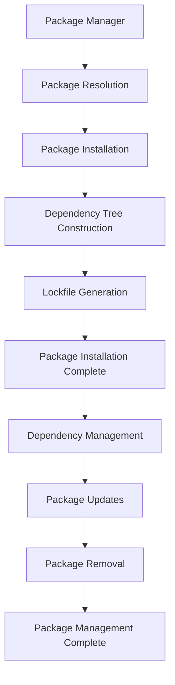

## Introduction
**Package management** is a crucial aspect of software development, enabling developers to easily manage and distribute their code. It solves the problem of **dependency hell**, where a project's dependencies are not properly managed, leading to conflicts and errors. Every engineer needs to know about package management because it is a fundamental concept in software development, and it is used in various programming languages, including **JavaScript**, **Python**, and **Java**. In real-world scenarios, package management is used in **npm** (Node Package Manager) for **JavaScript**, **pip** for **Python**, and **Maven** for **Java**.

## Core Concepts
The core concepts of package management include **packages**, **dependencies**, and **versioning**. A **package** is a collection of code that can be easily distributed and installed. **Dependencies** are packages that a project relies on to function properly. **Versioning** is the process of assigning a unique version number to each package, allowing developers to manage different versions of their code. Key terminology includes **package manager**, **dependency tree**, and **lockfile**.

> **Tip:** Understanding package management is essential for building scalable and maintainable software systems.

## How It Works Internally
Package management works by using a **package manager** to install and manage packages. The package manager uses a **dependency tree** to resolve dependencies and install the required packages. The **lockfile** is used to ensure that the dependencies are installed with the correct versions. The process of installing a package involves the following steps:
1. **Package resolution**: The package manager resolves the package dependencies.
2. **Package installation**: The package manager installs the required packages.
3. **Dependency tree construction**: The package manager constructs the dependency tree.
4. **Lockfile generation**: The package manager generates the lockfile.

> **Warning:** Not using a package manager can lead to **dependency hell**, making it difficult to manage and maintain large-scale software systems.

## Code Examples
### Example 1: Basic Package Installation
```bash
# Install a package using npm
npm install express
```
This code installs the **express** package using **npm**.

### Example 2: Package Management with Dependencies
```javascript
// package.json
{
  "name": "example",
  "version": "1.0.0",
  "dependencies": {
    "express": "^4.17.1"
  }
}
```
This code defines a **package.json** file that specifies the dependencies for a project.

### Example 3: Advanced Package Management with Lockfile
```bash
# Install packages using npm with a lockfile
npm install --package-lock
```
This code installs packages using **npm** with a **lockfile**, ensuring that the dependencies are installed with the correct versions.

## Visual Diagram

This diagram illustrates the package management process, from package resolution to package management completion.

> **Note:** The package management process involves several steps, including package resolution, installation, and dependency tree construction.

## Comparison
| Package Manager | Language | Time Complexity | Space Complexity | Pros | Cons | Best For |
| --- | --- | --- | --- | --- | --- | --- |
| npm | JavaScript | O(n) | O(n) | Easy to use, large ecosystem | Slow installation, security issues | Front-end development |
| pip | Python | O(n) | O(n) | Easy to use, large ecosystem | Slow installation, security issues | Back-end development |
| Maven | Java | O(n) | O(n) | Easy to use, large ecosystem | Slow installation, security issues | Enterprise development |
| yarn | JavaScript | O(n) | O(n) | Fast installation, secure | Limited ecosystem | Front-end development |

## Real-world Use Cases
1. **Netflix**: Uses **npm** for front-end development and **Maven** for back-end development.
2. **Google**: Uses **pip** for back-end development and **yarn** for front-end development.
3. **Amazon**: Uses **Maven** for enterprise development and **npm** for front-end development.

## Common Pitfalls
1. **Not using a package manager**: Can lead to **dependency hell**.
2. **Not specifying dependencies**: Can lead to **version conflicts**.
3. **Not using a lockfile**: Can lead to **inconsistent dependencies**.
4. **Not updating dependencies**: Can lead to **security vulnerabilities**.

> **Warning:** Not using a package manager can lead to **dependency hell**, making it difficult to manage and maintain large-scale software systems.

## Interview Tips
1. **What is package management?**: A strong answer should include the definition of package management, its importance, and its benefits.
2. **How does package management work?**: A strong answer should include the steps involved in package management, including package resolution, installation, and dependency tree construction.
3. **What are the benefits of using a package manager?**: A strong answer should include the benefits of using a package manager, including ease of use, large ecosystem, and security.

> **Interview:** Be prepared to answer questions about package management, including its definition, importance, and benefits.

## Key Takeaways
* Package management is essential for building scalable and maintainable software systems.
* Understanding package management is crucial for software development.
* Using a package manager can help avoid **dependency hell**.
* Specifying dependencies and using a lockfile can help ensure consistent dependencies.
* Updating dependencies regularly can help prevent security vulnerabilities.
* Package management involves several steps, including package resolution, installation, and dependency tree construction.
* The time and space complexity of package management algorithms are O(n).
* Package managers like **npm**, **pip**, and **Maven** are widely used in software development.