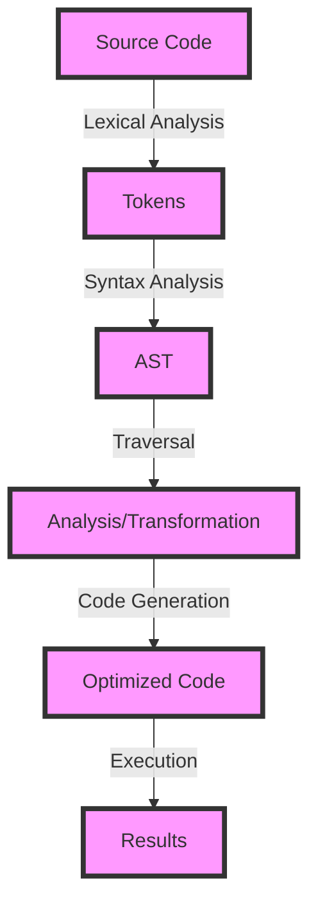

## Introduction
Designing static systems with Abstract Syntax Tree (AST) parsing is a fundamental concept in computer science that has numerous applications in modern software development. An AST is a tree representation of the source code, where each node represents a construct in the programming language, such as a variable declaration, function call, or loop statement. By parsing the AST, developers can analyze, transform, and optimize the code without executing it. This approach has become increasingly popular in recent years due to its ability to improve code quality, performance, and maintainability. In this article, we will delve into the world of AST parsing and explore its core concepts, internal mechanics, and practical applications.

## Core Concepts
To understand AST parsing, it is essential to grasp the following key concepts:
* **Abstract Syntax Tree (AST):** A tree-like data structure that represents the source code of a programming language.
* **Parser:** A program that takes the source code as input and generates an AST.
* **Traversal:** The process of visiting each node in the AST, which can be done using various techniques, such as recursive descent or iterative approaches.
* **Transformation:** The process of modifying the AST to optimize, refactor, or analyze the code.

> **Note:** AST parsing is not limited to programming languages; it can also be applied to other domains, such as data formats, configuration files, or even natural languages.

## How It Works Internally
The AST parsing process involves the following steps:
1. **Lexical Analysis:** The source code is broken down into individual tokens, such as keywords, identifiers, and literals.
2. **Syntax Analysis:** The tokens are parsed into an AST, which represents the syntactic structure of the code.
3. **Traversal:** The AST is traversed to analyze, transform, or optimize the code.
4. **Code Generation:** The modified AST is used to generate the optimized or transformed code.

> **Warning:** AST parsing can be complex and error-prone, especially when dealing with large and intricate codebases. It is crucial to use established libraries and frameworks to ensure accuracy and efficiency.

## Code Examples
### Example 1: Basic AST Parsing
```javascript
// Import the AST parser library
const esprima = require('esprima');

// Define a sample JavaScript code snippet
const code = 'function add(a, b) { return a + b; }';

// Parse the code into an AST
const ast = esprima.parseScript(code);

// Traverse the AST and print the node types
function traverse(node) {
  console.log(node.type);
  if (node.body) {
    node.body.forEach(traverse);
  }
}
traverse(ast);
```
### Example 2: AST Transformation
```javascript
// Import the AST transformation library
const eslint = require('eslint');

// Define a sample JavaScript code snippet
const code = 'function add(a, b) { return a + b; }';

// Parse the code into an AST
const ast = eslint.parse(code);

// Define a transformation function to rename the 'add' function to 'sum'
function transform(node) {
  if (node.type === 'FunctionDeclaration' && node.id.name === 'add') {
    node.id.name = 'sum';
  }
}

// Traverse the AST and apply the transformation
eslint.traverse(ast, transform);

// Generate the transformed code
const transformedCode = eslint.generate(ast);
console.log(transformedCode);
```
### Example 3: Advanced AST Analysis
```python
# Import the AST analysis library
import ast

# Define a sample Python code snippet
code = '''
def add(a, b):
  return a + b
'''

# Parse the code into an AST
tree = ast.parse(code)

# Define a function to analyze the AST and detect potential issues
def analyze(node):
  if isinstance(node, ast.FunctionDef):
    if len(node.args.args) > 2:
      print('Warning: Function has more than 2 arguments')

# Traverse the AST and apply the analysis
for node in ast.walk(tree):
  analyze(node)
```
## Visual Diagram

The diagram illustrates the AST parsing process, from source code to optimized code.

## Comparison
| Approach | Time Complexity | Space Complexity | Pros | Cons | Best For |
| --- | --- | --- | --- | --- | --- |
| Recursive Descent | O(n) | O(n) | Easy to implement, flexible | Can be slow, recursive function calls | Simple languages, prototyping |
| Iterative Approach | O(n) | O(1) | Fast, efficient | More complex to implement, less flexible | Large-scale applications, performance-critical code |
| Top-Down Parsing | O(n) | O(n) | Easy to implement, flexible | Can be slow, recursive function calls | Simple languages, prototyping |
| Bottom-Up Parsing | O(n) | O(1) | Fast, efficient | More complex to implement, less flexible | Large-scale applications, performance-critical code |

> **Tip:** The choice of approach depends on the specific requirements of the project, such as performance, complexity, and maintainability.

## Real-world Use Cases
* **Linting and Formatting:** Tools like ESLint and Prettier use AST parsing to analyze and transform code, ensuring consistency and adherence to coding standards.
* **Code Optimization:** Compilers and optimizers use AST parsing to analyze and optimize code, reducing execution time and improving performance.
* **Code Analysis:** Tools like SonarQube and CodeCoverage use AST parsing to analyze code quality, detect potential issues, and provide insights for improvement.

## Common Pitfalls
* **Incorrect Tokenization:** Failing to properly tokenize the source code can lead to incorrect AST construction and subsequent errors.
* **Insufficient Error Handling:** Failing to handle errors and exceptions properly can result in crashes or unexpected behavior.
* **Inefficient Traversal:** Using inefficient traversal algorithms can lead to performance issues and slow analysis times.
* **Incorrect Transformation:** Applying incorrect transformations to the AST can result in incorrect or optimized code.

> **Warning:** It is essential to thoroughly test and validate AST parsing code to ensure accuracy and reliability.

## Interview Tips
* **What is AST parsing, and how does it work?** A strong answer should provide a clear and concise explanation of the AST parsing process, including lexical analysis, syntax analysis, traversal, and code generation.
* **How do you optimize AST parsing for performance?** A strong answer should discuss techniques such as memoization, caching, and parallel processing to improve performance.
* **What are some common applications of AST parsing?** A strong answer should mention real-world use cases, such as linting and formatting, code optimization, and code analysis.

## Key Takeaways
* **AST parsing is a fundamental concept in computer science:** It has numerous applications in modern software development, including code analysis, optimization, and transformation.
* **There are different approaches to AST parsing:** Each approach has its pros and cons, and the choice of approach depends on the specific requirements of the project.
* **AST parsing can be complex and error-prone:** It is essential to use established libraries and frameworks to ensure accuracy and efficiency.
* **Performance optimization is crucial:** Techniques such as memoization, caching, and parallel processing can significantly improve performance.
* **Real-world applications are diverse:** AST parsing is used in various domains, including linting and formatting, code optimization, and code analysis.
* **Testing and validation are essential:** Thoroughly testing and validating AST parsing code is crucial to ensure accuracy and reliability.