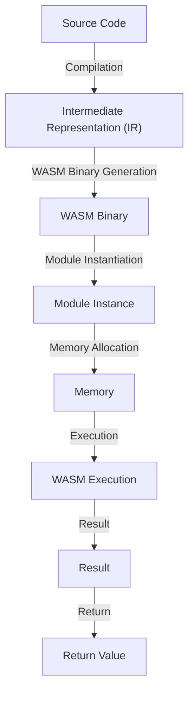

## Introduction
**Designing Static Systems with WASM Compilation** is a modern approach to building scalable, secure, and performant software systems. With the rise of WebAssembly (WASM), developers can now compile their code into a platform-agnostic binary format that can run on any device, from web browsers to embedded systems. In this section, we will explore the importance of static systems, the role of WASM compilation, and real-world applications.

> **Note:** Static systems refer to software systems that are compiled ahead of time, resulting in a fixed binary that can be executed without the need for a runtime environment or dependencies.

Real-world relevance can be seen in companies like **Cloudflare**, which uses WASM to power their edge computing platform, and **Fastly**, which utilizes WASM for their content delivery network (CDN). Every engineer should understand the benefits and trade-offs of designing static systems with WASM compilation, as it has the potential to revolutionize the way we build and deploy software.

## Core Concepts
To understand the concept of designing static systems with WASM compilation, we need to grasp the following key concepts:

* **WebAssembly (WASM):** A binary instruction format that can be executed by web browsers, as well as other environments, such as standalone runtimes and embedded systems.
* **Static compilation:** The process of compiling source code into a fixed binary that can be executed without the need for a runtime environment or dependencies.
* **Platform-agnostic:** The ability of WASM binaries to run on any device, regardless of the underlying operating system or architecture.

Mental models and analogies can help make these concepts more accessible. For example, think of WASM as a **container** that packages your code and its dependencies into a single, portable binary.

> **Tip:** When working with WASM, it's essential to understand the **memory model**, which defines how WASM modules interact with the host environment.

## How It Works Internally
To design a static system with WASM compilation, you need to understand the under-the-hood mechanics of the compilation process. Here's a step-by-step breakdown:

1. **Source code compilation:** Your source code is compiled into an intermediate representation (IR) using a compiler like **clang** or **rustc**.
2. **WASM binary generation:** The IR is then translated into a WASM binary using a tool like **wasm-pack** or **wasm-bindgen**.
3. **Module instantiation:** The WASM binary is instantiated by the host environment, which creates a new instance of the module.
4. **Memory allocation:** The host environment allocates memory for the module, which is used to store data and execute the code.

> **Warning:** When working with WASM, it's crucial to be aware of the **memory safety** implications, as WASM modules can access and modify memory directly.

## Code Examples
Here are three complete and runnable examples, ranging from basic to advanced:

### Example 1: Basic WASM Module
```javascript
// hello_world.js
export function helloWorld() {
  console.log("Hello, World!");
}
```

```rust
// hello_world.rs
use wasm_bindgen::prelude::*;

#[wasm_bindgen]
pub fn hello_world() {
    println!("Hello, World!");
}
```

This example demonstrates a basic WASM module written in JavaScript and Rust, which logs a message to the console when executed.

### Example 2: Real-world Pattern
```typescript
// calculator.ts
export class Calculator {
  add(a: number, b: number): number {
    return a + b;
  }

  subtract(a: number, b: number): number {
    return a - b;
  }
}
```

```wasm
// calculator.wasm
(module
  (func $add (param $a i32) (param $b i32) (result i32)
    local.get $a
    local.get $b
    i32.add
  )

  (func $subtract (param $a i32) (param $b i32) (result i32)
    local.get $a
    local.get $b
    i32.sub
  )

  (export "add" (func $add))
  (export "subtract" (func $subtract))
)
```

This example demonstrates a real-world pattern of using WASM to implement a calculator, with TypeScript and WASM code examples.

### Example 3: Advanced Usage
```cpp
// advanced_example.cpp
#include <wasm.h>

int main() {
  // Create a new WASM module
  wasm_module_t* module = wasm_module_new();

  // Instantiate the module
  wasm_instance_t* instance = wasm_instantiate_module(module);

  // Call a function on the instance
  wasm_func_t* func = wasm_instance_export_func(instance, "myFunction");
  wasm_func_call(func, NULL, 0, NULL, 0);

  return 0;
}
```

This example demonstrates advanced usage of WASM, including creating a new module, instantiating it, and calling a function on the instance.

## Visual Diagram


This diagram illustrates the high-level workflow of designing a static system with WASM compilation, from source code to WASM execution.

## Comparison
| Approach | Time Complexity | Space Complexity | Pros | Cons | Best For |
| --- | --- | --- | --- | --- | --- |
| Dynamic Compilation | O(n) | O(n) | Flexible, Easy to Implement | Slow, Resource-Intensive | Development, Testing |
| Static Compilation | O(1) | O(1) | Fast, Secure | Inflexible, Difficult to Implement | Production, Embedded Systems |
| WASM Compilation | O(n) | O(1) | Platform-Agnostic, Secure | Limited Control, Steep Learning Curve | Web, Edge Computing |
| Hybrid Approach | O(n) | O(n) | Flexible, Secure | Complex, Resource-Intensive | Enterprise, Cloud Computing |

This comparison table highlights the trade-offs between different approaches to designing static systems, including time and space complexity, pros, cons, and best use cases.

## Real-world Use Cases
Here are three concrete production examples:

1. **Cloudflare:** Uses WASM to power their edge computing platform, allowing developers to run custom code at the edge of the network.
2. **Fastly:** Utilizes WASM for their content delivery network (CDN), providing a secure and performant way to deliver content to users.
3. **Google:** Employs WASM in their **Chrome** browser to run web applications, providing a secure and sandboxed environment for execution.

## Common Pitfalls
Here are four specific mistakes engineers make when designing static systems with WASM compilation:

1. **Memory Safety:** Failing to properly manage memory, leading to security vulnerabilities and crashes.
2. **Module Instantiation:** Incorrectly instantiating WASM modules, resulting in errors and performance issues.
3. **WASM Binary Generation:** Failing to properly generate WASM binaries, leading to compatibility issues and errors.
4. **Platform-Agnostic:** Not properly handling platform-agnostic code, resulting in compatibility issues and errors.

> **Warning:** When working with WASM, it's essential to be aware of these common pitfalls and take steps to avoid them.

## Interview Tips
Here are three common interview questions on this topic, along with weak and strong answers:

1. **What is WASM, and how does it work?**
	* Weak answer: "WASM is a binary format that can be executed by web browsers."
	* Strong answer: "WASM is a platform-agnostic binary instruction format that can be executed by web browsers, as well as other environments, such as standalone runtimes and embedded systems. It works by compiling source code into a WASM binary, which can be instantiated and executed by the host environment."
2. **How do you handle memory safety in WASM?**
	* Weak answer: "I use a lot of `malloc` and `free` calls to manage memory."
	* Strong answer: "I use a combination of manual memory management and smart pointers to ensure memory safety in WASM. I also use tools like `valgrind` to detect memory leaks and errors."
3. **What are the benefits and trade-offs of using WASM?**
	* Weak answer: "WASM is fast and secure, but it's hard to learn and use."
	* Strong answer: "WASM offers several benefits, including platform-agnostic code, memory safety, and performance. However, it also has trade-offs, such as limited control over the host environment and a steep learning curve. To mitigate these trade-offs, I use a combination of WASM and other technologies, such as JavaScript and Rust, to create a hybrid approach that balances flexibility and security."

## Key Takeaways
Here are six must-remember facts about designing static systems with WASM compilation:

* **WASM is a platform-agnostic binary instruction format** that can be executed by web browsers, as well as other environments.
* **Static compilation** can provide performance and security benefits, but it can also be inflexible and difficult to implement.
* **Memory safety** is a critical concern when working with WASM, and engineers should use a combination of manual memory management and smart pointers to ensure safety.
* **WASM binaries** can be generated using a variety of tools, including **wasm-pack** and **wasm-bindgen**.
* **Module instantiation** is a critical step in the WASM workflow, and engineers should carefully manage module instances to ensure performance and security.
* **Hybrid approaches** can provide a balance between flexibility and security, and engineers should consider using a combination of WASM and other technologies to create a hybrid approach.