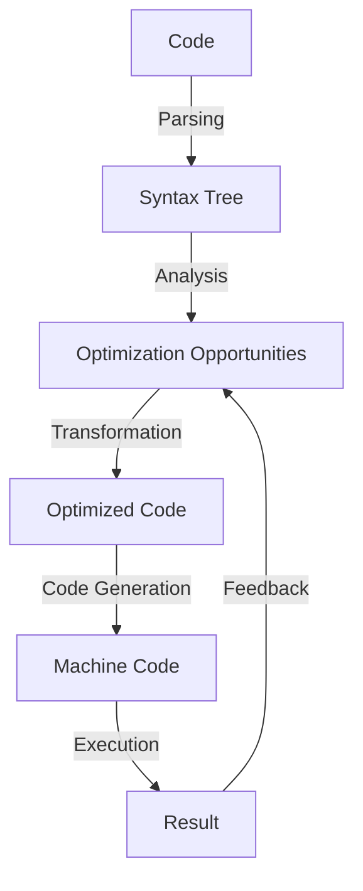

## Introduction
Evaluating compiler optimizations is a crucial step in developing high-performance applications. Compiler optimizations refer to the techniques used by compilers to improve the efficiency and speed of the generated machine code. These optimizations can have a significant impact on the performance of an application, making it essential for developers to understand how to evaluate and utilize them effectively. In this section, we will explore the importance of compiler optimizations, their real-world relevance, and why every engineer needs to know about them. 
> **Note:** Compiler optimizations can be applied at various levels, including the source code, intermediate representation, and machine code.

## Core Concepts
To evaluate compiler optimizations, it is essential to understand the core concepts involved. These concepts include:
* **Just-In-Time (JIT) compilation**: a technique where the compiler translates the code into machine code at runtime.
* **Ahead-Of-Time (AOT) compilation**: a technique where the compiler translates the code into machine code before runtime.
* **Interpreted execution**: a technique where the code is executed directly without compilation.
* **Inlining**: a technique where a function call is replaced with the actual function code.
* **Dead code elimination**: a technique where unused code is removed.
> **Tip:** Understanding these core concepts is crucial for evaluating the effectiveness of compiler optimizations.

## How It Works Internally
Compiler optimizations work by analyzing the code and applying various techniques to improve its performance. The process involves:
1. **Parsing**: breaking the code into smaller components, such as tokens and syntax trees.
2. **Analysis**: analyzing the code to identify optimization opportunities.
3. **Transformation**: applying the optimizations to the code.
4. **Code generation**: generating the optimized machine code.
> **Warning:** Over-optimization can lead to increased compilation time and potential bugs.

## Code Examples
Here are three complete and runnable code examples demonstrating the use of compiler optimizations:
### Example 1: Basic Inlining
```java
public class Example1 {
    public static void main(String[] args) {
        // Inlining the add function
        int result = add(5, 10);
        System.out.println(result);
    }

    // The add function will be inlined by the compiler
    public static int add(int a, int b) {
        return a + b;
    }
}
```
### Example 2: Loop Unrolling
```c
#include <stdio.h>

int main() {
    int array[100];
    int sum = 0;

    // Loop unrolling to improve performance
    for (int i = 0; i < 100; i += 4) {
        sum += array[i] + array[i + 1] + array[i + 2] + array[i + 3];
    }

    printf("%d\n", sum);
    return 0;
}
```
### Example 3: Dead Code Elimination
```python
def example3():
    x = 5
    # The following code will be eliminated by the compiler
    if False:
        print("This code will not be executed")
    return x

print(example3())
```
> **Interview:** Can you explain the difference between JIT and AOT compilation? How do they impact performance?

## Visual Diagram

This diagram illustrates the internal process of compiler optimizations, from parsing the code to generating the optimized machine code.

## Comparison
The following table compares different compiler optimization techniques:
| Technique | Time Complexity | Space Complexity | Pros | Cons | Best For |
| --- | --- | --- | --- | --- | --- |
| Inlining | O(1) | O(n) | Improved performance, reduced function call overhead | Increased code size, potential for over-optimization | Small functions with frequent calls |
| Loop Unrolling | O(n) | O(1) | Improved performance, reduced loop overhead | Increased code size, potential for over-optimization | Loops with small iteration counts |
| Dead Code Elimination | O(1) | O(1) | Reduced code size, improved performance | Potential for incorrect elimination | Unused code, conditional statements |

## Real-world Use Cases
1. **Google's V8 Engine**: uses JIT compilation and inlining to improve JavaScript performance.
2. **Intel's C++ Compiler**: uses AOT compilation and loop unrolling to optimize C++ code.
3. **Apple's Swift Compiler**: uses dead code elimination and inlining to optimize Swift code.
> **Tip:** Understanding the use cases of different compiler optimizations can help developers choose the best approach for their application.

## Common Pitfalls
1. **Over-optimization**: can lead to increased compilation time and potential bugs.
2. **Incorrect Elimination**: can lead to incorrect results or crashes.
3. **Insufficient Analysis**: can lead to missed optimization opportunities.
4. **Inadequate Testing**: can lead to bugs or performance issues in the optimized code.
> **Warning:** Over-optimization can have negative consequences on the overall performance and reliability of the application.

## Interview Tips
1. **What is the difference between JIT and AOT compilation?**: Explain the difference between just-in-time and ahead-of-time compilation, and how they impact performance.
2. **How does inlining improve performance?**: Explain the benefits of inlining, including reduced function call overhead and improved performance.
3. **What is dead code elimination, and how is it used?**: Explain the concept of dead code elimination, and how it is used to optimize code.
> **Interview:** Can you explain the trade-offs between different compiler optimization techniques?

## Key Takeaways
* Compiler optimizations can significantly improve the performance of an application.
* Understanding the core concepts, including JIT and AOT compilation, inlining, and dead code elimination, is essential for evaluating compiler optimizations.
* Different compiler optimization techniques have varying time and space complexities, and are suited for different use cases.
* Over-optimization can lead to negative consequences, and adequate testing is essential to ensure the reliability and performance of the optimized code.
* Real-world examples, such as Google's V8 Engine and Apple's Swift Compiler, demonstrate the effective use of compiler optimizations in high-performance applications.
* Developers should carefully evaluate the trade-offs between different compiler optimization techniques to choose the best approach for their application.