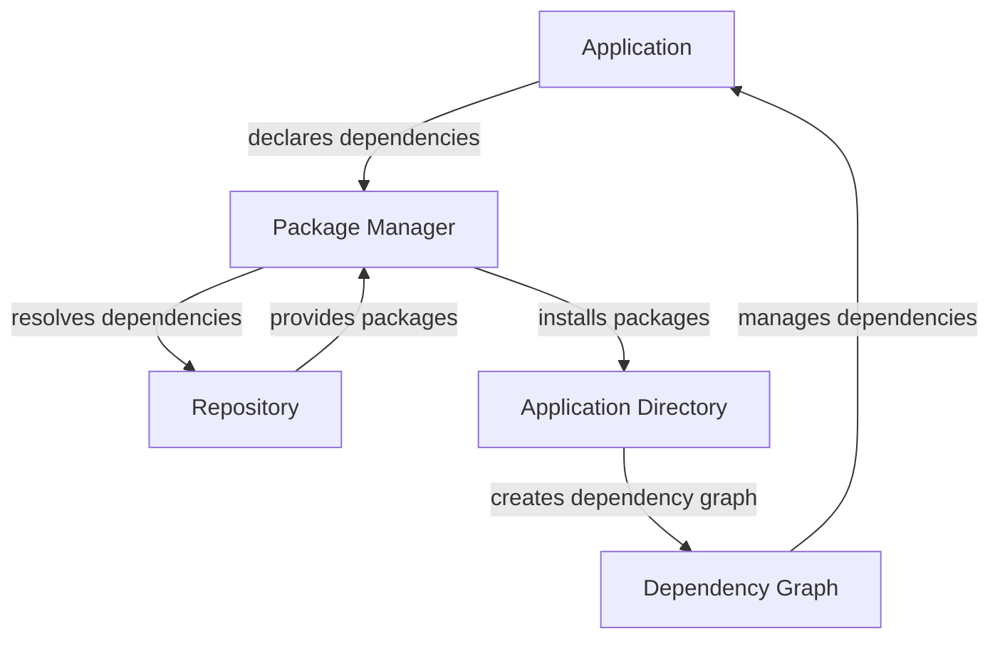

## Introduction
**Package management** is a crucial aspect of software development, especially for high-performance applications. It refers to the process of managing and maintaining the dependencies required by an application. With the ever-increasing complexity of modern software systems, package management has become a vital tool for ensuring the reliability, scalability, and maintainability of applications. In this section, we will explore the world of package management, its importance, and its relevance in real-world applications.

> **Note:** Package management is not just limited to dependency management; it also involves managing the versions, configurations, and updates of dependencies.

In real-world scenarios, package management is essential for ensuring that applications are built and deployed consistently across different environments. For instance, a web application may require a specific version of a library to function correctly. Without proper package management, it can be challenging to ensure that the correct version of the library is used across all environments.

## Core Concepts
To understand package management, it's essential to grasp the following core concepts:

* **Dependencies**: These are the libraries, frameworks, or modules required by an application to function correctly.
* **Package managers**: These are tools that manage dependencies, such as npm, Maven, or pip.
* **Repositories**: These are centralized locations where packages are stored, such as npm registry or Maven Central.
* **Versions**: These refer to the different releases of a package, which can be managed using versioning schemes like semantic versioning.

> **Tip:** Using a package manager can simplify the process of managing dependencies and reduce the risk of version conflicts.

## How It Works Internally
When a package manager is used to manage dependencies, it follows a specific workflow:

1. **Dependency declaration**: The application declares its dependencies in a configuration file, such as `package.json` or `pom.xml`.
2. **Package resolution**: The package manager resolves the dependencies by checking the repository for the required packages.
3. **Package download**: The package manager downloads the required packages from the repository.
4. **Package installation**: The package manager installs the packages in the application's directory.
5. **Dependency graph**: The package manager creates a dependency graph to manage the relationships between packages.

> **Warning:** Not managing dependencies correctly can lead to version conflicts, which can cause application instability or crashes.

## Code Examples
Here are three complete and runnable code examples that demonstrate package management in different scenarios:

### Example 1: Basic Package Management with npm
```javascript
// package.json
{
  "name": "example-app",
  "version": "1.0.0",
  "dependencies": {
    "express": "^4.17.1"
  }
}

// index.js
const express = require('express');
const app = express();

app.get('/', (req, res) => {
  res.send('Hello World!');
});

app.listen(3000, () => {
  console.log('Server started on port 3000');
});
```
This example demonstrates how to manage dependencies using npm. The `package.json` file declares the dependency on Express, and the `index.js` file uses the Express library to create a simple web server.

### Example 2: Package Management with Maven
```java
// pom.xml
<project xmlns="http://maven.apache.org/POM/4.0.0" xmlns:xsi="http://www.w3.org/2001/XMLSchema-instance"
  xsi:schemaLocation="http://maven.apache.org/POM/4.0.0 http://maven.apache.org/xsd/maven-4.0.0.xsd">
  <modelVersion>4.0.0</modelVersion>

  <groupId>com.example</groupId>
  <artifactId>example-app</artifactId>
  <version>1.0.0</version>
  <packaging>jar</packaging>

  <dependencies>
    <dependency>
      <groupId>org.springframework</groupId>
      <artifactId>spring-boot-starter-web</artifactId>
      <version>2.4.3</version>
    </dependency>
  </dependencies>
</project>

// ExampleApp.java
import org.springframework.boot.SpringApplication;
import org.springframework.boot.autoconfigure.SpringBootApplication;

@SpringBootApplication
public class ExampleApp {
  public static void main(String[] args) {
    SpringApplication.run(ExampleApp.class, args);
  }
}
```
This example demonstrates how to manage dependencies using Maven. The `pom.xml` file declares the dependency on Spring Boot, and the `ExampleApp.java` file uses the Spring Boot library to create a simple web application.

### Example 3: Advanced Package Management with pip
```python
# requirements.txt
Flask==2.0.1
requests==2.25.1

# app.py
from flask import Flask
import requests

app = Flask(__name__)

@app.route('/')
def index():
  response = requests.get('https://example.com')
  return response.text

if __name__ == '__main__':
  app.run()
```
This example demonstrates how to manage dependencies using pip. The `requirements.txt` file declares the dependencies on Flask and requests, and the `app.py` file uses these libraries to create a simple web application.

## Visual Diagram

This diagram illustrates the workflow of package management, from declaring dependencies to creating a dependency graph.

## Comparison
Here's a comparison of different package managers:

| Package Manager | Time Complexity | Space Complexity | Pros | Cons | Best For |
| --- | --- | --- | --- | --- | --- |
| npm | O(n) | O(n) | Easy to use, large ecosystem | Can be slow, prone to version conflicts | JavaScript applications |
| Maven | O(n) | O(n) | Widely used, robust ecosystem | Steep learning curve, verbose configuration | Java applications |
| pip | O(n) | O(n) | Easy to use, simple configuration | Limited ecosystem, not suitable for large projects | Python applications |
| yarn | O(n) | O(n) | Fast, secure, and reliable | Limited ecosystem, not suitable for large projects | JavaScript applications |

> **Interview:** What are the advantages and disadvantages of using npm versus Maven?

## Real-world Use Cases
Here are some real-world examples of package management in production:

* **Netflix**: Uses a combination of npm and Maven to manage dependencies for its web applications.
* **Airbnb**: Uses pip to manage dependencies for its Python applications.
* **Uber**: Uses a custom package manager to manage dependencies for its mobile applications.

> **Tip:** When choosing a package manager, consider the size and complexity of your project, as well as the ecosystem and community support.

## Common Pitfalls
Here are some common mistakes to avoid when using package managers:

* **Not managing dependencies correctly**: Failing to declare dependencies or not using a package manager can lead to version conflicts and application instability.
* **Not updating dependencies regularly**: Failing to update dependencies can lead to security vulnerabilities and performance issues.
* **Using outdated package managers**: Using outdated package managers can lead to compatibility issues and security vulnerabilities.

> **Warning:** Not managing dependencies correctly can lead to version conflicts, which can cause application instability or crashes.

## Interview Tips
Here are some common interview questions related to package management:

* **What is the difference between npm and Maven?**: A good answer should highlight the differences in ecosystem, configuration, and use cases.
* **How do you manage dependencies in a large project?**: A good answer should describe a strategy for managing dependencies, including using package managers and dependency graphs.
* **What are the advantages and disadvantages of using yarn?**: A good answer should highlight the advantages of yarn, including its speed and security, as well as its limitations, including its limited ecosystem.

## Key Takeaways
Here are the key takeaways from this section:

* **Package management is critical for high-performance applications**: Proper package management can ensure application reliability, scalability, and maintainability.
* **Choose the right package manager for your project**: Consider the size and complexity of your project, as well as the ecosystem and community support.
* **Manage dependencies correctly**: Use a package manager to manage dependencies, and update dependencies regularly to avoid security vulnerabilities and performance issues.
* **Use dependency graphs to visualize dependencies**: Dependency graphs can help identify version conflicts and optimize dependency management.
* **Consider using a custom package manager for large projects**: Custom package managers can provide more flexibility and control over dependency management.
* **Keep package managers up to date**: Outdated package managers can lead to compatibility issues and security vulnerabilities.
* **Monitor dependency updates**: Regularly monitor dependency updates to ensure that applications are using the latest versions of dependencies.
* **Use package managers to optimize dependency management**: Package managers can optimize dependency management by reducing the number of dependencies and improving application performance.