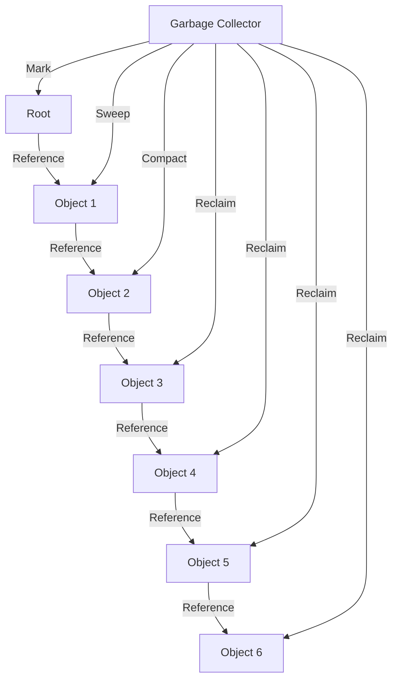

## Introduction
**Garbage Collection (GC)** is a memory management technique used by programming languages to automatically reclaim memory occupied by objects that are no longer in use. This approach eliminates the need for manual memory management, reducing the risk of memory leaks and dangling pointers. GC is a crucial component of modern programming languages, including Java, C#, and Python. In this study, we will delve into the world of garbage collection, exploring its internal mechanics, performance characteristics, and alternative approaches. We will also examine real-world use cases, common pitfalls, and interview tips to help you master this essential topic.

## Core Concepts
To understand garbage collection, it's essential to grasp the following key concepts:
* **Heap**: The memory region where objects are allocated.
* **Object**: A collection of data and methods that occupy memory.
* **Reference**: A variable or data structure that points to an object.
* **Root**: A global variable, stack frame, or CPU register that holds a reference to an object.
* **Garbage Collector**: The component responsible for identifying and reclaiming unused objects.

A mental model for garbage collection is to think of the heap as a graph, where objects are nodes, and references are edges. The garbage collector traverses this graph, starting from the roots, to identify reachable objects (i.e., objects that can be accessed through a chain of references).

## How It Works Internally
The garbage collection process involves the following steps:
1. **Mark**: The garbage collector identifies all reachable objects by traversing the graph, starting from the roots.
2. **Sweep**: The garbage collector goes through the heap and identifies all unmarked objects (i.e., objects that were not reached during the mark phase).
3. **Compact**: The garbage collector reclaims the memory occupied by unmarked objects and compacts the heap to eliminate holes.

There are several garbage collection algorithms, including:
* **Generational GC**: Divides the heap into generations based on object lifetimes.
* **Concurrent GC**: Runs the garbage collector in parallel with the application.
* **Incremental GC**: Breaks the garbage collection process into smaller, incremental steps.

> **Note:** The choice of garbage collection algorithm depends on the specific use case and performance requirements.

## Code Examples
### Example 1: Basic Garbage Collection (Java)
```java
public class GarbageCollectionExample {
    public static void main(String[] args) {
        // Create an object
        Object obj = new Object();
        
        // Remove the reference to the object
        obj = null;
        
        // Request garbage collection
        System.gc();
    }
}
```
This example demonstrates basic garbage collection in Java. The `System.gc()` method requests the garbage collector to run, but it does not guarantee that the object will be immediately reclaimed.

### Example 2: Generational Garbage Collection (Python)
```python
import gc

class GarbageCollectionExample:
    def __init__(self):
        self.obj = object()

    def __del__(self):
        print("Object deleted")

# Create an object
obj = GarbageCollectionExample()

# Remove the reference to the object
del obj

# Request garbage collection
gc.collect()
```
This example demonstrates generational garbage collection in Python. The `gc.collect()` function requests the garbage collector to run, and the `__del__` method is called when the object is deleted.

### Example 3: Concurrent Garbage Collection (C#)
```csharp
using System;

class GarbageCollectionExample
{
    static void Main(string[] args)
    {
        // Create an object
        object obj = new object();
        
        // Remove the reference to the object
        obj = null;
        
        // Request garbage collection
        GC.Collect();
        
        // Continue executing the program
        Console.WriteLine("Program continues executing");
    }
}
```
This example demonstrates concurrent garbage collection in C#. The `GC.Collect()` method requests the garbage collector to run, and the program continues executing while the garbage collector runs in the background.

## Visual Diagram

This diagram illustrates the garbage collection process, starting from the roots and traversing the graph to identify reachable objects.

## Comparison
| Approach | Time Complexity | Space Complexity | Pros | Cons | Best For |
| --- | --- | --- | --- | --- | --- |
| Generational GC | O(n) | O(n) | Fast, efficient | Complex, requires tuning | Long-lived objects |
| Concurrent GC | O(n) | O(n) | Low pause times, concurrent | Complex, requires synchronization | Real-time systems |
| Incremental GC | O(n) | O(n) | Low pause times, incremental | Complex, requires synchronization | Interactive systems |
| Manual Memory Management | O(1) | O(1) | Fast, efficient | Error-prone, requires expertise | Performance-critical code |
| Reference Counting | O(1) | O(1) | Fast, efficient | Limited, requires cycles detection | Simple, short-lived objects |

> **Warning:** Manual memory management can lead to memory leaks and dangling pointers if not done correctly.

## Real-world Use Cases
1. **Java Virtual Machine (JVM)**: The JVM uses a generational garbage collector to manage memory for Java applications.
2. **Python**: Python uses a reference counting garbage collector to manage memory for Python applications.
3. **Microsoft .NET**: The .NET runtime uses a concurrent garbage collector to manage memory for .NET applications.

## Common Pitfalls
1. **Memory Leaks**: Failing to release references to objects can lead to memory leaks.
2. **Dangling Pointers**: Failing to update references to objects can lead to dangling pointers.
3. **Garbage Collector Overhead**: Excessive garbage collection can lead to performance overhead.
4. **Object Promotion**: Promoting objects to the wrong generation can lead to performance issues.

> **Tip:** Use profiling tools to identify memory-related issues and optimize garbage collection settings.

## Interview Tips
1. **What is garbage collection?**: Explain the basics of garbage collection, including the mark, sweep, and compact phases.
2. **How does generational garbage collection work?**: Describe the generational approach, including the young, old, and permanent generations.
3. **What are the advantages and disadvantages of concurrent garbage collection?**: Discuss the trade-offs between concurrent and non-concurrent garbage collection.

> **Interview:** Be prepared to explain the differences between various garbage collection algorithms and their use cases.

## Key Takeaways
* Garbage collection is a memory management technique used to automatically reclaim memory occupied by unused objects.
* There are several garbage collection algorithms, including generational, concurrent, and incremental GC.
* Manual memory management can lead to memory leaks and dangling pointers if not done correctly.
* Profiling tools can help identify memory-related issues and optimize garbage collection settings.
* The choice of garbage collection algorithm depends on the specific use case and performance requirements.
* Generational GC is suitable for long-lived objects, while concurrent GC is suitable for real-time systems.
* Incremental GC is suitable for interactive systems, and reference counting is suitable for simple, short-lived objects.
* The time complexity of garbage collection algorithms is typically O(n), where n is the number of objects in the heap.
* The space complexity of garbage collection algorithms is typically O(n), where n is the number of objects in the heap.