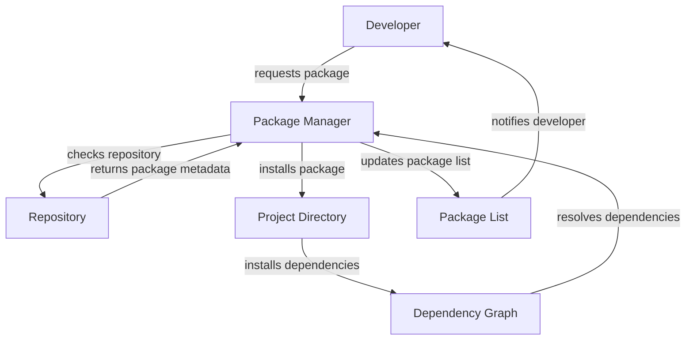

## Introduction
Package management is a crucial aspect of modern software development, enabling developers to easily manage dependencies, libraries, and frameworks in their projects. **Package managers** like npm, yarn, and pip have become essential tools for developers, allowing them to focus on writing code rather than managing dependencies. In this section, we will explore the core concepts of package management, its internal workings, and its real-world applications.

> **Note:** Package management is not limited to programming languages; it is also used in other areas like operating systems and databases.

Package management solves several problems, including:
* Dependency management: ensuring that all required libraries and frameworks are installed and up-to-date.
* Versioning: managing different versions of dependencies to ensure compatibility and stability.
* Security: verifying the integrity and authenticity of dependencies to prevent security breaches.

## Core Concepts
Package management involves several key concepts, including:
* **Packages**: self-contained bundles of code, documentation, and metadata that can be easily installed and managed.
* **Dependencies**: packages that are required by other packages to function correctly.
* **Versioning**: the process of managing different versions of packages to ensure compatibility and stability.
* **Repositories**: centralized storage locations for packages, where developers can upload and download packages.

> **Tip:** Understanding the concept of **semver** (semantic versioning) is crucial for effective package management. Semver helps developers manage versions and ensure compatibility between packages.

## How It Works Internally
Package managers use a combination of algorithms and data structures to manage packages and dependencies. The process involves:
1. **Package registration**: packages are registered in a repository, along with their metadata and dependencies.
2. **Dependency resolution**: the package manager resolves dependencies by traversing the dependency graph and installing required packages.
3. **Package installation**: packages are installed in a project-specific directory, along with their dependencies.
4. **Versioning**: package managers manage different versions of packages, ensuring compatibility and stability.

> **Warning:** Incorrectly managing dependencies can lead to **dependency hell**, where conflicting versions of packages cause errors and instability.

## Code Examples
### Example 1: Basic Package Installation using npm
```javascript
// Install a package using npm
const npm = require('npm');

npm.install('express', (err) => {
  if (err) {
    console.error(err);
  } else {
    console.log('Express installed successfully');
  }
});
```
### Example 2: Managing Dependencies using yarn
```javascript
// Create a new yarn project
const yarn = require('yarn');

yarn.init((err) => {
  if (err) {
    console.error(err);
  } else {
    // Install dependencies
    yarn.add(['express', 'react'], (err) => {
      if (err) {
        console.error(err);
      } else {
        console.log('Dependencies installed successfully');
      }
    });
  }
});
```
### Example 3: Advanced Package Management using pip
```python
# Install a package using pip
import pip

def install_package(package_name):
  try:
    pip.main(['install', package_name])
    print(f'{package_name} installed successfully')
  except Exception as e:
    print(f'Error installing {package_name}: {e}')

# Install multiple packages
install_package('requests')
install_package('numpy')
```
## Visual Diagram

The diagram illustrates the package management process, from the developer's request to the package manager, to the installation of packages and dependencies.

## Comparison
| Package Manager | Time Complexity | Space Complexity | Pros | Cons | Best For |
| --- | --- | --- | --- | --- | --- |
| npm | O(n) | O(n) | easy to use, large community | slow, prone to dependency hell | JavaScript projects |
| yarn | O(log n) | O(n) | fast, secure | limited support for older packages | modern JavaScript projects |
| pip | O(n) | O(n) | easy to use, widely adopted | slow, limited support for Windows | Python projects |
| Maven | O(n) | O(n) | widely adopted, robust | complex, steep learning curve | Java projects |

## Real-world Use Cases
* **Netflix**: uses a custom package manager to manage dependencies for its microservices architecture.
* **Facebook**: uses a combination of package managers, including npm and yarn, to manage dependencies for its web and mobile applications.
* **Google**: uses a custom package manager, **Bazel**, to manage dependencies for its large-scale software projects.

## Common Pitfalls
* **Dependency hell**: incorrect management of dependencies can lead to conflicting versions and errors.
* **Package duplication**: installing multiple versions of the same package can lead to waste and inefficiency.
* **Security vulnerabilities**: failing to update packages and dependencies can expose projects to security vulnerabilities.
* **Performance issues**: poorly optimized package managers can lead to slow installation and update times.

> **Interview:** Can you explain the difference between npm and yarn? How would you manage dependencies in a large-scale project?

## Interview Tips
* **Question 1:** What is the difference between a package and a dependency?
	+ Weak answer: "A package is a bundle of code, and a dependency is a package that is required by another package."
	+ Strong answer: "A package is a self-contained bundle of code, documentation, and metadata, while a dependency is a package that is required by another package to function correctly. Understanding the difference is crucial for effective package management."
* **Question 2:** How would you manage dependencies in a large-scale project?
	+ Weak answer: "I would use a package manager like npm or yarn to install dependencies."
	+ Strong answer: "I would use a combination of package managers and custom scripts to manage dependencies, ensuring that all dependencies are up-to-date and compatible. I would also use techniques like **semver** to manage versions and ensure stability."
* **Question 3:** What is the purpose of a package repository?
	+ Weak answer: "A package repository is a storage location for packages."
	+ Strong answer: "A package repository is a centralized storage location for packages, where developers can upload and download packages. It provides a convenient way to manage packages and dependencies, ensuring that all packages are up-to-date and compatible."

## Key Takeaways
* Package management is a crucial aspect of modern software development.
* Understanding the concepts of packages, dependencies, and versioning is essential for effective package management.
* Package managers like npm, yarn, and pip provide a convenient way to manage dependencies and packages.
* Semver is a crucial concept for managing versions and ensuring compatibility.
* Custom package managers and scripts can be used to manage dependencies in large-scale projects.
* Package repositories provide a centralized storage location for packages and dependencies.
* Dependency hell, package duplication, and security vulnerabilities are common pitfalls in package management.
* Performance issues can be addressed by optimizing package managers and using techniques like caching and parallel installation.