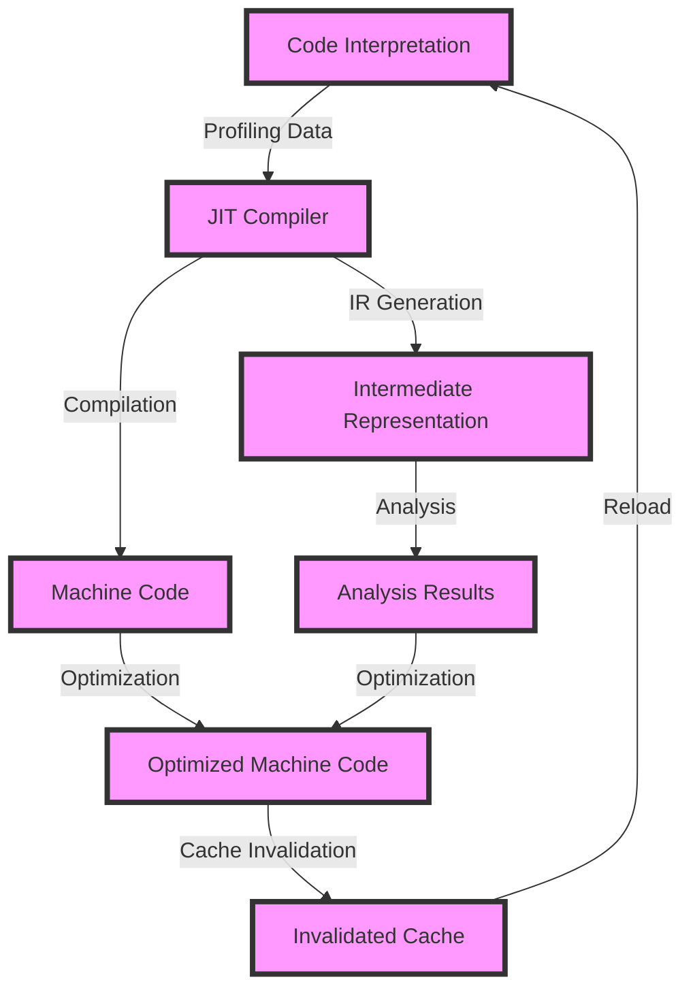

## Introduction
**Just-In-Time (JIT) compilation** is a technique used by modern programming languages to improve the performance of applications. It involves compiling the code into machine code at runtime, rather than ahead of time. This approach allows for better optimization and faster execution, making it a crucial aspect of high-performance applications. In this section, we will explore the importance of JIT compilation, its real-world relevance, and why every engineer needs to understand this concept.
> **Note:** JIT compilation is not limited to a specific programming language, but it is commonly used in languages like Java, .NET, and JavaScript.

## Core Concepts
To understand JIT compilation, we need to grasp the following key concepts:
* **Interpreted languages**: These languages do not require compilation before execution. Instead, the code is interpreted line by line at runtime.
* **Compiled languages**: These languages require compilation before execution. The code is compiled into machine code, which can be executed directly by the computer.
* **JIT compiler**: A JIT compiler is a component that translates the interpreted code into machine code at runtime. This process is also known as dynamic compilation.
* **Intermediate representation (IR)**: IR is a platform-agnostic representation of the code that can be optimized and analyzed by the JIT compiler.
> **Tip:** Understanding the differences between interpreted and compiled languages is essential for appreciating the benefits of JIT compilation.

## How It Works Internally
The JIT compilation process involves the following steps:
1. **Code interpretation**: The interpreter reads the code and executes it line by line.
2. **Profiling**: The JIT compiler collects data on the code's execution, including frequency of method calls, branch prediction, and memory access patterns.
3. **Compilation**: The JIT compiler uses the profiling data to identify performance-critical sections of the code and compiles them into machine code.
4. **Optimization**: The JIT compiler applies various optimization techniques, such as inlining, loop unrolling, and dead code elimination, to improve the performance of the compiled code.
5. **Cache invalidation**: The JIT compiler ensures that the compiled code is invalidated when the underlying data changes, to prevent stale data from being used.
> **Warning:** Improperly configured JIT compilation can lead to performance degradation, increased memory usage, and even crashes.

## Code Examples
### Example 1: Basic JIT Compilation
```java
public class HelloWorld {
    public static void main(String[] args) {
        // This code will be interpreted and executed by the JVM
        System.out.println("Hello, World!");
    }
}
```
In this example, the Java Virtual Machine (JVM) will interpret the code and execute it. However, if we add a performance-critical section, the JIT compiler will kick in and compile the code into machine code.
### Example 2: Performance-Critical Code
```java
public class PerformanceCritical {
    public static void main(String[] args) {
        // This loop will be compiled into machine code by the JIT compiler
        for (int i = 0; i < 100000000; i++) {
            // Perform some computationally intensive operation
            double result = Math.sqrt(i);
        }
    }
}
```
In this example, the JIT compiler will identify the performance-critical loop and compile it into machine code, resulting in a significant performance boost.
### Example 3: Advanced JIT Compilation
```java
public class AdvancedJIT {
    public static void main(String[] args) {
        // This code will be compiled into machine code by the JIT compiler
        // with advanced optimizations, such as inlining and loop unrolling
        for (int i = 0; i < 100000000; i++) {
            // Perform some computationally intensive operation
            double result = Math.sqrt(i);
            // Perform some memory-intensive operation
            byte[] array = new byte[1024];
            array[0] = (byte) result;
        }
    }
}
```
In this example, the JIT compiler will apply advanced optimizations, such as inlining and loop unrolling, to further improve the performance of the compiled code.
> **Interview:** Can you explain the difference between interpreted and compiled languages? How does JIT compilation fit into this picture?

## Visual Diagram

This diagram illustrates the JIT compilation process, including code interpretation, profiling, compilation, optimization, and cache invalidation.

## Comparison
| Approach | Time Complexity | Space Complexity | Pros | Cons | Best For |
| --- | --- | --- | --- | --- | --- |
| Interpretation | O(n) | O(1) | Easy to implement, flexible | Slow performance | Development, testing |
| Compilation | O(1) | O(n) | Fast performance, efficient | Complex implementation, rigid | Production, high-performance applications |
| JIT Compilation | O(n) | O(n) | Balances performance and flexibility | Complex implementation, overhead | Production, high-performance applications with dynamic code |
| Ahead-of-Time (AOT) Compilation | O(1) | O(n) | Fast performance, efficient | Limited flexibility, complex implementation | Production, high-performance applications with static code |
> **Tip:** Choose the right approach based on your application's requirements and constraints.

## Real-world Use Cases
1. **Google's V8 JavaScript Engine**: V8 uses JIT compilation to improve the performance of JavaScript code in Google Chrome.
2. **Java Virtual Machine (JVM)**: The JVM uses JIT compilation to improve the performance of Java code in production environments.
3. **Microsoft's .NET Common Language Runtime (CLR)**: The CLR uses JIT compilation to improve the performance of .NET code in production environments.
> **Note:** These examples demonstrate the widespread adoption of JIT compilation in real-world applications.

## Common Pitfalls
1. **Incorrect Profiling**: Incorrect profiling data can lead to suboptimal compilation and optimization.
2. **Insufficient Optimization**: Insufficient optimization can result in poor performance and increased memory usage.
3. **Cache Invalidation Issues**: Cache invalidation issues can lead to stale data and performance degradation.
4. **Over-Compilation**: Over-compilation can result in increased memory usage and performance degradation.
> **Warning:** Be aware of these common pitfalls to avoid performance issues and ensure optimal JIT compilation.

## Interview Tips
1. **What is JIT compilation, and how does it work?**: Explain the basics of JIT compilation, including code interpretation, profiling, compilation, and optimization.
2. **How does JIT compilation improve performance?**: Discuss the benefits of JIT compilation, including improved execution speed and reduced memory usage.
3. **What are some common challenges and pitfalls in JIT compilation?**: Describe common issues, such as incorrect profiling, insufficient optimization, and cache invalidation problems.
> **Interview:** Can you explain the trade-offs between interpretation, compilation, and JIT compilation? How would you choose the right approach for a given application?

## Key Takeaways
* JIT compilation is a technique used to improve the performance of applications by compiling code into machine code at runtime.
* JIT compilation involves code interpretation, profiling, compilation, optimization, and cache invalidation.
* The choice of approach depends on the application's requirements and constraints, including performance, flexibility, and complexity.
* Common pitfalls include incorrect profiling, insufficient optimization, cache invalidation issues, and over-compilation.
* Real-world examples of JIT compilation include Google's V8 JavaScript Engine, Java Virtual Machine (JVM), and Microsoft's .NET Common Language Runtime (CLR).
* Time complexity: O(n) for interpretation, O(1) for compilation, and O(n) for JIT compilation.
* Space complexity: O(1) for interpretation, O(n) for compilation, and O(n) for JIT compilation.
> **Note:** Remember these key takeaways to appreciate the importance and complexity of JIT compilation in modern programming languages.