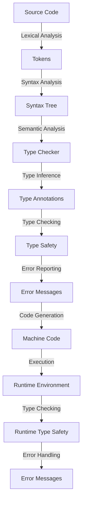

## Introduction
A typing system is a fundamental component of any programming language, responsible for defining the rules that govern the assignment of types to variables, function parameters, and return types. In other words, it determines how the language checks the types of variables at compile time or runtime. **Type safety** is a critical aspect of programming languages, as it helps prevent type-related errors, such as null pointer exceptions or incorrect function calls. In this article, we will delve into the inner workings of typing systems, exploring the core concepts, internal mechanics, and real-world applications.

> **Note:** The terms "typing system" and "type system" are often used interchangeably, but some researchers make a distinction between the two. A typing system refers to the set of rules that govern the assignment of types, while a type system refers to the set of types themselves.

## Core Concepts
To understand how typing systems work, it is essential to grasp the following core concepts:

* **Type**: A type is a label assigned to a value, indicating its properties and behavior. For example, the type `int` represents a 32-bit integer value.
* **Type checker**: A type checker is a component of the compiler or interpreter that verifies the types of variables, function parameters, and return types at compile time or runtime.
* **Type inference**: Type inference is the process of automatically determining the types of variables based on their usage in the code.
* **Type safety**: Type safety refers to the property of a programming language that ensures the correctness of type assignments at compile time or runtime.

> **Warning:** A lack of type safety can lead to runtime errors, making it challenging to debug and maintain code. For instance, in a dynamically-typed language like JavaScript, a variable can be reassigned to a different type, potentially causing type-related errors.

## How It Works Internally
The typing system works internally by performing the following steps:

1. **Lexical analysis**: The compiler or interpreter breaks the source code into tokens, such as keywords, identifiers, and literals.
2. **Syntax analysis**: The parser analyzes the tokens to ensure that the code conforms to the language's syntax rules.
3. **Semantic analysis**: The type checker analyzes the syntax tree to verify the types of variables, function parameters, and return types.
4. **Type inference**: The type checker infers the types of variables based on their usage in the code.
5. **Type checking**: The type checker verifies the types of variables, function parameters, and return types at compile time or runtime.

```java
// Example of a simple type checker in Java
public class TypeChecker {
    public static void checkType(Object value, Class<?> expectedType) {
        if (!expectedType.isInstance(value)) {
            throw new TypeError("Expected " + expectedType.getName() + ", but got " + value.getClass().getName());
        }
    }

    public static void main(String[] args) {
        Object value = "Hello";
        checkType(value, String.class); // Passes
        checkType(value, Integer.class); // Fails
    }
}
```

## Code Examples
Here are three complete and runnable code examples that demonstrate the typing system in action:

### Example 1: Basic Type Checking
```python
def check_type(value, expected_type):
    if not isinstance(value, expected_type):
        raise TypeError("Expected " + expected_type.__name__ + ", but got " + type(value).__name__)

# Test the function
check_type("Hello", str)  # Passes
check_type(123, str)  # Fails
```

### Example 2: Type Inference
```typescript
function add(a: number, b: number): number {
    return a + b;
}

// Test the function
console.log(add(2, 3));  // Returns 5
console.log(add("Hello", 3));  // Fails at compile time
```

### Example 3: Advanced Type Checking
```cpp
#include <iostream>
#include <type_traits>

template <typename T>
void check_type(T value) {
    if (!std::is_same<T, int>::value) {
        throw std::runtime_error("Expected int, but got " + std::string(typeid(T).name()));
    }
}

int main() {
    try {
        check_type(123);  // Passes
        check_type("Hello");  // Fails
    } catch (const std::exception& e) {
        std::cerr << e.what() << std::endl;
    }
    return 0;
}
```

## Visual Diagram

The diagram illustrates the typing system's internal mechanics, from lexical analysis to runtime type safety.

> **Tip:** Understanding the typing system's internal mechanics can help you write more efficient and effective code. For instance, using type inference can simplify your code and reduce the risk of type-related errors.

## Comparison
The following table compares different typing systems:

| Typing System | Time Complexity | Space Complexity | Pros | Cons | Best For |
| --- | --- | --- | --- | --- | --- |
| Statically-typed | O(1) | O(1) | Type safety, performance | Verbose, inflexible | Systems programming, high-performance applications |
| Dynamically-typed | O(n) | O(n) | Flexibility, ease of use | Type-related errors, slower performance | Rapid prototyping, scripting |
| Gradually-typed | O(1) | O(1) | Balance between type safety and flexibility | Complexity, learning curve | Large-scale applications, concurrent programming |
| Duck-typed | O(n) | O(n) | Flexibility, ease of use | Type-related errors, slower performance | Rapid prototyping, scripting |

## Real-world Use Cases
The following companies and systems use typing systems in their production environments:

* **Google**: Google's programming language, Go, uses a statically-typed typing system to ensure type safety and performance.
* **Microsoft**: Microsoft's programming language, C#, uses a statically-typed typing system to ensure type safety and performance.
* **Facebook**: Facebook's programming language, Hack, uses a gradually-typed typing system to balance type safety and flexibility.

> **Interview:** What is the difference between a statically-typed and dynamically-typed typing system? How do you choose between the two?

## Common Pitfalls
The following are common mistakes that engineers make when working with typing systems:

* **Type-related errors**: Failing to handle type-related errors can lead to runtime errors and make it challenging to debug and maintain code.
* **Type inference**: Over-relying on type inference can lead to type-related errors and make it challenging to understand the code.
* **Type annotations**: Failing to use type annotations can lead to type-related errors and make it challenging to understand the code.
* **Type checking**: Failing to perform type checking can lead to type-related errors and make it challenging to debug and maintain code.

```java
// Example of a type-related error
public class TypeError {
    public static void main(String[] args) {
        Object value = "Hello";
        // Fails at runtime
        System.out.println((Integer) value);
    }
}
```

## Interview Tips
The following are common interview questions related to typing systems:

* **What is the difference between a statically-typed and dynamically-typed typing system?**
	+ Weak answer: "A statically-typed typing system checks types at compile time, while a dynamically-typed typing system checks types at runtime."
	+ Strong answer: "A statically-typed typing system checks types at compile time, ensuring type safety and performance, while a dynamically-typed typing system checks types at runtime, providing flexibility and ease of use. However, dynamically-typed typing systems can lead to type-related errors and slower performance."
* **How do you choose between a statically-typed and dynamically-typed typing system?**
	+ Weak answer: "I choose a statically-typed typing system for systems programming and a dynamically-typed typing system for rapid prototyping."
	+ Strong answer: "I choose a statically-typed typing system for systems programming and high-performance applications, where type safety and performance are critical. I choose a dynamically-typed typing system for rapid prototyping and scripting, where flexibility and ease of use are essential. However, I consider the trade-offs between type safety, performance, and flexibility when making this decision."

## Key Takeaways
The following are key takeaways related to typing systems:

* **Type safety**: Type safety is critical for preventing type-related errors and ensuring the correctness of code.
* **Type inference**: Type inference can simplify code and reduce the risk of type-related errors, but it can also lead to type-related errors if not used carefully.
* **Type annotations**: Type annotations are essential for ensuring type safety and making code more maintainable.
* **Type checking**: Type checking is critical for preventing type-related errors and ensuring the correctness of code.
* **Statically-typed typing systems**: Statically-typed typing systems provide type safety and performance, but can be verbose and inflexible.
* **Dynamically-typed typing systems**: Dynamically-typed typing systems provide flexibility and ease of use, but can lead to type-related errors and slower performance.
* **Gradually-typed typing systems**: Gradually-typed typing systems balance type safety and flexibility, but can be complex and have a steep learning curve.