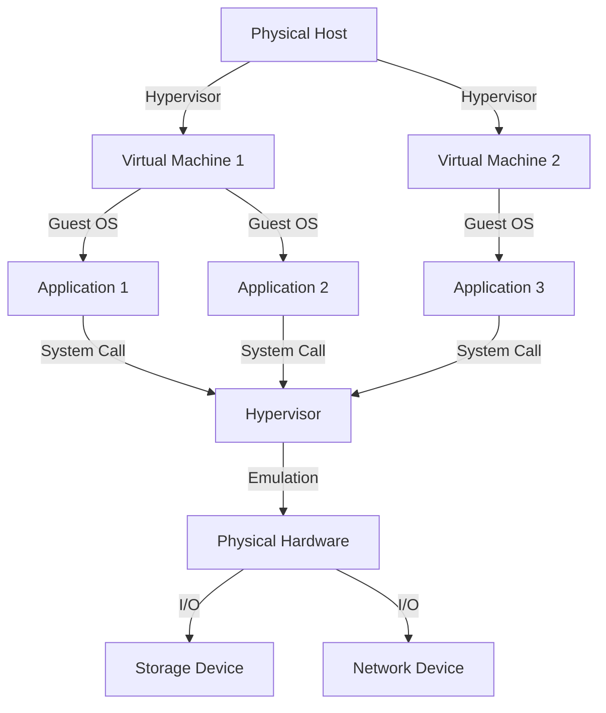

## Introduction
**Virtual Machines (VMs)** are software layers that emulate the functionality of physical computers, allowing multiple operating systems to run on a single physical machine. This technology has revolutionized the way we develop, test, and deploy software applications. In this article, we will delve into the internal workings of Virtual Machines, exploring their core concepts, mechanics, and real-world applications. Every engineer should understand how VMs work, as they are a crucial component of modern software development and deployment.

> **Note:** Virtual Machines are not to be confused with **Containerization**, which is a related but distinct technology. While both enable multiple applications to run on a single host, Containerization uses a single kernel and shares the operating system, whereas Virtual Machines run separate operating systems.

## Core Concepts
To understand how Virtual Machines work, we need to grasp the following key concepts:
* **Hypervisor**: The software layer that creates and manages Virtual Machines. It sits between the physical hardware and the VMs, allocating resources such as CPU, memory, and I/O devices.
* **Guest Operating System**: The operating system that runs inside a Virtual Machine. It is unaware of the hypervisor and thinks it is running on physical hardware.
* **Virtualization**: The process of creating a virtual representation of physical hardware, such as CPUs, memory, and storage devices.
* **Emulation**: The process of mimicking the behavior of physical hardware, allowing the guest operating system to run on the Virtual Machine.

> **Warning:** Virtual Machines can introduce additional overhead due to the hypervisor and emulation layers, which can impact performance. However, this overhead is often negligible compared to the benefits of virtualization.

## How It Works Internally
Here is a step-by-step breakdown of how Virtual Machines work internally:
1. The hypervisor is installed on the physical host machine.
2. The hypervisor creates a new Virtual Machine by allocating resources such as CPU, memory, and I/O devices.
3. The guest operating system is installed on the Virtual Machine.
4. When the guest operating system makes a system call, the hypervisor intercepts the call and emulates the behavior of the physical hardware.
5. The hypervisor allocates and deallocates resources as needed, ensuring that each Virtual Machine has access to the required resources.
6. The hypervisor provides a virtualized environment for the guest operating system, allowing it to run as if it were on physical hardware.

## Code Examples
### Example 1: Basic Virtual Machine Creation (Java)
```java
import java.lang.reflect.Method;

// Create a new Virtual Machine
public class VirtualMachine {
    public static void main(String[] args) {
        // Create a new hypervisor instance
        Hypervisor hypervisor = new Hypervisor();

        // Create a new Virtual Machine
        VirtualMachine vm = hypervisor.createVM("MyVM", 1024, 2);

        // Start the Virtual Machine
        vm.start();
    }
}

class Hypervisor {
    public VirtualMachine createVM(String name, int memory, int cpus) {
        // Allocate resources and create a new Virtual Machine
        return new VirtualMachine(name, memory, cpus);
    }
}

class VirtualMachine {
    private String name;
    private int memory;
    private int cpus;

    public VirtualMachine(String name, int memory, int cpus) {
        this.name = name;
        this.memory = memory;
        this.cpus = cpus;
    }

    public void start() {
        // Start the Virtual Machine
        System.out.println("Starting Virtual Machine: " + name);
    }
}
```
### Example 2: Real-World Virtual Machine Management (Python)
```python
import libvirt

# Connect to the hypervisor
conn = libvirt.open("qemu:///system")

# Get a list of all Virtual Machines
vms = conn.listAllDomains()

# Print the name and state of each Virtual Machine
for vm in vms:
    print("Name: " + vm.name() + ", State: " + str(vm.state()))

# Create a new Virtual Machine
vm = conn.createXML("<domain><name>MyVM</name><memory>1024</memory><vcpu>2</vcpu></domain>")

# Start the Virtual Machine
vm.create()
```
### Example 3: Advanced Virtual Machine Networking (C++)
```cpp
#include <iostream>
#include <libvirt/libvirt.h>

int main() {
    // Connect to the hypervisor
    virConnectPtr conn = virConnectOpen("qemu:///system");

    // Get a list of all Virtual Machines
    virDomainPtr* vms = virConnectListAllDomains(conn, NULL, 0);

    // Print the name and state of each Virtual Machine
    for (int i = 0; i < 10; i++) {
        std::cout << "Name: " << virDomainGetName(vms[i]) << ", State: " << virDomainState(vms[i]) << std::endl;
    }

    // Create a new Virtual Machine with advanced networking
    virDomainPtr vm = virDomainDefineXML(conn, "<domain><name>MyVM</name><memory>1024</memory><vcpu>2</vcpu><interface type='bridge'><source bridge='br0'/></interface></domain>");

    // Start the Virtual Machine
    virDomainCreate(vm);

    return 0;
}
```
## Visual Diagram

The diagram illustrates the relationship between the physical host, hypervisor, Virtual Machines, guest operating systems, and applications. The hypervisor creates and manages Virtual Machines, which run guest operating systems and applications. The hypervisor emulates the behavior of physical hardware, allowing the guest operating system to make system calls and access I/O devices.

## Comparison
| Virtualization Technology | Time Complexity | Space Complexity | Pros | Cons | Best For |
| --- | --- | --- | --- | --- | --- |
| Full Virtualization | O(n) | O(n) | Provides a complete virtual environment, supports multiple operating systems | Introduces overhead due to emulation | Server virtualization, cloud computing |
| Para-Virtualization | O(log n) | O(log n) | Improves performance by reducing overhead, requires guest OS modifications | Limited support for operating systems, requires guest OS modifications | Embedded systems, real-time systems |
| Hardware-Assisted Virtualization | O(1) | O(1) | Provides near-native performance, supports multiple operating systems | Requires specific hardware support, limited compatibility | Desktop virtualization, gaming |
| Containerization | O(1) | O(1) | Provides lightweight and efficient virtualization, supports multiple applications | Limited isolation between containers, requires a single kernel | Web development, microservices |

## Real-world Use Cases
* **Amazon Web Services (AWS)**: Uses Virtual Machines to provide scalable and secure cloud computing services.
* **Google Compute Engine**: Uses Virtual Machines to provide infrastructure-as-a-service (IaaS) and platform-as-a-service (PaaS) solutions.
* **VMware**: Provides Virtual Machine software for desktop and server virtualization, used by companies such as IBM and Microsoft.

> **Tip:** When choosing a virtualization technology, consider the trade-offs between performance, security, and compatibility. Full virtualization provides a complete virtual environment but introduces overhead, while para-virtualization improves performance but requires guest OS modifications.

## Common Pitfalls
* **Inadequate resource allocation**: Failing to allocate sufficient resources to Virtual Machines can lead to performance issues and crashes.
* **Insufficient security**: Failing to implement proper security measures, such as encryption and access control, can compromise the security of Virtual Machines and guest operating systems.
* **Incompatible hardware**: Using incompatible hardware can lead to compatibility issues and decreased performance.
* **Inadequate monitoring and maintenance**: Failing to monitor and maintain Virtual Machines can lead to performance issues, crashes, and security vulnerabilities.

> **Interview:** When asked about virtualization, be prepared to discuss the different types of virtualization, their pros and cons, and real-world use cases. Be sure to highlight your understanding of the trade-offs between performance, security, and compatibility.

## Key Takeaways
* Virtual Machines provide a complete virtual environment for guest operating systems and applications.
* Hypervisors create and manage Virtual Machines, allocating resources and emulating physical hardware.
* Full virtualization introduces overhead due to emulation, while para-virtualization improves performance but requires guest OS modifications.
* Hardware-assisted virtualization provides near-native performance but requires specific hardware support.
* Containerization provides lightweight and efficient virtualization but has limited isolation between containers.
* Virtualization technologies have different time and space complexities, affecting performance and scalability.
* Real-world use cases include cloud computing, desktop virtualization, and embedded systems.
* Common pitfalls include inadequate resource allocation, insufficient security, incompatible hardware, and inadequate monitoring and maintenance.