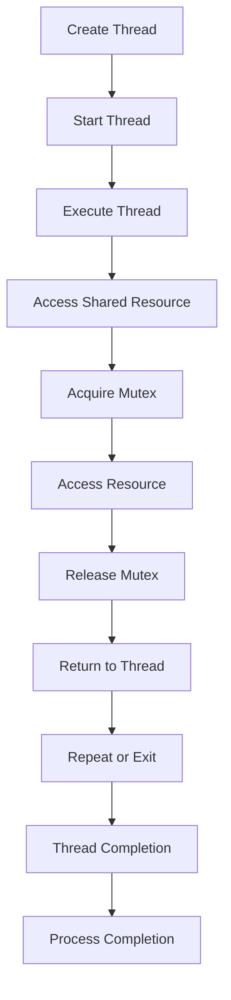

## Introduction
Concurrency models are a fundamental concept in computer science, enabling multiple tasks to be executed simultaneously, improving system performance, and responsiveness. In today's multithreaded and distributed systems, understanding concurrency models is crucial for designing and developing efficient, scalable, and reliable software. Concurrency models provide a framework for managing shared resources, handling synchronization, and coordinating tasks, making them a vital component of modern programming languages. Every engineer should be familiar with concurrency models, as they are essential for building high-performance, concurrent systems.

## Core Concepts
**Concurrency** refers to the ability of a program to execute multiple tasks simultaneously, improving system responsiveness and throughput. **Parallelism** is a related concept, where multiple tasks are executed simultaneously on multiple processing units, such as CPUs or cores. **Synchronization** is the process of coordinating access to shared resources, ensuring that multiple tasks do not interfere with each other. Key terminology includes **threads**, **processes**, **mutexes**, **semaphores**, and **monitors**, which are used to manage concurrency and synchronization.

> **Note:** Concurrency models are not limited to multithreaded programming; they also apply to distributed systems, where tasks are executed on multiple machines or nodes.

## How It Works Internally
When a program is executed, the operating system creates a **process**, which is an independent unit of execution. Within a process, multiple **threads** can be created, each executing a separate portion of the program. Threads share the same memory space, making synchronization essential to prevent data corruption. **Mutexes** (mutual exclusion locks) and **semaphores** are used to coordinate access to shared resources, ensuring that only one thread can access a resource at a time. **Monitors** are a higher-level construct, providing a way to synchronize access to shared resources using a combination of mutexes and condition variables.

```java
// Example of using a mutex to synchronize access to a shared resource
public class Counter {
    private int count = 0;
    private final Object mutex = new Object();

    public void increment() {
        synchronized (mutex) {
            count++;
        }
    }

    public int getCount() {
        synchronized (mutex) {
            return count;
        }
    }
}
```

## Code Examples
### Example 1: Basic Thread Creation
```java
// Create and start two threads
public class ThreadExample {
    public static void main(String[] args) {
        Thread thread1 = new Thread(() -> {
            System.out.println("Thread 1: Hello, World!");
        });

        Thread thread2 = new Thread(() -> {
            System.out.println("Thread 2: Hello, World!");
        });

        thread1.start();
        thread2.start();
    }
}
```

### Example 2: Using a Semaphore for Synchronization
```java
// Use a semaphore to limit the number of threads accessing a resource
import java.util.concurrent.Semaphore;

public class SemaphoreExample {
    private final Semaphore semaphore = new Semaphore(5); // Allow 5 threads to access the resource

    public void accessResource() {
        try {
            semaphore.acquire();
            System.out.println("Accessing resource...");
            // Simulate some work
            Thread.sleep(1000);
        } catch (InterruptedException e) {
            Thread.currentThread().interrupt();
        } finally {
            semaphore.release();
        }
    }

    public static void main(String[] args) {
        SemaphoreExample example = new SemaphoreExample();
        for (int i = 0; i < 10; i++) {
            Thread thread = new Thread(example::accessResource);
            thread.start();
        }
    }
}
```

### Example 3: Using a Monitor for Synchronization
```java
// Use a monitor to synchronize access to a shared resource
public class MonitorExample {
    private final Object monitor = new Object();
    private int count = 0;

    public void increment() {
        synchronized (monitor) {
            count++;
            System.out.println("Count: " + count);
        }
    }

    public void decrement() {
        synchronized (monitor) {
            count--;
            System.out.println("Count: " + count);
        }
    }

    public static void main(String[] args) {
        MonitorExample example = new MonitorExample();
        Thread thread1 = new Thread(() -> {
            for (int i = 0; i < 10; i++) {
                example.increment();
            }
        });

        Thread thread2 = new Thread(() -> {
            for (int i = 0; i < 10; i++) {
                example.decrement();
            }
        });

        thread1.start();
        thread2.start();
    }
}
```

## Visual Diagram

This diagram illustrates the lifecycle of a thread, from creation to completion, and the synchronization steps involved in accessing a shared resource.

## Comparison
| Concurrency Model | Time Complexity | Space Complexity | Pros | Cons | Best For |
| --- | --- | --- | --- | --- | --- |
| **Mutex-based** | O(1) | O(1) | Simple, efficient | Limited scalability | Small-scale, low-contention systems |
| **Semaphore-based** | O(1) | O(1) | Flexible, scalable | More complex | Medium-scale, high-contention systems |
| **Monitor-based** | O(1) | O(1) | High-level, abstract | Less efficient | Large-scale, complex systems |
| **Lock-free** | O(1) | O(1) | Highly scalable, efficient | Complex, difficult to implement | High-performance, real-time systems |

> **Tip:** When choosing a concurrency model, consider the system's scalability requirements, the level of contention, and the complexity of the implementation.

## Real-world Use Cases
1. **Google's MapReduce**: A distributed computing framework that uses a concurrency model to process large datasets in parallel.
2. **Amazon's DynamoDB**: A NoSQL database that uses a concurrency model to handle high traffic and provide low-latency responses.
3. **Netflix's Chaos Monkey**: A tool that uses a concurrency model to simulate failures in a distributed system, ensuring high availability and reliability.

## Common Pitfalls
1. **Deadlocks**: A situation where two or more threads are blocked, waiting for each other to release a resource.
2. **Starvation**: A situation where a thread is unable to access a resource due to constant contention.
3. **Livelocks**: A situation where two or more threads are constantly retrying to access a resource, causing high CPU usage.
4. **Data corruption**: A situation where multiple threads access and modify shared data, causing inconsistencies and errors.

> **Warning:** Concurrency models can be complex and error-prone; careful consideration and testing are essential to avoid common pitfalls.

## Interview Tips
1. **What is the difference between concurrency and parallelism?**: A strong answer should explain the difference between executing multiple tasks simultaneously (concurrency) and executing multiple tasks on multiple processing units (parallelism).
2. **How do you synchronize access to a shared resource?**: A strong answer should explain the use of mutexes, semaphores, and monitors to synchronize access to shared resources.
3. **What are some common pitfalls when using concurrency models?**: A strong answer should identify deadlocks, starvation, livelocks, and data corruption as common pitfalls and explain how to avoid them.

## Key Takeaways
* Concurrency models are essential for building high-performance, concurrent systems.
* **Mutexes**, **semaphores**, and **monitors** are used to synchronize access to shared resources.
* **Lock-free** concurrency models can provide high scalability and efficiency but are complex to implement.
* **Deadlocks**, **starvation**, **livelocks**, and **data corruption** are common pitfalls when using concurrency models.
* **Scalability**, **contention**, and **complexity** are key factors to consider when choosing a concurrency model.
* **Testing** and **validation** are crucial to ensure the correct implementation of concurrency models.