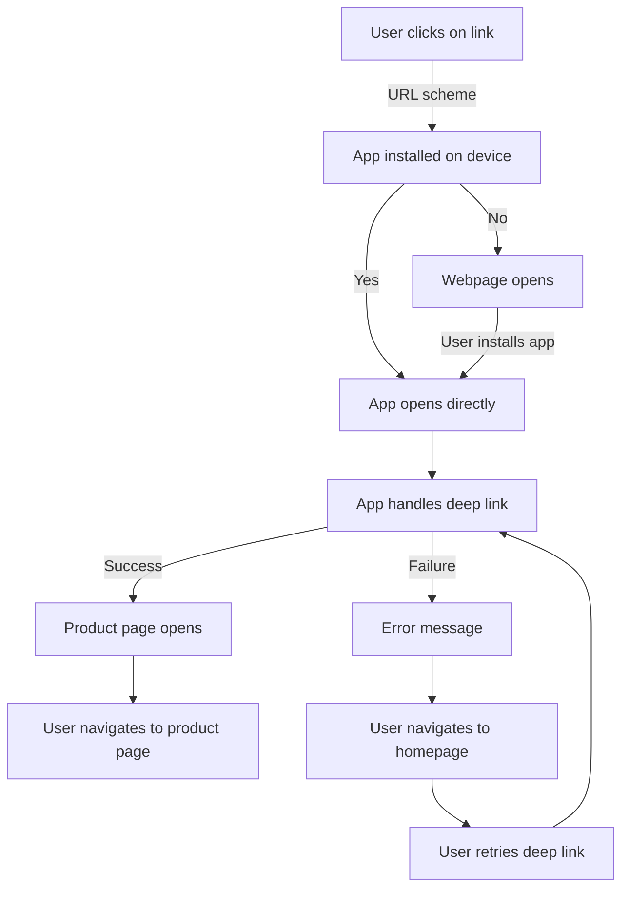

## Introduction
Deep linking and universal links are techniques used in mobile development to enable seamless navigation between different apps and websites. **Deep linking** allows users to click on a link and be taken directly to a specific page or section within an app, rather than opening the app's homepage. **Universal links**, on the other hand, are a type of deep link that can open a webpage or an app, depending on the user's device and preferences. In this section, we will explore the importance of deep linking and universal links, their real-world relevance, and why every mobile developer needs to know about them.

Deep linking and universal links have become essential in today's mobile ecosystem, as they enable a more streamlined and user-friendly experience. For example, when a user clicks on a link to a product on an e-commerce website, they expect to be taken directly to the product page, rather than having to navigate through the website's homepage. Similarly, when a user clicks on a link to a social media post, they expect to be taken directly to the post, rather than having to navigate through the social media app's homepage.

> **Note:** Deep linking and universal links are not limited to e-commerce and social media apps. They can be used in a wide range of apps, including news apps, productivity apps, and gaming apps.

## Core Concepts
To understand deep linking and universal links, it's essential to grasp the following core concepts:

* **URL scheme**: A unique identifier for an app that allows it to handle specific URLs.
* **App link**: A link that opens an app, rather than a webpage.
* **Universal link**: A link that can open either a webpage or an app, depending on the user's device and preferences.
* **Intent**: A message that an app sends to the operating system to request a specific action, such as opening a webpage or launching an app.

> **Tip:** When implementing deep linking and universal links, it's essential to consider the user's experience and ensure that the links are intuitive and easy to use.

## How It Works Internally
Deep linking and universal links work by using a combination of URL schemes, app links, and intents. Here's a step-by-step breakdown of how they work:

1. A user clicks on a link to a webpage or an app.
2. The operating system checks if the link is a URL scheme or an app link.
3. If the link is a URL scheme, the operating system checks if there is an app installed on the device that can handle the URL scheme.
4. If an app is found, the operating system sends an intent to the app to open the corresponding page or section.
5. If the link is an app link, the operating system checks if the app is installed on the device and opens it directly.
6. If the link is a universal link, the operating system checks if the app is installed on the device and opens it directly. If not, the operating system opens the corresponding webpage.

> **Warning:** Deep linking and universal links can be affected by app updates, changes in the operating system, and user preferences. It's essential to test and debug the links regularly to ensure they are working correctly.

## Code Examples
Here are three complete and runnable code examples that demonstrate deep linking and universal links:

### Example 1: Basic Deep Linking
```java
// Android example
import android.app.Activity;
import android.content.Intent;
import android.net.Uri;
import android.os.Bundle;

public class MainActivity extends Activity {
    @Override
    protected void onCreate(Bundle savedInstanceState) {
        super.onCreate(savedInstanceState);
        // Define the URL scheme
        Intent intent = getIntent();
        Uri uri = intent.getData();
        if (uri != null) {
            // Handle the deep link
            String path = uri.getPath();
            if (path.equals("/product")) {
                // Open the product page
                Intent productIntent = new Intent(this, ProductActivity.class);
                startActivity(productIntent);
            }
        }
    }
}
```

### Example 2: Universal Linking
```swift
// iOS example
import UIKit

class ViewController: UIViewController {
    override func viewDidLoad() {
        super.viewDidLoad()
        // Define the universal link
        let url = URL(string: "https://example.com/product")!
        let universalLink = UILink(url: url)
        // Handle the universal link
        universalLink.open { (success) in
            if success {
                // Open the product page
                let productViewController = ProductViewController()
                self.present(productViewController, animated: true, completion: nil)
            } else {
                // Open the webpage
                let safariViewController = SFSafariViewController(url: url)
                self.present(safariViewController, animated: true, completion: nil)
            }
        }
    }
}
```

### Example 3: Advanced Deep Linking
```javascript
// React Native example
import React, { useState, useEffect } from 'react';
import { Linking } from 'react-native';

const App = () => {
    const [deepLink, setDeepLink] = useState(null);

    useEffect(() => {
        // Handle the deep link
        Linking.getInitialURL().then((url) => {
            if (url) {
                setDeepLink(url);
            }
        });
        // Define the URL scheme
        Linking.addEventListener('url', (event) => {
            setDeepLink(event.url);
        });
    }, []);

    if (deepLink) {
        // Open the product page
        return <ProductScreen deepLink={deepLink} />;
    } else {
        // Open the homepage
        return <HomeScreen />;
    }
};
```

## Visual Diagram

This diagram illustrates the flow of deep linking and universal links, from the user clicking on a link to the app handling the deep link and opening the corresponding page or section.

> **Interview:** When asked about deep linking and universal links, be prepared to explain the different types of links, how they work, and the benefits of using them in your app.

## Comparison
| Approach | Time Complexity | Space Complexity | Pros | Cons | Best For |
| --- | --- | --- | --- | --- | --- |
| Deep Linking | O(1) | O(1) | Easy to implement, fast, and seamless user experience | Limited to apps with a URL scheme | E-commerce apps, social media apps |
| Universal Linking | O(1) | O(1) | Can open either a webpage or an app, flexible, and user-friendly | Requires additional setup and configuration | News apps, productivity apps, gaming apps |
| App Linking | O(1) | O(1) | Fast and seamless user experience, easy to implement | Limited to apps with an app link | Social media apps, messaging apps |
| Web Linking | O(1) | O(1) | Easy to implement, flexible, and user-friendly | May not provide a seamless user experience | News apps, blogs, websites |

## Real-world Use Cases
Here are three real-world examples of deep linking and universal links in production:

* **Instagram**: Instagram uses deep linking to allow users to click on a link and be taken directly to a specific post or profile.
* **Amazon**: Amazon uses universal links to allow users to click on a link and be taken directly to a product page, either on the website or in the app.
* **Facebook**: Facebook uses app linking to allow users to click on a link and be taken directly to a specific page or section within the app.

> **Tip:** When implementing deep linking and universal links, consider using a library or framework to simplify the process and ensure compatibility across different platforms.

## Common Pitfalls
Here are four common mistakes that developers make when implementing deep linking and universal links:

* **Incorrect URL scheme**: Using an incorrect URL scheme can prevent the app from handling the deep link correctly.
* **Missing app link**: Failing to define an app link can prevent the app from opening directly.
* **Insufficient error handling**: Failing to handle errors and exceptions can result in a poor user experience.
* **Incompatible platform**: Failing to test and debug the links on different platforms can result in compatibility issues.

Here is an example of wrong code vs right code:
```java
// Wrong code
Intent intent = new Intent(Intent.ACTION_VIEW, Uri.parse("https://example.com/product"));
startActivity(intent);

// Right code
Intent intent = new Intent(Intent.ACTION_VIEW, Uri.parse("https://example.com/product"));
if (intent.resolveActivity(getPackageManager()) != null) {
    startActivity(intent);
} else {
    // Handle the error
}
```

## Interview Tips
Here are three common interview questions related to deep linking and universal links, along with weak and strong answers:

* **What is deep linking, and how does it work?**
	+ Weak answer: "Deep linking is a way to open an app from a webpage. I'm not sure how it works."
	+ Strong answer: "Deep linking is a technique that allows users to click on a link and be taken directly to a specific page or section within an app. It works by using a URL scheme, which is a unique identifier for an app that allows it to handle specific URLs."
* **What is the difference between deep linking and universal linking?**
	+ Weak answer: "I'm not sure. I think they're the same thing."
	+ Strong answer: "Deep linking is a technique that allows users to click on a link and be taken directly to a specific page or section within an app. Universal linking, on the other hand, is a technique that can open either a webpage or an app, depending on the user's device and preferences."
* **How do you handle errors and exceptions when implementing deep linking and universal links?**
	+ Weak answer: "I'm not sure. I think I would just log the error and move on."
	+ Strong answer: "I would handle errors and exceptions by using try-catch blocks and logging the error. I would also provide a fallback experience for the user, such as opening the webpage instead of the app."

> **Warning:** When answering interview questions, be sure to provide specific examples and explanations, and avoid giving vague or generic answers.

## Key Takeaways
Here are ten key takeaways to remember when implementing deep linking and universal links:

* **Use a URL scheme**: Use a unique identifier for your app to handle specific URLs.
* **Define an app link**: Define an app link to allow users to click on a link and be taken directly to a specific page or section within your app.
* **Handle errors and exceptions**: Handle errors and exceptions by using try-catch blocks and logging the error.
* **Provide a fallback experience**: Provide a fallback experience for the user, such as opening the webpage instead of the app.
* **Test and debug**: Test and debug your links on different platforms to ensure compatibility.
* **Use a library or framework**: Consider using a library or framework to simplify the process and ensure compatibility.
* **Use universal links**: Consider using universal links to allow users to click on a link and be taken directly to a specific page or section within your app, or to a webpage.
* **Optimize for user experience**: Optimize your links for user experience by providing a seamless and intuitive experience.
* **Monitor and analyze**: Monitor and analyze your links to ensure they are working correctly and provide insights into user behavior.
* **Stay up-to-date**: Stay up-to-date with the latest trends and best practices in deep linking and universal linking to ensure your app remains competitive.