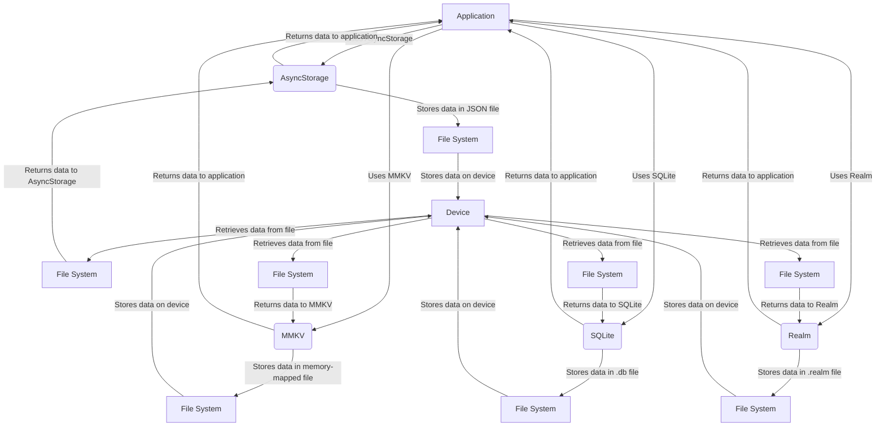

## Introduction
**Local Storage** refers to the ability of a mobile application to store data on the device it is running on, rather than relying on a remote server or database. This is important because it allows for offline access to data, reduces latency, and improves overall user experience. In mobile development, local storage is a crucial aspect of building robust and efficient applications. Real-world examples of local storage include caching user preferences, storing encrypted data, and maintaining a local database of frequently accessed information.

> **Note:** Local storage is not the same as session storage, which is used to store data for a single session. Local storage, on the other hand, persists across sessions and even app restarts.

## Core Concepts
* **AsyncStorage**: A built-in React Native module that provides a simple way to store and retrieve data asynchronously.
* **MMKV**: A high-performance, asynchronous key-value store for mobile applications.
* **SQLite**: A self-contained, serverless, and zero-configuration database that can be used for local storage.
* **Realm**: A mobile database that allows for efficient and secure storage of data.

> **Warning:** When using local storage, it is essential to consider data security and encryption to prevent unauthorized access to sensitive information.

## How It Works Internally
AsyncStorage, MMKV, SQLite, and Realm all work differently under the hood:
* **AsyncStorage**: Stores data in a JSON file on the device's file system.
* **MMKV**: Uses a combination of memory-mapped files and asynchronous I/O to achieve high performance.
* **SQLite**: Uses a relational database model and stores data in a .db file on the device.
* **Realm**: Uses a proprietary database engine and stores data in a .realm file on the device.

Here is a step-by-step breakdown of how AsyncStorage works:
1. The application imports the AsyncStorage module.
2. The application uses the `setItem` method to store data.
3. The data is serialized to JSON and written to a file on the device's file system.
4. The application uses the `getItem` method to retrieve data.
5. The data is deserialized from JSON and returned to the application.

## Code Examples
### Example 1: Basic AsyncStorage Usage
```javascript
import AsyncStorage from '@react-native-async-storage/async-storage';

// Set data
AsyncStorage.setItem('username', 'johnDoe')
  .then(() => console.log('Data stored successfully'))
  .catch((error) => console.error('Error storing data:', error));

// Get data
AsyncStorage.getItem('username')
  .then((value) => console.log('Retrieved data:', value))
  .catch((error) => console.error('Error retrieving data:', error));
```

### Example 2: Real-World MMKV Usage
```java
import com.tencent.mmkv.MMKV;

// Initialize MMKV
MMKV mmkv = MMKV.defaultMMKV();

// Set data
mmkv.encode('username', 'janeDoe');

// Get data
String username = mmkv.decodeString('username');
```

### Example 3: Advanced Realm Usage
```swift
import RealmSwift

// Create a Realm instance
let realm = try! Realm()

// Define a Realm model
class User: Object {
    @objc dynamic var username: String = ""
}

// Add a user to the Realm
try! realm.write {
    let user = User()
    user.username = "johnDoe"
    realm.add(user)
}

// Query the Realm for users
let users = realm.objects(User.self)
```

## Visual Diagram

This diagram illustrates the different components involved in local storage and how they interact with each other.

## Comparison
| Approach | Time Complexity | Space Complexity | Pros | Cons | Best For |
| --- | --- | --- | --- | --- | --- |
| AsyncStorage | O(1) | O(n) | Easy to use, asynchronous | Limited storage capacity, slower than MMKV | Small to medium-sized applications |
| MMKV | O(1) | O(n) | High performance, asynchronous | More complex to use than AsyncStorage | Large-scale applications, high-performance requirements |
| SQLite | O(log n) | O(n) | Relational database model, supports queries | Steeper learning curve, slower than MMKV | Complex data relationships, querying requirements |
| Realm | O(1) | O(n) | High performance, supports queries | Proprietary, more complex to use than MMKV | Large-scale applications, high-performance requirements, complex data relationships |

## Real-world Use Cases
* **Instagram**: Uses a combination of AsyncStorage and Realm to store user preferences and cached data.
* **Facebook**: Uses MMKV to store user data and preferences.
* **Twitter**: Uses SQLite to store tweet data and user information.

> **Tip:** When choosing a local storage solution, consider the size and complexity of your application, as well as the performance requirements.

## Common Pitfalls
* **Insufficient error handling**: Failing to handle errors properly can lead to data corruption or loss.
* **Insecure data storage**: Storing sensitive data in plaintext can compromise user security.
* **Inefficient data retrieval**: Retrieving data inefficiently can lead to performance issues.
* **Incorrect data typing**: Using incorrect data types can lead to data corruption or errors.

> **Warning:** When using local storage, it is essential to consider data security and encryption to prevent unauthorized access to sensitive information.

## Interview Tips
* **What is the difference between AsyncStorage and MMKV?**: A strong answer would discuss the performance differences and use cases for each.
* **How do you handle errors when using local storage?**: A strong answer would discuss the importance of error handling and provide examples of how to handle errors properly.
* **What are some common pitfalls when using local storage?**: A strong answer would discuss the common pitfalls mentioned above and provide examples of how to avoid them.

## Key Takeaways
* **Local storage is essential for mobile applications**: It allows for offline access to data, reduces latency, and improves overall user experience.
* **AsyncStorage is easy to use but limited in capacity**: It is suitable for small to medium-sized applications but may not be sufficient for larger applications.
* **MMKV is high-performance but more complex to use**: It is suitable for large-scale applications with high-performance requirements.
* **SQLite is a relational database model but has a steeper learning curve**: It is suitable for complex data relationships and querying requirements.
* **Realm is high-performance but proprietary**: It is suitable for large-scale applications with high-performance requirements and complex data relationships.
* **Error handling is crucial when using local storage**: It is essential to handle errors properly to prevent data corruption or loss.
* **Data security and encryption are essential**: It is essential to consider data security and encryption to prevent unauthorized access to sensitive information.