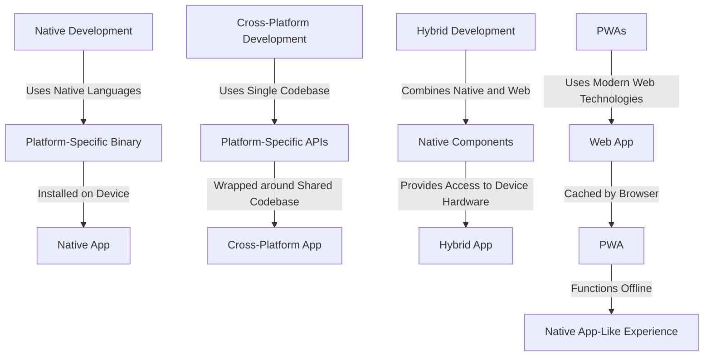

## Introduction
The mobile development landscape has evolved significantly over the years, with various approaches emerging to cater to the diverse needs of developers, businesses, and users. The primary goal of mobile development is to create applications that provide a seamless user experience, are efficient, and can reach a wide audience. In this overview, we will delve into the world of native, cross-platform, hybrid, and Progressive Web Apps (PWAs), exploring their definitions, internal workings, and real-world applications.

> **Note:** The choice of mobile development approach depends on factors such as the target audience, development time, budget, and required features.

## Core Concepts
To understand the mobile development landscape, it is essential to grasp the core concepts and terminology.

* **Native Development:** Building applications using the native programming languages and tools provided by the platform owners (e.g., Java or Kotlin for Android, Swift or Objective-C for iOS).
* **Cross-Platform Development:** Creating applications that can run on multiple platforms using a single codebase, often using frameworks like React Native, Flutter, or Xamarin.
* **Hybrid Development:** Combining native and web technologies to create applications that can run on multiple platforms, using frameworks like Ionic or PhoneGap.
* **Progressive Web Apps (PWAs):** Web applications that provide a native app-like experience, using modern web technologies like HTML, CSS, and JavaScript.

> **Warning:** Choosing the wrong development approach can lead to increased development time, higher costs, and a poor user experience.

## How It Works Internally
Let's take a closer look at how each approach works internally:

1. **Native Development:** Native applications are built using the platform's native programming languages and tools. The code is compiled into a platform-specific binary, which is then installed on the user's device.
2. **Cross-Platform Development:** Cross-platform frameworks use a single codebase to generate platform-specific binaries. This is achieved through the use of platform-specific APIs, which are wrapped around the shared codebase.
3. **Hybrid Development:** Hybrid applications use a combination of native and web technologies. The native components provide access to device hardware and platform-specific features, while the web components handle the user interface and business logic.
4. **PWAs:** PWAs use modern web technologies to provide a native app-like experience. They are built using HTML, CSS, and JavaScript, and are deployed on a web server. When a user accesses a PWA, the browser caches the application's resources, allowing it to function offline.

## Code Examples
Here are three complete and runnable code examples, demonstrating the use of each approach:

### Example 1: Native Android App (Java)
```java
// Import necessary packages
import android.app.Activity;
import android.os.Bundle;
import android.widget.TextView;

// Define the main activity
public class MainActivity extends Activity {
    @Override
    protected void onCreate(Bundle savedInstanceState) {
        super.onCreate(savedInstanceState);
        // Set the content view
        setContentView(R.layout.activity_main);
        // Find the text view and set its text
        TextView textView = findViewById(R.id.text_view);
        textView.setText("Hello, World!");
    }
}
```

### Example 2: Cross-Platform React Native App (JavaScript)
```javascript
// Import necessary packages
import React from 'react';
import { AppRegistry, View, Text } from 'react-native';

// Define the main component
const App = () => {
    return (
        <View>
            <Text>Hello, World!</Text>
        </View>
    );
};

// Register the component
AppRegistry.registerComponent('App', () => App);
```

### Example 3: Hybrid Ionic App (JavaScript)
```javascript
// Import necessary packages
import { Component } from '@angular/core';
import { NavController } from 'ionic-angular';

// Define the main component
@Component({
    selector: 'page-home',
    template: `
        <ion-content>
            <ion-card>
                <ion-card-content>
                    <p>Hello, World!</p>
                </ion-card-content>
            </ion-card>
        </ion-content>
    `
})
export class HomePage {
    constructor(public navCtrl: NavController) {}
}
```

## Visual Diagram

This diagram illustrates the different approaches to mobile development, highlighting their internal workings and relationships.

> **Tip:** When choosing a development approach, consider factors such as development time, budget, and required features.

## Comparison
The following table compares the different approaches to mobile development:

| Approach | Time Complexity | Space Complexity | Pros | Cons | Best For |
| --- | --- | --- | --- | --- | --- |
| Native Development | O(n) | O(1) | High performance, direct access to device hardware | Steep learning curve, high development costs | Complex, high-performance applications |
| Cross-Platform Development | O(n) | O(1) | Shared codebase, reduced development time | Limited access to device hardware, potential performance issues | Simple to medium-complexity applications |
| Hybrid Development | O(n) | O(1) | Combines native and web technologies, flexible | Complex architecture, potential performance issues | Applications requiring native and web features |
| PWAs | O(1) | O(1) | Fast development, low costs, native app-like experience | Limited access to device hardware, potential performance issues | Simple to medium-complexity web applications |

## Real-world Use Cases
Here are three real-world examples of mobile development in action:

1. **Instagram:** Instagram's mobile application is built using a combination of native and cross-platform technologies. The core functionality is built using native languages, while the user interface and business logic are built using cross-platform frameworks.
2. **Uber:** Uber's mobile application is built using a native approach, with separate codebases for Android and iOS. This allows for direct access to device hardware and provides a high-performance, seamless user experience.
3. **Twitter:** Twitter's mobile application is built using a hybrid approach, combining native and web technologies. The native components provide access to device hardware, while the web components handle the user interface and business logic.

## Common Pitfalls
Here are four common mistakes to avoid in mobile development:

1. **Insufficient Testing:** Failing to test the application thoroughly can lead to bugs, crashes, and a poor user experience.
2. **Inadequate Security:** Failing to implement proper security measures can put user data at risk and lead to financial losses.
3. **Poor Performance Optimization:** Failing to optimize the application's performance can lead to slow loading times, battery drain, and a poor user experience.
4. **Inconsistent User Interface:** Failing to maintain a consistent user interface can lead to user confusion, frustration, and a poor overall experience.

> **Interview:** When asked about common pitfalls in mobile development, be sure to mention the importance of testing, security, performance optimization, and consistent user interface design.

## Interview Tips
Here are three common interview questions related to mobile development, along with sample answers:

1. **What is the difference between native and cross-platform development?**
	* Weak answer: "Native development is when you build an application using the native programming languages, while cross-platform development is when you use a single codebase to build applications for multiple platforms."
	* Strong answer: "Native development involves building applications using the native programming languages and tools provided by the platform owners. This approach provides direct access to device hardware and allows for high-performance, seamless user experiences. Cross-platform development, on the other hand, involves using a single codebase to build applications for multiple platforms. This approach reduces development time and costs but may limit access to device hardware and potentially affect performance."
2. **How do you optimize the performance of a mobile application?**
	* Weak answer: "I use caching, minimize network requests, and optimize images."
	* Strong answer: "To optimize the performance of a mobile application, I use a combination of techniques such as caching, minimizing network requests, optimizing images, and reducing computational complexity. I also use profiling tools to identify performance bottlenecks and optimize the application's architecture and codebase accordingly."
3. **What is the difference between a hybrid and a PWA?**
	* Weak answer: "A hybrid application is built using a combination of native and web technologies, while a PWA is a web application that provides a native app-like experience."
	* Strong answer: "A hybrid application is built using a combination of native and web technologies, where the native components provide access to device hardware and the web components handle the user interface and business logic. A PWA, on the other hand, is a web application that provides a native app-like experience using modern web technologies such as HTML, CSS, and JavaScript. PWAs are deployed on a web server and can be accessed through a browser, providing a fast, seamless, and engaging user experience."

## Key Takeaways
Here are ten key takeaways to remember when it comes to mobile development:

* **Native development provides high performance and direct access to device hardware.**
* **Cross-platform development reduces development time and costs but may limit access to device hardware.**
* **Hybrid development combines native and web technologies, providing flexibility and a range of features.**
* **PWAs provide a native app-like experience using modern web technologies.**
* **Testing, security, performance optimization, and consistent user interface design are crucial for a successful mobile application.**
* **The choice of development approach depends on factors such as target audience, development time, budget, and required features.**
* **Mobile applications should be designed with a user-centered approach, providing a seamless and engaging user experience.**
* **Mobile development requires a deep understanding of platform-specific APIs, device hardware, and web technologies.**
* **Staying up-to-date with the latest trends, technologies, and best practices is essential for a successful mobile development career.**
* **Mobile development is a complex and ever-evolving field, requiring a combination of technical skills, creativity, and problem-solving abilities.**

> **Tip:** Remember to stay focused on the user experience and to continuously test, iterate, and improve your mobile application to ensure its success.