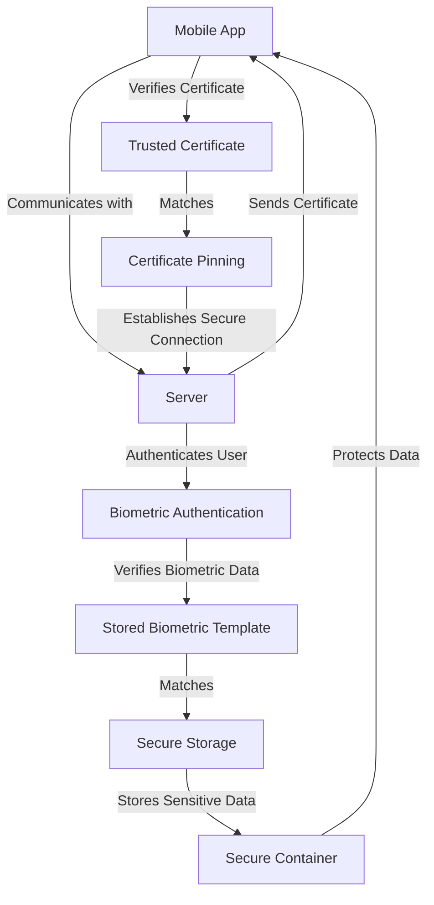

## Introduction
Mobile security is a critical aspect of mobile development, as it ensures the protection of sensitive user data and prevents malicious attacks on mobile devices. With the increasing use of mobile devices for personal and professional purposes, the need for robust mobile security measures has become more pressing than ever. In this section, we will explore the importance of mobile security, its relevance in real-world scenarios, and why every mobile developer should be aware of its best practices. 
> **Note:** Mobile security is not just about protecting devices from malware, but also about ensuring the confidentiality, integrity, and availability of user data.

Mobile security encompasses a wide range of techniques and technologies, including certificate pinning, biometrics, and secure storage. Certificate pinning is a technique used to ensure that a mobile app only communicates with a trusted server, while biometrics provides a secure way to authenticate users. Secure storage, on the other hand, ensures that sensitive data is protected from unauthorized access.

## Core Concepts
To understand mobile security, it's essential to grasp some core concepts:
- **Certificate Pinning**: a technique used to ensure that a mobile app only communicates with a trusted server by verifying the server's certificate against a known good certificate or public key.
- **Biometrics**: a method of authentication that uses unique physical characteristics, such as fingerprints or facial recognition, to verify a user's identity.
- **Secure Storage**: a mechanism for protecting sensitive data, such as encryption keys or authentication tokens, from unauthorized access.

These concepts are crucial in mobile security, as they provide a robust defense against various types of attacks, including man-in-the-middle (MITM) attacks, phishing attacks, and data breaches.
> **Warning:** Failure to implement these concepts can lead to severe security vulnerabilities, compromising user data and trust.

## How It Works Internally
Let's take a closer look at how these concepts work internally:
1. **Certificate Pinning**: When a mobile app communicates with a server, it verifies the server's certificate against a known good certificate or public key. If the certificate matches, the app proceeds with the communication; otherwise, it terminates the connection.
2. **Biometrics**: When a user attempts to authenticate, the mobile device captures their biometric data, such as a fingerprint or facial scan. The device then compares this data with the stored biometric template to verify the user's identity.
3. **Secure Storage**: Sensitive data is stored in a secure container, such as a trusted execution environment (TEE) or a hardware security module (HSM). These containers provide an additional layer of protection against unauthorized access.

The internal mechanics of these concepts are critical to understanding how mobile security works and how to implement it effectively.
> **Tip:** Use a combination of certificate pinning, biometrics, and secure storage to provide robust security for your mobile app.

## Code Examples
Here are three complete and runnable code examples that demonstrate the implementation of mobile security concepts:

### Example 1: Basic Certificate Pinning
```java
import java.security.cert.Certificate;
import java.security.cert.CertificateFactory;
import javax.net.ssl.SSLContext;
import javax.net.ssl.TrustManager;
import javax.net.ssl.X509TrustManager;

public class CertificatePinning {
    public static void main(String[] args) throws Exception {
        // Load the trusted certificate
        Certificate trustedCert = CertificateFactory.getInstance("X509")
                .generateCertificate(CertificatePinning.class.getResourceAsStream("/trusted_cert.pem"));

        // Create an SSL context with the trusted certificate
        SSLContext sslContext = SSLContext.getInstance("TLS");
        sslContext.init(null, new TrustManager[]{new X509TrustManager() {
            @Override
            public void checkServerTrusted(Certificate[] chain, String authType) throws Exception {
                // Verify the server's certificate against the trusted certificate
                if (!chain[0].equals(trustedCert)) {
                    throw new Exception("Certificate mismatch");
                }
            }

            @Override
            public void checkClientTrusted(Certificate[] chain, String authType) throws Exception {
                // Not implemented
            }

            @Override
            public Certificate[] getAcceptedIssuers() {
                return new Certificate[0];
            }
        }}, null);

        // Use the SSL context to establish a secure connection
        sslContext.createSSLEngine().setUseClientMode(true);
    }
}
```

### Example 2: Biometric Authentication
```java
import android.hardware.biometrics.BiometricManager;
import android.hardware.biometrics.BiometricPrompt;
import android.os.Bundle;
import androidx.appcompat.app.AppCompatActivity;

public class BiometricAuth extends AppCompatActivity {
    @Override
    protected void onCreate(Bundle savedInstanceState) {
        super.onCreate(savedInstanceState);

        // Create a biometric prompt
        BiometricPrompt prompt = new BiometricPrompt(this, new BiometricPrompt.AuthenticationCallback() {
            @Override
            public void onAuthenticationError(int errorCode, CharSequence errString) {
                super.onAuthenticationError(errorCode, errString);
                // Handle authentication error
            }

            @Override
            public void onAuthenticationSucceeded(BiometricPrompt.AuthenticationResult result) {
                super.onAuthenticationSucceeded(result);
                // Handle successful authentication
            }

            @Override
            public void onAuthenticationFailed() {
                super.onAuthenticationFailed();
                // Handle failed authentication
            }
        });

        // Create a biometric prompt info
        BiometricPrompt.PromptInfo promptInfo = new BiometricPrompt.PromptInfo.Builder()
                .setTitle("Biometric Authentication")
                .setDescription("Authenticate using biometrics")
                .setNegativeButtonText("Cancel")
                .build();

        // Show the biometric prompt
        prompt.authenticate(promptInfo);
    }
}
```

### Example 3: Secure Storage
```java
import android.security.keystore.KeyGenParameterSpec;
import android.security.keystore.KeyProperties;
import javax.crypto.KeyGenerator;
import javax.crypto.SecretKey;

public class SecureStorage {
    public static void main(String[] args) throws Exception {
        // Create a key generator
        KeyGenerator keyGen = KeyGenerator.getInstance(KeyProperties.KEY_ALGORITHM_AES, "AndroidKeyStore");

        // Create a key generator parameter spec
        KeyGenParameterSpec spec = new KeyGenParameterSpec.Builder("secure_key", KeyProperties.PURPOSE_ENCRYPT | KeyProperties.PURPOSE_DECRYPT)
                .setBlockModes(KeyProperties.BLOCK_MODE_GCM)
                .setEncryptionPaddings(KeyProperties.ENCRYPTION_PADDING_NONE)
                .build();

        // Generate a secret key
        keyGen.init(spec);
        SecretKey secretKey = keyGen.generateKey();

        // Use the secret key for encryption and decryption
        // ...
    }
}
```

These code examples demonstrate the implementation of certificate pinning, biometric authentication, and secure storage in mobile apps.
> **Interview:** Can you explain the difference between certificate pinning and biometric authentication?

## Visual Diagram

This diagram illustrates the flow of mobile security concepts, including certificate pinning, biometric authentication, and secure storage.

## Comparison
| Approach | Time Complexity | Space Complexity | Pros | Cons | Best For |
| --- | --- | --- | --- | --- | --- |
| Certificate Pinning | O(1) | O(1) | Robust security, easy to implement | Limited to trusted certificates | Mobile apps that require secure communication |
| Biometric Authentication | O(n) | O(1) | Convenient, secure | Vulnerable to spoofing attacks | Mobile apps that require user authentication |
| Secure Storage | O(1) | O(n) | Protects sensitive data | Limited storage capacity | Mobile apps that require secure data storage |
| Two-Factor Authentication | O(n) | O(1) | Robust security, convenient | Vulnerable to phishing attacks | Mobile apps that require secure user authentication |
| Encryption | O(n) | O(n) | Protects data in transit | Computational overhead | Mobile apps that require secure data transmission |

This table compares different approaches to mobile security, including their time and space complexities, pros, cons, and best use cases.

## Real-world Use Cases
Here are three real-world use cases for mobile security:
1. **Mobile Banking Apps**: Mobile banking apps require robust security measures to protect user financial data. Certificate pinning, biometric authentication, and secure storage are essential for ensuring the confidentiality, integrity, and availability of user data.
2. **Healthcare Apps**: Healthcare apps often handle sensitive patient data, making mobile security a top priority. Secure storage and encryption are crucial for protecting patient data, while biometric authentication ensures that only authorized users can access the data.
3. **E-commerce Apps**: E-commerce apps require secure payment processing and user authentication. Certificate pinning and biometric authentication can help prevent man-in-the-middle attacks and ensure secure payment transactions.

These use cases demonstrate the importance of mobile security in various industries and applications.
> **Tip:** Implement mobile security measures early in the development process to ensure robust protection for your app and its users.

## Common Pitfalls
Here are four common pitfalls to avoid in mobile security:
1. **Insecure Data Storage**: Storing sensitive data in plaintext or using insecure storage mechanisms can lead to data breaches and compromise user trust.
2. **Weak Authentication**: Using weak authentication mechanisms, such as simple passwords or PINs, can make it easy for attackers to gain unauthorized access to user data.
3. **Inadequate Encryption**: Failing to encrypt sensitive data or using weak encryption algorithms can put user data at risk of interception or eavesdropping.
4. **Insufficient Certificate Pinning**: Failing to implement certificate pinning or using an insecure certificate pinning mechanism can make it easy for attackers to intercept or manipulate communication between the app and server.

To avoid these pitfalls, it's essential to follow best practices for mobile security and stay up-to-date with the latest security guidelines and recommendations.
> **Warning:** Ignoring mobile security best practices can lead to severe consequences, including data breaches, financial losses, and damage to your app's reputation.

## Interview Tips
Here are three common interview questions related to mobile security, along with sample answers:
1. **What is certificate pinning, and how does it work?**
	* Weak answer: "Certificate pinning is a way to ensure that a mobile app only communicates with a trusted server."
	* Strong answer: "Certificate pinning is a technique used to ensure that a mobile app only communicates with a trusted server by verifying the server's certificate against a known good certificate or public key. It works by storing the trusted certificate or public key in the app's secure storage and verifying it against the server's certificate during the SSL/TLS handshake."
2. **How does biometric authentication work, and what are its advantages and disadvantages?**
	* Weak answer: "Biometric authentication uses fingerprints or facial recognition to authenticate users."
	* Strong answer: "Biometric authentication uses unique physical characteristics, such as fingerprints or facial recognition, to verify a user's identity. Its advantages include convenience, security, and ease of use. However, it can be vulnerable to spoofing attacks and may require additional hardware or software components."
3. **What is secure storage, and how does it work?**
	* Weak answer: "Secure storage is a way to protect sensitive data from unauthorized access."
	* Strong answer: "Secure storage is a mechanism for protecting sensitive data, such as encryption keys or authentication tokens, from unauthorized access. It works by storing the data in a secure container, such as a trusted execution environment (TEE) or a hardware security module (HSM), which provides an additional layer of protection against unauthorized access."

To answer these questions effectively, it's essential to demonstrate a deep understanding of mobile security concepts and their implementation in real-world scenarios.
> **Interview:** Can you explain the difference between symmetric and asymmetric encryption?

## Key Takeaways
Here are ten key takeaways to remember about mobile security:
* **Certificate pinning** is a technique used to ensure that a mobile app only communicates with a trusted server.
* **Biometric authentication** uses unique physical characteristics to verify a user's identity.
* **Secure storage** protects sensitive data from unauthorized access.
* **Encryption** is essential for protecting data in transit and at rest.
* **Two-factor authentication** provides an additional layer of security for user authentication.
* **Regular security updates** are crucial for patching vulnerabilities and ensuring the app's security.
* **Secure coding practices** can help prevent common security vulnerabilities, such as SQL injection and cross-site scripting (XSS).
* **Penetration testing** can help identify security vulnerabilities and weaknesses in the app.
* **User education** is essential for promoting secure user behavior and preventing security breaches.
* **Compliance with security regulations** is critical for ensuring the app's security and avoiding legal liabilities.

By following these key takeaways, you can ensure robust mobile security for your app and protect your users' sensitive data.
> **Note:** Mobile security is an ongoing process that requires continuous monitoring, testing, and improvement to stay ahead of emerging threats and vulnerabilities.