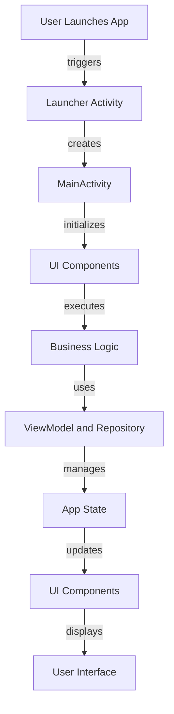

## Introduction
Native Android development using **Kotlin** and **Jetpack Compose/XML** is a powerful way to build high-performance, visually appealing applications that integrate seamlessly with the Google ecosystem. As a mobile developer, it's essential to understand the intricacies of native Android development to create apps that meet the demands of modern users. In this overview, we'll delve into the world of native Android development, exploring its core concepts, internal mechanics, and best practices.

Native Android development is crucial for several reasons:
- **Performance**: Native apps can tap into the device's hardware, providing a more responsive and efficient user experience.
- **Security**: By leveraging the Android operating system's built-in security features, developers can ensure their apps are protected from potential threats.
- **Integration**: Native apps can seamlessly integrate with other Google services, such as Google Maps, Google Drive, and Google Pay.

> **Note:** Native Android development requires a strong understanding of the Android ecosystem, including its architecture, components, and best practices.

## Core Concepts
To get started with native Android development, it's essential to understand the following core concepts:
- **Activities**: The building blocks of an Android app, responsible for handling user interactions and displaying content.
- **Fragments**: Reusable UI components that can be used to create complex, dynamic interfaces.
- **Jetpack Compose**: A modern UI framework for building native Android apps, providing a declarative, reactive programming model.
- **Kotlin**: A modern, statically typed programming language used for Android app development, offering a concise and expressive syntax.

> **Tip:** When working with Jetpack Compose, consider using the **State** and **ViewModel** classes to manage app state and business logic.

## How It Works Internally
Under the hood, native Android development involves a complex interplay of components, including:
1. **AndroidManifest.xml**: The central configuration file for an Android app, declaring its components, permissions, and features.
2. **Activity Lifecycle**: The series of events that occur during an activity's lifetime, including creation, start, resume, pause, stop, and destroy.
3. **Fragment Lifecycle**: The series of events that occur during a fragment's lifetime, including attachment, creation, start, resume, pause, stop, and detachment.

Here's a step-by-step breakdown of the Android app startup process:
1. The user launches the app, triggering the **Launcher** activity.
2. The **Launcher** activity creates an instance of the **MainActivity**.
3. The **MainActivity** initializes its UI components, including fragments and views.
4. The app's business logic is executed, using the **ViewModel** and **Repository** classes.

> **Warning:** Failing to properly manage the activity and fragment lifecycles can lead to memory leaks and other performance issues.

## Code Examples
### Example 1: Basic Activity
```kotlin
// MainActivity.kt
import androidx.appcompat.app.AppCompatActivity
import android.os.Bundle

class MainActivity : AppCompatActivity() {
    override fun onCreate(savedInstanceState: Bundle?) {
        super.onCreate(savedInstanceState)
        setContentView(R.layout.activity_main)
    }
}
```

### Example 2: Jetpack Compose UI
```kotlin
// MainActivity.kt
import androidx.activity.ComponentActivity
import androidx.activity.compose.setContent
import androidx.compose.foundation.layout.Column
import androidx.compose.foundation.layout.fillMaxSize
import androidx.compose.material.Text
import androidx.compose.runtime.Composable
import androidx.compose.ui.Modifier
import androidx.compose.ui.tooling.preview.Preview

class MainActivity : ComponentActivity() {
    override fun onCreate(savedInstanceState: Bundle?) {
        super.onCreate(savedInstanceState)
        setContent {
            MyUI()
        }
    }
}

@Composable
fun MyUI() {
    Column(modifier = Modifier.fillMaxSize()) {
        Text(text = "Hello, World!")
    }
}
```

### Example 3: Advanced Fragment Implementation
```kotlin
// MyFragment.kt
import android.os.Bundle
import android.view.LayoutInflater
import android.view.View
import android.view.ViewGroup
import androidx.fragment.app.Fragment

class MyFragment : Fragment() {
    override fun onCreateView(
        inflater: LayoutInflater,
        container: ViewGroup?,
        savedInstanceState: Bundle?
    ): View? {
        return inflater.inflate(R.layout.fragment_my, container, false)
    }

    override fun onViewCreated(view: View, savedInstanceState: Bundle?) {
        super.onViewCreated(view, savedInstanceState)
        // Initialize UI components and business logic
    }
}
```

## Visual Diagram

The diagram illustrates the high-level flow of a native Android app, from the user launching the app to the display of the user interface.

> **Note:** This diagram simplifies the complex interactions between components, but it should provide a general understanding of the app's flow.

## Comparison
| Approach | Time Complexity | Space Complexity | Pros | Cons | Best For |
| --- | --- | --- | --- | --- | --- |
| Jetpack Compose | O(1) | O(1) | Declarative, reactive, and concise | Steep learning curve | Complex, dynamic UIs |
| XML Layouts | O(n) | O(n) | Familiar, easy to use | Verbose, rigid | Simple, static UIs |
| Fragments | O(1) | O(1) | Reusable, modular | Complex lifecycle management | Complex, dynamic UIs |
| Activities | O(1) | O(1) | Simple, easy to use | Limited reuse, tight coupling | Simple, static UIs |

## Real-world Use Cases
1. **Google Maps**: Uses native Android development to provide a seamless, high-performance mapping experience.
2. **Instagram**: Leverages Jetpack Compose to create a dynamic, interactive UI for its Android app.
3. **TikTok**: Employs a combination of native Android development and cross-platform frameworks to deliver a engaging, feature-rich experience.

> **Tip:** When building complex, dynamic UIs, consider using a combination of Jetpack Compose and fragments to achieve a modular, reusable architecture.

## Common Pitfalls
1. **Memory Leaks**: Failing to properly manage activity and fragment lifecycles can lead to memory leaks.
2. **UI Thread Blocking**: Performing long-running operations on the UI thread can cause the app to become unresponsive.
3. **Incorrect Layout**: Using an incorrect layout can lead to UI issues, such as overlapping views or incorrect sizing.
4. **Inconsistent State**: Failing to properly manage app state can result in inconsistent behavior, such as incorrect data display.

> **Warning:** Ignoring these pitfalls can lead to poor app performance, crashes, and negative user reviews.

## Interview Tips
1. **What is the difference between an activity and a fragment?**
	* Weak answer: "An activity is a single screen, while a fragment is a reusable UI component."
	* Strong answer: "An activity is the entry point for an app, responsible for handling user interactions and displaying content, while a fragment is a modular, reusable UI component that can be used to create complex, dynamic interfaces."
2. **How do you manage app state in a native Android app?**
	* Weak answer: "I use a single, global variable to store app state."
	* Strong answer: "I use a combination of the **ViewModel** and **Repository** classes to manage app state, ensuring a clean, modular architecture."
3. **What is Jetpack Compose, and how does it differ from traditional XML layouts?**
	* Weak answer: "Jetpack Compose is a new way of building UIs, but I'm not sure how it differs from XML layouts."
	* Strong answer: "Jetpack Compose is a declarative, reactive UI framework that provides a concise, expressive syntax for building native Android apps, differing from traditional XML layouts in its ability to handle complex, dynamic UIs with ease."

## Key Takeaways
* Native Android development provides high-performance, visually appealing apps that integrate seamlessly with the Google ecosystem.
* **Kotlin** and **Jetpack Compose/XML** are essential tools for building native Android apps.
* Understanding the **activity** and **fragment** lifecycles is crucial for managing app state and preventing memory leaks.
* **Jetpack Compose** is a declarative, reactive UI framework that provides a concise, expressive syntax for building complex, dynamic UIs.
* Properly managing app state using the **ViewModel** and **Repository** classes is essential for a clean, modular architecture.
* Native Android development requires a strong understanding of the Android ecosystem, including its architecture, components, and best practices.