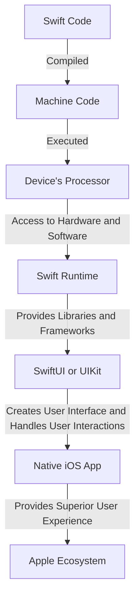

## Introduction
Native iOS development using **Swift** and **SwiftUI** or **UIKit** is the gold standard for building high-performance, visually stunning mobile applications that seamlessly integrate with the Apple ecosystem. With the rise of mobile devices, the demand for native iOS apps has never been higher. Every engineer needs to know how to build native iOS apps because it allows them to create apps that are optimized for the device's hardware and software, resulting in a superior user experience. Real-world relevance can be seen in apps like **Instagram**, **Facebook**, and **TikTok**, which all have native iOS versions that provide a rich and engaging experience for users.

> **Tip:** When building native iOS apps, it's essential to consider the app's performance, security, and user experience to ensure that it meets the high standards of the Apple App Store.

## Core Concepts
Native iOS development involves using **Swift**, a modern, high-performance language developed by Apple, and **SwiftUI** or **UIKit**, which are frameworks for building user interfaces. **Swift** provides a safe and easy-to-use syntax, while **SwiftUI** and **UIKit** provide a set of pre-built UI components and tools for creating responsive and interactive interfaces.

* **Swift**: A modern, high-performance language developed by Apple.
* **SwiftUI**: A framework for building user interfaces that provides a set of pre-built UI components and tools for creating responsive and interactive interfaces.
* **UIKit**: A framework for building user interfaces that provides a set of pre-built UI components and tools for creating responsive and interactive interfaces.

> **Note:** **Swift** is a statically typed language, which means that the data type of a variable is known at compile time, preventing type-related errors at runtime.

## How It Works Internally
When building a native iOS app, the **Swift** compiler translates the **Swift** code into machine code that can be executed by the device's processor. The **Swift** runtime provides a set of libraries and frameworks that provide access to the device's hardware and software features, such as the camera, GPS, and networking.

Here's a step-by-step breakdown of how it works:

1. **Swift** code is written and compiled into machine code.
2. The machine code is executed by the device's processor.
3. The **Swift** runtime provides access to the device's hardware and software features.
4. The **SwiftUI** or **UIKit** framework is used to create the user interface and handle user interactions.

> **Warning:** When building native iOS apps, it's essential to consider the app's performance and optimize it for the device's hardware and software to ensure a smooth user experience.

## Code Examples
### Example 1: Basic **Swift** Usage
```swift
// Import the Swift standard library
import Foundation

// Define a function that prints a message to the console
func printMessage() {
    print("Hello, World!")
}

// Call the function
printMessage()
```

### Example 2: Real-world **SwiftUI** Pattern
```swift
// Import the SwiftUI framework
import SwiftUI

// Define a view that displays a list of items
struct ListView: View {
    @State private var items: [String] = ["Item 1", "Item 2", "Item 3"]

    var body: some View {
        List {
            ForEach(items, id: \.self) { item in
                Text(item)
            }
        }
    }
}

// Create a new instance of the view
@main
struct MyApp: App {
    var body: some Scene {
        WindowGroup {
            ListView()
        }
    }
}
```

### Example 3: Advanced **UIKit** Usage
```swift
// Import the UIKit framework
import UIKit

// Define a view controller that displays a table view
class TableViewController: UIViewController {
    // Define a table view
    let tableView = UITableView()

    override func viewDidLoad() {
        super.viewDidLoad()
        // Configure the table view
        tableView.dataSource = self
        tableView.delegate = self
        view.addSubview(tableView)
    }
}

// Conform to the UITableViewDataSource protocol
extension TableViewController: UITableViewDataSource {
    func tableView(_ tableView: UITableView, numberOfRowsInSection section: Int) -> Int {
        return 10
    }

    func tableView(_ tableView: UITableView, cellForRowAt indexPath: IndexPath) -> UITableViewCell {
        let cell = UITableViewCell()
        cell.textLabel?.text = "Row \(indexPath.row)"
        return cell
    }
}

// Conform to the UITableViewDelegate protocol
extension TableViewController: UITableViewDelegate {
    func tableView(_ tableView: UITableView, didSelectRowAt indexPath: IndexPath) {
        print("Row \(indexPath.row) selected")
    }
}
```

> **Interview:** When asked about native iOS development, be prepared to discuss the benefits of using **Swift** and **SwiftUI** or **UIKit**, as well as the importance of optimizing app performance and user experience.

## Visual Diagram


The diagram illustrates the process of building a native iOS app using **Swift** and **SwiftUI** or **UIKit**. The **Swift** code is compiled into machine code, which is then executed by the device's processor. The **Swift** runtime provides access to the device's hardware and software features, and the **SwiftUI** or **UIKit** framework is used to create the user interface and handle user interactions.

## Comparison
| Framework | Time Complexity | Space Complexity | Pros | Cons | Best For |
| --- | --- | --- | --- | --- | --- |
| **SwiftUI** | O(1) | O(1) | Easy to use, declarative syntax, fast performance | Limited customization options, still evolving | Building new apps with a modern UI |
| **UIKit** | O(n) | O(n) | Highly customizable, mature framework, large community | Steeper learning curve, more verbose code | Building complex, custom UI components |
| **React Native** | O(n) | O(n) | Cross-platform, large community, fast development | Performance issues, limited access to native features | Building cross-platform apps with a web-like UI |
| **Flutter** | O(1) | O(1) | Fast performance, beautiful UI, cross-platform | Limited access to native features, still evolving | Building cross-platform apps with a modern UI |

> **Note:** The time and space complexity of the frameworks are approximate and can vary depending on the specific use case and implementation.

## Real-world Use Cases
* **Instagram**: Built using **Swift** and **SwiftUI**, Instagram provides a seamless user experience with fast performance and a modern UI.
* **Facebook**: Built using **Swift** and **UIKit**, Facebook provides a highly customizable UI with access to native features.
* **TikTok**: Built using **Swift** and **SwiftUI**, TikTok provides a fast and engaging user experience with a modern UI.

> **Tip:** When building native iOS apps, consider using **Swift** and **SwiftUI** for new apps with a modern UI, and **UIKit** for complex, custom UI components.

## Common Pitfalls
* **Not optimizing app performance**: Failing to optimize app performance can result in a slow and unresponsive user experience.
* **Not using **Swift** and **SwiftUI** or **UIKit** correctly**: Not using the frameworks correctly can result in bugs, crashes, and performance issues.
* **Not testing thoroughly**: Not testing the app thoroughly can result in bugs and issues that can affect the user experience.
* **Not following Apple's guidelines**: Not following Apple's guidelines can result in the app being rejected from the App Store.

> **Warning:** When building native iOS apps, it's essential to avoid common pitfalls by following best practices, testing thoroughly, and optimizing app performance.

## Interview Tips
* **Be prepared to discuss the benefits of using **Swift** and **SwiftUI** or **UIKit****: Be prepared to discuss the benefits of using the frameworks, including fast performance, easy-to-use syntax, and access to native features.
* **Be prepared to discuss app performance optimization**: Be prepared to discuss app performance optimization techniques, including using **Swift**'s built-in optimization features and optimizing UI components.
* **Be prepared to discuss UI design principles**: Be prepared to discuss UI design principles, including using a consistent design language, following Apple's guidelines, and creating a seamless user experience.

> **Interview:** When asked about native iOS development, be prepared to discuss the benefits of using **Swift** and **SwiftUI** or **UIKit**, as well as the importance of optimizing app performance and user experience.

## Key Takeaways
* **Use **Swift** and **SwiftUI** or **UIKit** for native iOS development**: Use the frameworks for building high-performance, visually stunning mobile applications that seamlessly integrate with the Apple ecosystem.
* **Optimize app performance**: Optimize app performance by using **Swift**'s built-in optimization features, optimizing UI components, and testing thoroughly.
* **Follow Apple's guidelines**: Follow Apple's guidelines for building native iOS apps, including using a consistent design language, following UI design principles, and creating a seamless user experience.
* **Test thoroughly**: Test the app thoroughly to ensure that it works as expected and provides a superior user experience.
* **Use **Swift**'s built-in features**: Use **Swift**'s built-in features, including **SwiftUI** and **UIKit**, to build fast and engaging user interfaces.
* **Consider cross-platform development**: Consider cross-platform development using frameworks like **React Native** or **Flutter** for building apps that need to run on multiple platforms.