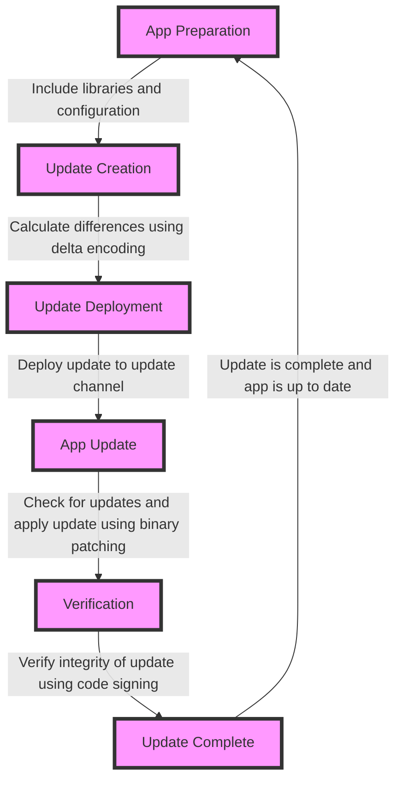

## Introduction
Over-the-air (OTA) updates are a crucial feature in mobile app development, enabling developers to update their apps without requiring users to download and install a new version from the app store. This feature is particularly important in the mobile development industry, where apps are frequently updated to fix bugs, add new features, or improve performance. In this section, we will explore the importance of OTA updates, their real-world relevance, and why every engineer needs to know about them. 
> **Note:** OTA updates are not limited to mobile apps; they can also be used in other areas, such as firmware updates for IoT devices or software updates for cars.

## Core Concepts
To understand OTA updates, it's essential to grasp the following core concepts:
* **Delta encoding**: a technique used to reduce the size of updates by only sending the differences between the old and new versions of the app.
* **Binary patching**: a method of applying updates to an app's binary code, which can be more efficient than updating the entire app.
* **Code signing**: a process of digitally signing an app's code to ensure its authenticity and integrity.
* **Update channels**: a way to manage different versions of an app, such as beta, staging, and production.
> **Tip:** Using delta encoding and binary patching can significantly reduce the size of updates, making them faster and more efficient.

## How It Works Internally
The process of OTA updates involves several steps:
1. **App preparation**: the app is prepared for OTA updates by including the necessary libraries and configuration.
2. **Update creation**: a new version of the app is created, and the differences between the old and new versions are calculated using delta encoding.
3. **Update deployment**: the update is deployed to the update channel, which can be a cloud-based service or a custom solution.
4. **App update**: the app checks for updates and applies the update using binary patching.
5. **Verification**: the app verifies the integrity of the update using code signing.

## Code Examples
Here are three complete and runnable examples of OTA updates using Expo EAS Update and CodePush:
### Example 1: Basic Usage with Expo EAS Update
```javascript
// Import the necessary libraries
import { Updates } from 'expo';

// Check for updates
async function checkForUpdates() {
  const update = await Updates.checkForUpdateAsync();
  if (update.isAvailable) {
    // Download and apply the update
    await Updates.fetchUpdateAsync();
    await Updates.applyUpdateAsync();
  }
}

// Call the function to check for updates
checkForUpdates();
```
### Example 2: Real-World Pattern with CodePush
```typescript
// Import the necessary libraries
import * as CodePush from 'react-native-code-push';

// Define the update configuration
const codePushOptions = {
  checkFrequency: CodePush.CheckFrequency.ON_APP_START,
  installMode: CodePush.InstallMode.IMMEDIATE,
};

// Initialize CodePush
CodePush.initialize(codePushOptions);

// Check for updates
CodePush.sync({
  updateDialog: true,
  installMode: CodePush.InstallMode.IMMEDIATE,
}, (status) => {
  switch (status) {
    case CodePush.SyncStatus.CHECKING_FOR_UPDATE:
      console.log('Checking for update...');
      break;
    case CodePush.SyncStatus.DOWNLOADING_PACKAGE:
      console.log('Downloading package...');
      break;
    case CodePush.SyncStatus.INSTALLING_UPDATE:
      console.log('Installing update...');
      break;
    case CodePush.SyncStatus.UP_TO_DATE:
      console.log('Up to date!');
      break;
    case CodePush.SyncStatus.UPDATE_INSTALLED:
      console.log('Update installed!');
      break;
  }
});
```
### Example 3: Advanced Usage with Custom Update Channels
```java
// Import the necessary libraries
import io.github.code29.codepush.client.CodePushClient;
import io.github.code29.codepush.client.Update;

// Define the custom update channel
String updateChannel = "my-custom-channel";

// Initialize the CodePush client
CodePushClient client = new CodePushClient(updateChannel);

// Check for updates
client.checkForUpdate(new CodePushClient.CheckForUpdateCallback() {
  @Override
  public void onUpdateAvailable(Update update) {
    // Download and apply the update
    client.downloadUpdate(update);
    client.applyUpdate(update);
  }

  @Override
  public void onUpdateNotFound() {
    // Handle the case where no update is found
  }

  @Override
  public void onError(Throwable throwable) {
    // Handle any errors that occur during the update process
  }
});
```
> **Interview:** Can you explain the difference between delta encoding and binary patching? How do they relate to OTA updates?

## Visual Diagram

The diagram illustrates the process of OTA updates, from app preparation to verification. Each step is connected to the next, showing how the update is created, deployed, and applied to the app.

## Comparison
| Approach | Time Complexity | Space Complexity | Pros | Cons | Best For |
|----------|----------------|-----------------|------|------|----------|
| Delta Encoding | O(n) | O(n) | Reduces update size, faster updates | More complex to implement | Small to medium-sized updates |
| Binary Patching | O(n) | O(n) | Efficient, fast updates | More complex to implement | Large updates or updates with many changes |
| Code Signing | O(1) | O(1) | Ensures authenticity and integrity | Can be slow for large updates | All updates, especially those with sensitive data |
| Update Channels | O(1) | O(1) | Easy to manage different versions | Can be complex to set up | Large-scale apps with multiple versions |

## Real-world Use Cases
1. **Facebook**: uses OTA updates to update their mobile app, ensuring that users have the latest features and bug fixes.
2. **Uber**: uses CodePush to update their mobile app, allowing them to quickly deploy new features and fixes.
3. **Microsoft**: uses CodePush to update their Office mobile app, ensuring that users have the latest features and security patches.
> **Warning:** Failing to properly test and verify updates can lead to crashes, bugs, or security vulnerabilities.

## Common Pitfalls
1. **Incorrect update configuration**: failing to properly configure the update channel or update settings can lead to updates not being applied correctly.
2. **Insufficient testing**: not thoroughly testing updates can lead to bugs or crashes.
3. **Inadequate code signing**: failing to properly sign updates can lead to security vulnerabilities.
4. **Inconsistent update deployment**: deploying updates inconsistently can lead to confusion and errors.
> **Tip:** Use a staging environment to test updates before deploying them to production.

## Interview Tips
1. **What is delta encoding, and how does it relate to OTA updates?**: a strong answer should explain the concept of delta encoding and how it reduces update size.
2. **How do you handle errors during the update process?**: a strong answer should explain how to handle errors, such as using try-catch blocks and logging.
3. **What is the difference between binary patching and code signing?**: a strong answer should explain the difference between the two and how they relate to OTA updates.
> **Interview:** Can you explain the trade-offs between using delta encoding and binary patching?

## Key Takeaways
* OTA updates are essential for mobile app development, enabling developers to update their apps without requiring users to download and install a new version.
* Delta encoding and binary patching are techniques used to reduce update size and improve update efficiency.
* Code signing ensures the authenticity and integrity of updates.
* Update channels enable developers to manage different versions of their app.
* Proper testing and verification are crucial to ensure updates are applied correctly and do not introduce bugs or security vulnerabilities.
* Common pitfalls include incorrect update configuration, insufficient testing, inadequate code signing, and inconsistent update deployment.
> **Note:** OTA updates are not limited to mobile apps; they can also be used in other areas, such as firmware updates for IoT devices or software updates for cars.