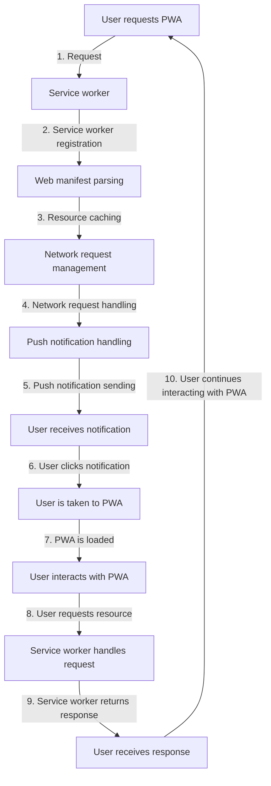

## Introduction
A **Progressive Web App (PWA)** is a web application that uses modern web technologies to provide a native-like experience to users. It is designed to take advantage of the features of modern web browsers and devices, while also providing a seamless and engaging user experience. PWAs are built using standard web technologies such as HTML, CSS, and JavaScript, but they also include additional features such as offline support, push notifications, and home screen installation. 
> **Note:** PWAs are not a replacement for native apps, but rather a way to provide a native-like experience to web users.

PWAs matter because they can provide a number of benefits to users and developers, including:
* **Offline support**: PWAs can function even when the user is offline or has a slow internet connection.
* **Push notifications**: PWAs can send push notifications to users, even when the app is not running.
* **Home screen installation**: PWAs can be installed on the user's home screen, providing a native-like experience.
* **Fast and seamless experience**: PWAs can provide a fast and seamless experience, similar to native apps.

In real-world scenarios, PWAs are used by companies such as Twitter, Forbes, and The Washington Post to provide a native-like experience to their users. For example, Twitter's PWA allows users to access their timeline and send tweets even when they are offline.

## Core Concepts
The core concepts of PWAs include:
* **Service workers**: A service worker is a script that runs in the background, allowing the PWA to manage network requests and cache resources.
* **Web manifest**: A web manifest is a JSON file that provides metadata about the PWA, such as its name, description, and icons.
* **Responsive design**: Responsive design is the practice of designing web applications to adapt to different screen sizes and devices.
* **Offline support**: Offline support is the ability of a PWA to function even when the user is offline or has a slow internet connection.

> **Tip:** To build a PWA, you should start by creating a service worker and a web manifest, and then add responsive design and offline support features.

## How It Works Internally
A PWA works internally by using a combination of web technologies and device features. Here is a step-by-step breakdown of how it works:
1. **Service worker registration**: The PWA registers a service worker, which is a script that runs in the background.
2. **Web manifest parsing**: The PWA parses the web manifest, which provides metadata about the PWA.
3. **Resource caching**: The PWA caches resources such as images and scripts, allowing it to function offline.
4. **Network request management**: The PWA manages network requests, allowing it to handle requests even when the user is offline.
5. **Push notification handling**: The PWA handles push notifications, allowing it to send notifications to the user even when the app is not running.

> **Warning:** One common mistake when building PWAs is to forget to register the service worker, which can prevent the PWA from functioning offline.

## Code Examples
Here are three complete and runnable code examples that demonstrate how to build a PWA:
### Example 1: Basic PWA
```javascript
// Register the service worker
navigator.serviceWorker.register('sw.js')
  .then(registration => {
    console.log('Service worker registered');
  })
  .catch(error => {
    console.error('Error registering service worker:', error);
  });

// Parse the web manifest
fetch('manifest.json')
  .then(response => response.json())
  .then(manifest => {
    console.log('Web manifest parsed:', manifest);
  })
  .catch(error => {
    console.error('Error parsing web manifest:', error);
  });
```

### Example 2: PWA with Offline Support
```javascript
// Register the service worker
navigator.serviceWorker.register('sw.js')
  .then(registration => {
    console.log('Service worker registered');
  })
  .catch(error => {
    console.error('Error registering service worker:', error);
  });

// Cache resources
self.addEventListener('install', event => {
  event.waitUntil(
    caches.open('cache')
      .then(cache => {
        return cache.addAll([
          'index.html',
          'style.css',
          'script.js'
        ]);
      })
  );
});

// Handle network requests
self.addEventListener('fetch', event => {
  event.respondWith(
    caches.match(event.request)
      .then(response => {
        return response || fetch(event.request);
      })
  );
});
```

### Example 3: PWA with Push Notifications
```javascript
// Register the service worker
navigator.serviceWorker.register('sw.js')
  .then(registration => {
    console.log('Service worker registered');
  })
  .catch(error => {
    console.error('Error registering service worker:', error);
  });

// Handle push notifications
self.addEventListener('push', event => {
  const notification = event.data.json();
  self.registration.showNotification(notification.title, {
    body: notification.body,
    icon: notification.icon
  });
});

// Handle notification clicks
self.addEventListener('notificationclick', event => {
  event.notification.close();
  event.waitUntil(
    clients.openWindow('https://example.com')
  );
});
```

## Visual Diagram

This diagram illustrates the flow of a PWA, from the user requesting the PWA to the user interacting with the PWA.

## Comparison
Here is a comparison of different approaches to building web applications:
| Approach | Time Complexity | Space Complexity | Pros | Cons | Best For |
| --- | --- | --- | --- | --- | --- |
| PWA | O(n) | O(n) | Fast and seamless experience, offline support, push notifications | Requires service worker and web manifest | Web applications that require a native-like experience |
| Responsive Web App | O(n) | O(n) | Fast and seamless experience, adaptable to different screen sizes | Does not provide offline support or push notifications | Web applications that do not require offline support or push notifications |
| Native App | O(1) | O(1) | Fast and seamless experience, offline support, push notifications | Requires native code and platform-specific development | Web applications that require a high level of performance and native features |
| Hybrid App | O(n) | O(n) | Fast and seamless experience, adaptable to different screen sizes, offline support | Requires native code and platform-specific development | Web applications that require a high level of performance and native features, but also need to be adaptable to different screen sizes |

> **Interview:** What is the difference between a PWA and a native app? A PWA is a web application that provides a native-like experience, while a native app is an application that is built using native code and platform-specific development.

## Real-world Use Cases
Here are three real-world use cases for PWAs:
* **Twitter**: Twitter's PWA allows users to access their timeline and send tweets even when they are offline.
* **Forbes**: Forbes' PWA provides a fast and seamless experience, with offline support and push notifications.
* **The Washington Post**: The Washington Post's PWA provides a native-like experience, with offline support and push notifications.

## Common Pitfalls
Here are four common pitfalls when building PWAs:
* **Forgetting to register the service worker**: This can prevent the PWA from functioning offline.
* **Not caching resources**: This can prevent the PWA from functioning offline.
* **Not handling network requests**: This can prevent the PWA from functioning offline.
* **Not handling push notifications**: This can prevent the PWA from sending notifications to the user.

> **Tip:** To avoid these pitfalls, make sure to register the service worker, cache resources, handle network requests, and handle push notifications.

## Interview Tips
Here are three common interview questions for PWAs:
* **What is the difference between a PWA and a native app?**: A PWA is a web application that provides a native-like experience, while a native app is an application that is built using native code and platform-specific development.
* **How do you handle offline support in a PWA?**: You can handle offline support by caching resources and handling network requests.
* **How do you handle push notifications in a PWA?**: You can handle push notifications by using the Push API and handling notification clicks.

> **Warning:** Make sure to explain the differences between PWAs and native apps, and how to handle offline support and push notifications.

## Key Takeaways
Here are ten key takeaways for PWAs:
* **PWAs provide a native-like experience**: PWAs can provide a fast and seamless experience, similar to native apps.
* **PWAs require a service worker and web manifest**: PWAs require a service worker and web manifest to function.
* **PWAs can handle offline support**: PWAs can handle offline support by caching resources and handling network requests.
* **PWAs can handle push notifications**: PWAs can handle push notifications using the Push API and handling notification clicks.
* **PWAs are built using web technologies**: PWAs are built using web technologies such as HTML, CSS, and JavaScript.
* **PWAs are adaptable to different screen sizes**: PWAs are adaptable to different screen sizes, making them suitable for a wide range of devices.
* **PWAs can provide a high level of performance**: PWAs can provide a high level of performance, similar to native apps.
* **PWAs require a high level of security**: PWAs require a high level of security, including HTTPS and secure storage.
* **PWAs can be installed on the home screen**: PWAs can be installed on the home screen, providing a native-like experience.
* **PWAs can be used for a wide range of applications**: PWAs can be used for a wide range of applications, including social media, news, and entertainment.