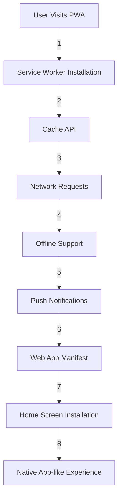

## Introduction
Progressive Web Apps (PWAs) are web applications that provide a native app-like experience to users. They are built using web technologies such as HTML, CSS, and JavaScript, and are designed to work across multiple platforms, including desktop, mobile, and tablet devices. PWAs are characterized by their ability to provide a seamless and engaging user experience, with features such as offline support, push notifications, and home screen installation. In this article, we will explore the core concepts of PWAs, including Service Workers and Web App Manifest, and provide code examples, real-world use cases, and common pitfalls to watch out for.

> **Note:** PWAs are not just limited to mobile devices, but can also be used on desktop devices, providing a consistent and engaging user experience across all platforms.

## Core Concepts
PWAs are built on top of several core concepts, including:

* **Service Workers**: A Service Worker is a script that runs in the background, allowing a web app to manage network requests, cache resources, and provide offline support. Service Workers are the backbone of PWAs, providing the necessary infrastructure for offline support, push notifications, and other features.
* **Web App Manifest**: A Web App Manifest is a JSON file that provides metadata about a web app, including its name, description, icons, and launch URL. The manifest file is used by browsers to provide a native app-like experience, including home screen installation and push notifications.
* **Cache API**: The Cache API is a JavaScript API that provides a way to cache resources, such as images, scripts, and stylesheets, allowing a web app to provide offline support.
* **Push API**: The Push API is a JavaScript API that provides a way to receive push notifications, allowing a web app to notify users of updates, messages, or other events.

> **Warning:** Service Workers can be complex to implement, and require careful consideration of caching, offline support, and push notifications.

## How It Works Internally
Here's a step-by-step overview of how PWAs work internally:

1. **Service Worker Installation**: When a user visits a PWA for the first time, the browser installs a Service Worker in the background.
2. **Cache API**: The Service Worker uses the Cache API to cache resources, such as images, scripts, and stylesheets.
3. **Network Requests**: When the user makes a network request, the Service Worker intercepts the request and checks if the resource is cached.
4. **Offline Support**: If the resource is cached, the Service Worker returns the cached resource, providing offline support.
5. **Push Notifications**: The Service Worker can also receive push notifications, allowing the web app to notify users of updates, messages, or other events.

> **Tip:** Use the Cache API to cache resources, and the Push API to receive push notifications.

## Code Examples
Here are three complete and runnable code examples, demonstrating basic, intermediate, and advanced usage of PWAs:

### Example 1: Basic Service Worker
```javascript
// Register the Service Worker
navigator.serviceWorker.register('sw.js')
  .then(registration => {
    console.log('Service Worker registered');
  })
  .catch(error => {
    console.error('Service Worker registration failed:', error);
  });
```

```javascript
// sw.js
self.addEventListener('install', event => {
  event.waitUntil(
    caches.open('my-cache')
      .then(cache => {
        return cache.addAll([
          '/index.html',
          '/styles.css',
          '/script.js'
        ]);
      })
  );
});
```

### Example 2: Intermediate Cache API
```javascript
// Use the Cache API to cache resources
caches.open('my-cache')
  .then(cache => {
    return cache.addAll([
      '/image1.jpg',
      '/image2.jpg',
      '/script.js'
    ]);
  })
  .then(() => {
    console.log('Resources cached');
  })
  .catch(error => {
    console.error('Caching failed:', error);
  });
```

### Example 3: Advanced Push Notifications
```javascript
// Use the Push API to receive push notifications
navigator.serviceWorker.getRegistration()
  .then(registration => {
    return registration.pushManager.subscribe({
      userVisibleOnly: true,
      applicationServerKey: 'your-public-key'
    });
  })
  .then(subscription => {
    console.log('Push subscription:', subscription);
  })
  .catch(error => {
    console.error('Push subscription failed:', error);
  });
```

## Visual Diagram

The diagram illustrates the flow of a PWA, from the user visiting the site, to the Service Worker installation, caching, offline support, push notifications, and finally, the native app-like experience.

## Comparison
Here's a comparison of PWAs with other technologies:

| Technology | Time Complexity | Space Complexity | Pros | Cons | Best For |
| --- | --- | --- | --- | --- | --- |
| PWAs | O(1) | O(n) | Offline support, push notifications, home screen installation | Complex implementation, limited browser support | Mobile devices, offline support |
| Native Apps | O(n) | O(n) | Native performance, offline support, push notifications | Complex implementation, platform-specific | Desktop devices, native performance |
| Hybrid Apps | O(n) | O(n) | Cross-platform support, offline support, push notifications | Limited native performance, complex implementation | Cross-platform development, offline support |
| Web Apps | O(1) | O(1) | Easy implementation, cross-platform support | Limited offline support, no push notifications | Desktop devices, simple web apps |

## Real-world Use Cases
Here are three real-world use cases of PWAs:

* **Twitter**: Twitter's PWA provides offline support, push notifications, and home screen installation, making it a seamless and engaging user experience.
* **The Washington Post**: The Washington Post's PWA provides offline support, push notifications, and home screen installation, making it a great example of a PWA in action.
* **Forbes**: Forbes' PWA provides offline support, push notifications, and home screen installation, making it a great example of a PWA in the publishing industry.

## Common Pitfalls
Here are four common pitfalls to watch out for when implementing PWAs:

* **Incorrect Service Worker Installation**: Make sure to register the Service Worker correctly, and handle any errors that may occur.
* **Insufficient Caching**: Make sure to cache resources correctly, and handle any errors that may occur.
* **Incorrect Push Notification Handling**: Make sure to handle push notifications correctly, and handle any errors that may occur.
* **Inadequate Error Handling**: Make sure to handle errors correctly, and provide a seamless and engaging user experience.

> **Interview:** What are some common pitfalls to watch out for when implementing PWAs? How would you handle errors and provide a seamless user experience?

## Interview Tips
Here are three common interview questions and answers for PWAs:

* **What is a Service Worker?**: A Service Worker is a script that runs in the background, allowing a web app to manage network requests, cache resources, and provide offline support.
* **How do you implement offline support in a PWA?**: You can implement offline support in a PWA by using the Cache API to cache resources, and handling network requests in the Service Worker.
* **How do you handle push notifications in a PWA?**: You can handle push notifications in a PWA by using the Push API to receive push notifications, and handling any errors that may occur.

## Key Takeaways
Here are ten key takeaways for PWAs:

* PWAs provide a native app-like experience, with features such as offline support, push notifications, and home screen installation.
* Service Workers are the backbone of PWAs, providing the necessary infrastructure for offline support, push notifications, and other features.
* The Cache API provides a way to cache resources, allowing a web app to provide offline support.
* The Push API provides a way to receive push notifications, allowing a web app to notify users of updates, messages, or other events.
* PWAs can be complex to implement, requiring careful consideration of caching, offline support, and push notifications.
* PWAs are best suited for mobile devices, providing a seamless and engaging user experience.
* PWAs can be used for cross-platform development, providing a consistent and engaging user experience across all platforms.
* PWAs require careful consideration of error handling, providing a seamless and engaging user experience.
* PWAs can be used for a variety of use cases, including news, social media, and e-commerce.
* PWAs are the future of web development, providing a native app-like experience, with features such as offline support, push notifications, and home screen installation.