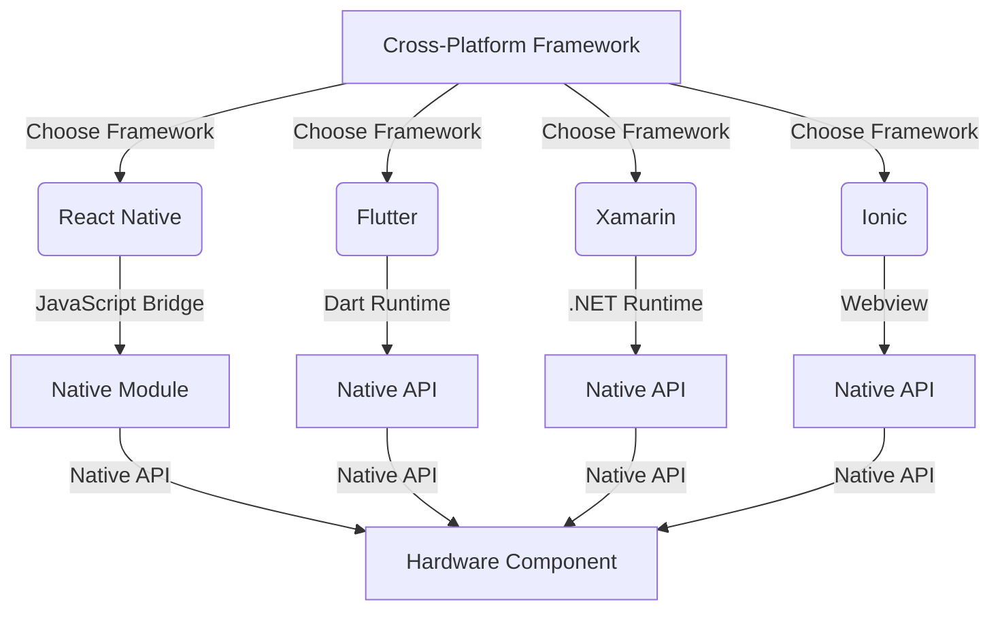

## Introduction
Cross-platform frameworks have revolutionized the way we develop mobile applications. With the rise of mobile devices, companies need to deploy their applications on multiple platforms, including iOS and Android. **React Native**, **Flutter**, **Xamarin**, and **Ionic** are four popular cross-platform frameworks that enable developers to build native-like applications using a single codebase. In this article, we will delve into the world of cross-platform development, exploring the core concepts, internal workings, and code examples of each framework.

## Core Concepts
Before diving into the details of each framework, it's essential to understand the core concepts of cross-platform development. **Cross-compilation** is the process of compiling code written in one language into native code for another platform. **Hybrid applications** use a combination of native and web technologies to build mobile applications. **Native modules** are platform-specific code that can be used to access native APIs and hardware components.

> **Note:** Cross-platform frameworks are not a one-size-fits-all solution. Each framework has its strengths and weaknesses, and the choice of framework depends on the project's requirements and the development team's expertise.

## How It Works Internally
Let's take a look at how each framework works internally:

* **React Native**: Uses a **JavaScript bridge** to communicate between the JavaScript code and the native platform. The bridge allows JavaScript code to call native modules and access native APIs.
* **Flutter**: Uses a **Dart runtime** to execute Dart code on the mobile device. The Dart runtime provides a platform-agnostic way to access native APIs and hardware components.
* **Xamarin**: Uses a **.NET runtime** to execute C# code on the mobile device. The .NET runtime provides a platform-agnostic way to access native APIs and hardware components.
* **Ionic**: Uses a **Webview** to render web pages on the mobile device. The Webview provides a platform-agnostic way to access native APIs and hardware components using JavaScript and HTML/CSS.

## Code Examples
Here are three complete and runnable code examples for each framework:

### React Native Example 1: Basic "Hello World" Application
```javascript
import React from 'react';
import { AppRegistry, Text, View } from 'react-native';

const App = () => {
  return (
    <View>
      <Text>Hello World!</Text>
    </View>
  );
};

AppRegistry.registerComponent('App', () => App);
```

### Flutter Example 2: Real-World Pattern - Todo List Application
```dart
import 'package:flutter/material.dart';

void main() {
  runApp(MyApp());
}

class MyApp extends StatelessWidget {
  @override
  Widget build(BuildContext context) {
    return MaterialApp(
      title: 'Todo List',
      home: TodoList(),
    );
  }
}

class TodoList extends StatefulWidget {
  @override
  _TodoListState createState() => _TodoListState();
}

class _TodoListState extends State<TodoList> {
  List<String> _todos = [];

  void _addTodo() {
    setState(() {
      _todos.add('New Todo');
    });
  }

  @override
  Widget build(BuildContext context) {
    return Scaffold(
      appBar: AppBar(
        title: Text('Todo List'),
      ),
      body: ListView.builder(
        itemCount: _todos.length,
        itemBuilder: (context, index) {
          return ListTile(
            title: Text(_todos[index]),
          );
        },
      ),
      floatingActionButton: FloatingActionButton(
        onPressed: _addTodo,
        tooltip: 'Add Todo',
        child: Icon(Icons.add),
      ),
    );
  }
}
```

### Xamarin Example 3: Advanced Usage - Native Module Integration
```csharp
using Xamarin.Forms;
using Xamarin.Forms.Xaml;

namespace XamarinExample
{
    public class MainPage : ContentPage
    {
        public MainPage()
        {
            var button = new Button
            {
                Text = "Click me!"
            };

            button.Clicked += async (sender, args) =>
            {
                await Navigation.PushAsync(new NativeModulePage());
            };

            Content = new StackLayout
            {
                Children = { button }
            };
        }
    }

    public class NativeModulePage : ContentPage
    {
        public NativeModulePage()
        {
            var nativeModule = new NativeModule();
            var result = nativeModule.InvokeNativeMethod();

            Content = new Label
            {
                Text = result
            };
        }
    }

    public class NativeModule
    {
        [DllImport("native_module")]
        private static extern string InvokeNativeMethod();

        public string InvokeNativeMethod()
        {
            return InvokeNativeMethod();
        }
    }
}
```

## Visual Diagram

The diagram illustrates the different cross-platform frameworks and how they interact with native modules and hardware components.

## Comparison
| Framework | Time Complexity | Space Complexity | Pros | Cons | Best For |
| --- | --- | --- | --- | --- | --- |
| React Native | O(1) | O(n) | Fast development, large community | Limited native module support, JavaScript bridge overhead | Rapid prototyping, small to medium-sized applications |
| Flutter | O(1) | O(n) | Fast development, beautiful UI | Steep learning curve, limited native module support | Rapid prototyping, small to medium-sized applications |
| Xamarin | O(1) | O(n) | Native performance, shared codebase | Complex setup, limited cross-platform support | Large-scale, complex applications |
| Ionic | O(1) | O(n) | Fast development, web technologies | Limited native module support, webview overhead | Rapid prototyping, small to medium-sized applications |

> **Warning:** Choosing the wrong framework can lead to performance issues, limited native module support, and increased development time.

## Real-world Use Cases
Here are three real-world use cases for each framework:

* **React Native**: Facebook, Instagram, and Walmart use React Native for their mobile applications.
* **Flutter**: Google, Alibaba, and Tencent use Flutter for their mobile applications.
* **Xamarin**: Microsoft, IBM, and SAP use Xamarin for their mobile applications.
* **Ionic**: Amazon, Cisco, and IBM use Ionic for their mobile applications.

## Common Pitfalls
Here are four common pitfalls to watch out for when using cross-platform frameworks:

* **Incorrect native module usage**: Failing to use native modules correctly can lead to performance issues and crashes.
* **Insufficient testing**: Failing to test cross-platform applications thoroughly can lead to bugs and performance issues.
* **Inadequate optimization**: Failing to optimize cross-platform applications can lead to performance issues and battery drain.
* **Incorrect framework choice**: Choosing the wrong framework can lead to performance issues, limited native module support, and increased development time.

> **Tip:** Use a framework-agnostic approach to development to minimize the risk of framework-specific issues.

## Interview Tips
Here are three common interview questions for cross-platform development:

* **What is the difference between React Native and Flutter?**: A strong answer should highlight the differences in architecture, performance, and ecosystem.
* **How do you optimize cross-platform applications?**: A strong answer should discuss techniques such as code splitting, caching, and native module optimization.
* **What are the advantages and disadvantages of using Xamarin?**: A strong answer should discuss the advantages of native performance and shared codebase, as well as the disadvantages of complex setup and limited cross-platform support.

## Key Takeaways
Here are ten key takeaways to remember when using cross-platform frameworks:

* **Choose the right framework**: Select a framework that aligns with your project's requirements and development team's expertise.
* **Understand native modules**: Use native modules correctly to access native APIs and hardware components.
* **Optimize applications**: Optimize cross-platform applications for performance, battery life, and user experience.
* **Test thoroughly**: Test cross-platform applications thoroughly to ensure bug-free and high-quality code.
* **Use a framework-agnostic approach**: Use a framework-agnostic approach to development to minimize the risk of framework-specific issues.
* **Consider performance**: Consider performance when choosing a framework and optimizing applications.
* **Use caching and code splitting**: Use caching and code splitting to improve application performance.
* **Monitor battery life**: Monitor battery life to ensure cross-platform applications are optimized for power consumption.
* **Stay up-to-date**: Stay up-to-date with the latest framework releases, updates, and best practices.
* **Join online communities**: Join online communities to connect with other developers, share knowledge, and learn from their experiences.