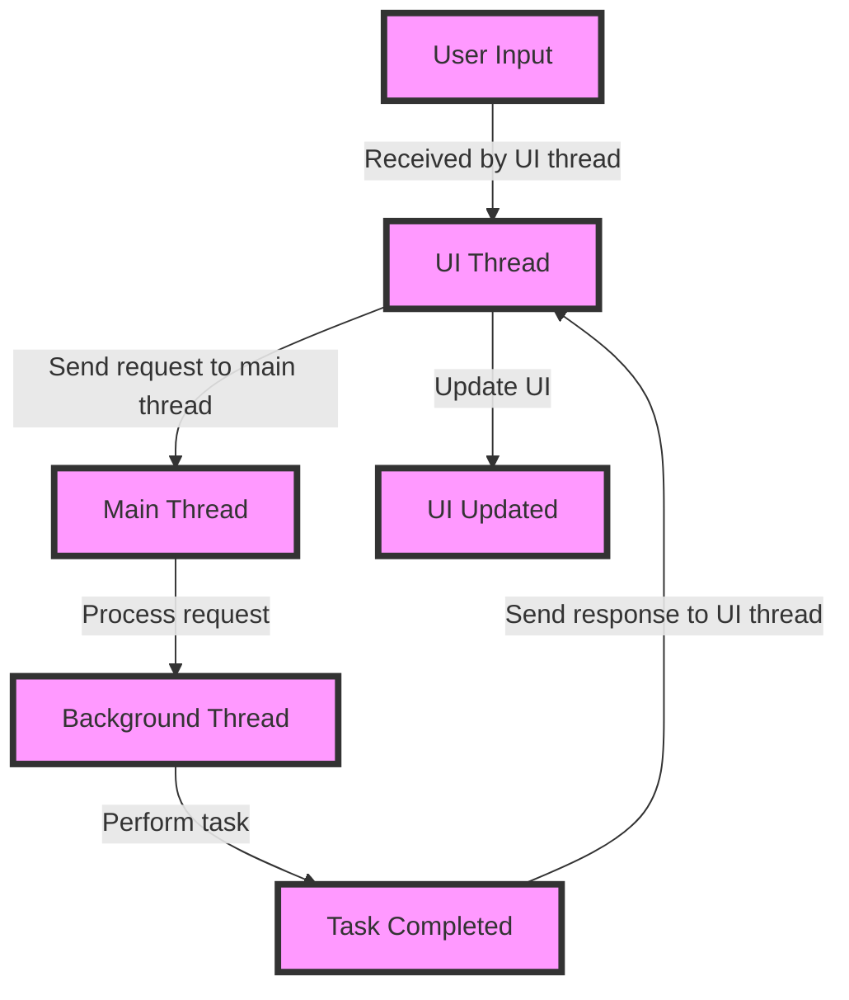

## Introduction
App performance optimization is the process of improving the speed, efficiency, and overall user experience of a mobile application. In today's competitive market, a well-performing app can make all the difference in retaining users and driving revenue. **Poorly optimized apps**, on the other hand, can lead to frustrated users, negative reviews, and ultimately, a loss of business. As a mobile developer, it's essential to understand the importance of app performance optimization and how to implement it in your development workflow. > **Note:** A study by Google found that 53% of mobile users will abandon a site if it takes more than 3 seconds to load.

## Core Concepts
To optimize app performance, you need to understand the following core concepts:
* **Latency**: The time it takes for an app to respond to user input. **Optimizing latency** involves reducing the time it takes for an app to process user input and display the result.
* **Throughput**: The amount of data an app can process in a given time. **Improving throughput** involves increasing the amount of data an app can process without sacrificing performance.
* **Memory usage**: The amount of memory an app uses to store data. **Reducing memory usage** involves minimizing the amount of memory an app uses to store data without sacrificing performance.
* **CPU usage**: The amount of CPU an app uses to process data. **Reducing CPU usage** involves minimizing the amount of CPU an app uses to process data without sacrificing performance.
> **Tip:** Use tools like Android Studio's **Profiler** or Xcode's **Instruments** to monitor and analyze your app's performance.

## How It Works Internally
When a user interacts with an app, the following steps occur:
1. The user's input is received by the app's **UI thread**.
2. The UI thread processes the input and sends a request to the **main thread**.
3. The main thread processes the request and sends a response back to the UI thread.
4. The UI thread receives the response and updates the app's UI.
To optimize app performance, you need to understand how these steps work internally and how to improve them. For example, you can use **asynchronous programming** to offload tasks from the main thread to a background thread, reducing the load on the main thread and improving responsiveness. > **Warning:** Using too many background threads can lead to **thread contention**, which can negatively impact performance.

## Code Examples
### Example 1: Basic Asynchronous Programming
```java
// Create a background thread to perform a task
Thread thread = new Thread(new Runnable() {
    @Override
    public void run() {
        // Perform the task
        System.out.println("Task completed");
    }
});
// Start the thread
thread.start();
```
### Example 2: Using a ThreadPoolExecutor
```java
// Create a ThreadPoolExecutor to manage a pool of threads
ThreadPoolExecutor executor = new ThreadPoolExecutor(5, 10, 1, TimeUnit.MINUTES, new LinkedBlockingQueue<Runnable>());
// Submit a task to the executor
executor.execute(new Runnable() {
    @Override
    public void run() {
        // Perform the task
        System.out.println("Task completed");
    }
});
```
### Example 3: Using Coroutines
```kotlin
// Create a coroutine to perform a task
CoroutineScope(Dispatchers.IO).launch {
    // Perform the task
    println("Task completed")
}
```
> **Interview:** Can you explain the difference between asynchronous programming and parallel processing? How would you implement asynchronous programming in a mobile app?

## Visual Diagram

This diagram illustrates the flow of user input through an app's UI thread, main thread, and background thread. > **Note:** The diagram shows a simplified example of how an app processes user input. In a real-world app, there may be additional threads and processes involved.

## Comparison
| Approach | Time Complexity | Space Complexity | Pros | Cons | Best For |
|----------|----------------|-----------------|------|------|----------|
| Asynchronous Programming | O(1) | O(1) | Improves responsiveness, reduces latency | Can be complex to implement | Real-time apps, games |
| ThreadPoolExecutor | O(1) | O(n) | Improves throughput, reduces CPU usage | Can lead to thread contention | Data-intensive apps, background tasks |
| Coroutines | O(1) | O(1) | Improves responsiveness, reduces latency | Can be complex to implement | Real-time apps, games |
| Parallel Processing | O(n) | O(n) | Improves throughput, reduces CPU usage | Can lead to thread contention | Data-intensive apps, scientific simulations |
> **Tip:** Choose the approach that best fits your app's requirements. Consider factors like responsiveness, throughput, and CPU usage when making your decision.

## Real-world Use Cases
* **Uber**: Uses asynchronous programming to improve responsiveness and reduce latency in their app.
* **Facebook**: Uses a combination of asynchronous programming and parallel processing to improve throughput and reduce CPU usage in their app.
* **Google Maps**: Uses coroutines to improve responsiveness and reduce latency in their app.
> **Note:** These examples illustrate how real-world companies have used app performance optimization techniques to improve their apps.

## Common Pitfalls
* **Overusing background threads**: Can lead to thread contention and negatively impact performance.
* **Not using asynchronous programming**: Can lead to poor responsiveness and increased latency.
* **Not optimizing memory usage**: Can lead to increased memory usage and negatively impact performance.
* **Not monitoring app performance**: Can lead to unknown performance issues and negatively impact user experience.
> **Warning:** Failing to monitor app performance can lead to unknown issues and negatively impact user experience.

## Interview Tips
* **What is the difference between asynchronous programming and parallel processing?**: Asynchronous programming is used to improve responsiveness and reduce latency, while parallel processing is used to improve throughput and reduce CPU usage.
* **How would you implement asynchronous programming in a mobile app?**: Use a combination of threads, ThreadPoolExecutor, and coroutines to improve responsiveness and reduce latency.
* **What are some common pitfalls to avoid when optimizing app performance?**: Overusing background threads, not using asynchronous programming, not optimizing memory usage, and not monitoring app performance.
> **Interview:** Can you explain the importance of app performance optimization and how you would implement it in a mobile app?

## Key Takeaways
* **Optimize latency**: Reduce the time it takes for an app to respond to user input.
* **Improve throughput**: Increase the amount of data an app can process without sacrificing performance.
* **Reduce memory usage**: Minimize the amount of memory an app uses to store data without sacrificing performance.
* **Reduce CPU usage**: Minimize the amount of CPU an app uses to process data without sacrificing performance.
* **Use asynchronous programming**: Improve responsiveness and reduce latency by offloading tasks to background threads.
* **Use ThreadPoolExecutor**: Improve throughput and reduce CPU usage by managing a pool of threads.
* **Use coroutines**: Improve responsiveness and reduce latency by using lightweight threads.
* **Monitor app performance**: Use tools like Android Studio's **Profiler** or Xcode's **Instruments** to monitor and analyze app performance.
* **Avoid common pitfalls**: Overusing background threads, not using asynchronous programming, not optimizing memory usage, and not monitoring app performance.
> **Tip:** Remember to always monitor and analyze your app's performance to identify areas for improvement.