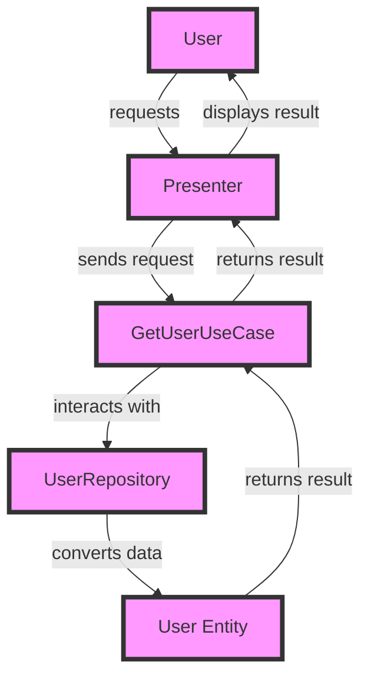

## Introduction
**Clean Architecture** is a software design pattern that separates the application's business logic from its infrastructure and presentation layers. In the context of mobile development, Clean Architecture is crucial for building maintainable, scalable, and testable applications. It solves the problem of tightly coupled code, where changes to one layer affect the entire application. Every engineer needs to know Clean Architecture to write robust, efficient, and easy-to-maintain code. > **Note:** Clean Architecture is not a new concept, but its application in mobile development is becoming increasingly popular.

## Core Concepts
Clean Architecture consists of several layers:
* **Entities**: Represent the business domain, such as users, products, or orders.
* **Use Cases**: Define the actions that can be performed on entities, like creating, reading, updating, or deleting.
* **Interface Adapters**: Convert data between the application's internal format and the external format required by infrastructure components, such as databases or APIs.
* **Frameworks and Drivers**: Include libraries, frameworks, and tools used to build the application, like iOS or Android SDKs.
* **Presenters**: Handle user input and display data to the user.
The key terminology includes **dependency inversion**, which means that higher-level layers depend on abstractions, not concrete implementations. > **Tip:** To achieve dependency inversion, use interfaces and abstract classes to define the interactions between layers.

## How It Works Internally
The application's business logic is implemented in the **Entities** and **Use Cases** layers. The **Interface Adapters** layer converts data between the internal format and the external format. The **Frameworks and Drivers** layer provides the necessary infrastructure components, such as databases or APIs. The **Presenters** layer handles user input and displays data to the user. Here's a step-by-step breakdown:
1. The user interacts with the application through the **Presenters** layer.
2. The **Presenters** layer sends a request to the **Use Cases** layer.
3. The **Use Cases** layer processes the request and interacts with the **Entities** layer.
4. The **Entities** layer performs the necessary business logic.
5. The **Use Cases** layer returns the result to the **Presenters** layer.
6. The **Presenters** layer displays the result to the user.

## Code Examples
### Example 1: Basic Clean Architecture
```java
// Entity
public class User {
    private String id;
    private String name;

    public User(String id, String name) {
        this.id = id;
        this.name = name;
    }

    public String getId() {
        return id;
    }

    public String getName() {
        return name;
    }
}

// Use Case
public class GetUserUseCase {
    private UserRepository userRepository;

    public GetUserUseCase(UserRepository userRepository) {
        this.userRepository = userRepository;
    }

    public User getUser(String id) {
        return userRepository.getUser(id);
    }
}

// Interface Adapter
public class UserRepository {
    public User getUser(String id) {
        // Convert data from external format to internal format
        return new User(id, "John Doe");
    }
}
```
### Example 2: Real-world Pattern
```swift
// Entity
struct User {
    let id: String
    let name: String
}

// Use Case
class GetUserUseCase {
    private let userRepository: UserRepository

    init(userRepository: UserRepository) {
        self.userRepository = userRepository
    }

    func getUser(id: String) -> User? {
        return userRepository.getUser(id: id)
    }
}

// Interface Adapter
class UserRepository {
    func getUser(id: String) -> User? {
        // Convert data from external format to internal format
        return User(id: id, name: "John Doe")
    }
}
```
### Example 3: Advanced Usage
```kotlin
// Entity
data class User(val id: String, val name: String)

// Use Case
class GetUserUseCase(private val userRepository: UserRepository) {
    fun getUser(id: String): User? {
        return userRepository.getUser(id)
    }
}

// Interface Adapter
class UserRepository {
    fun getUser(id: String): User? {
        // Convert data from external format to internal format
        return User(id, "John Doe")
    }
}
```
Each example demonstrates a different aspect of Clean Architecture, from basic to advanced usage. > **Warning:** Avoid tightly coupling the layers, as this can lead to maintenance issues and make the code harder to test.

## Visual Diagram

The diagram illustrates the interactions between the different layers in a Clean Architecture application. > **Interview:** Be prepared to explain the different layers and their interactions in a Clean Architecture application.

## Comparison
| Approach | Time Complexity | Space Complexity | Pros | Cons | Best For |
|----------|----------------|-----------------|------|------|----------|
| Clean Architecture | O(1) | O(1) | Maintainable, scalable, testable | Steeper learning curve | Complex, long-term projects |
| MVP | O(n) | O(n) | Easy to implement, simple | Limited scalability, tight coupling | Small, simple projects |
| MVVM | O(n) | O(n) | Easy to implement, separation of concerns | Limited scalability, tight coupling | Medium-sized projects |
| MVC | O(n) | O(n) | Easy to implement, simple | Limited scalability, tight coupling | Small, simple projects |
Clean Architecture has a time and space complexity of O(1), making it suitable for complex, long-term projects. > **Tip:** When choosing an approach, consider the project's complexity and scalability requirements.

## Real-world Use Cases
1. **Uber**: Uses a variant of Clean Architecture to separate the business logic from the infrastructure and presentation layers.
2. **Airbnb**: Employs a Clean Architecture-inspired approach to build a scalable and maintainable application.
3. **Pinterest**: Utilizes a Clean Architecture-like pattern to separate the concerns and improve the application's testability.
These companies have successfully applied Clean Architecture principles to build robust and scalable applications. > **Note:** Clean Architecture can be applied to various domains, from mobile to web development.

## Common Pitfalls
1. **Tightly Coupled Code**: Avoid coupling the layers too tightly, as this can lead to maintenance issues and make the code harder to test.
2. **Over-Engineering**: Don't over-engineer the application, as this can lead to unnecessary complexity and make the code harder to maintain.
3. **Under-Engineering**: Don't under-engineer the application, as this can lead to scalability issues and make the code harder to test.
4. **Incorrect Layering**: Ensure that the layers are correctly defined and that the interactions between them are well-defined.
```java
// Wrong: Tightly coupled code
public class GetUserUseCase {
    private UserRepository userRepository;

    public GetUserUseCase() {
        this.userRepository = new UserRepository();
    }

    public User getUser(String id) {
        return userRepository.getUser(id);
    }
}

// Right: Loosely coupled code
public class GetUserUseCase {
    private UserRepository userRepository;

    public GetUserUseCase(UserRepository userRepository) {
        this.userRepository = userRepository;
    }

    public User getUser(String id) {
        return userRepository.getUser(id);
    }
}
```
> **Warning:** Be aware of these common pitfalls and take steps to avoid them.

## Interview Tips
1. **What is Clean Architecture?**: Be prepared to explain the definition and principles of Clean Architecture.
2. **How does Clean Architecture work?**: Explain the interactions between the different layers and how they work together.
3. **What are the benefits of Clean Architecture?**: Discuss the advantages of using Clean Architecture, such as maintainability, scalability, and testability.
A weak answer might focus on the superficial aspects of Clean Architecture, while a strong answer would delve into the underlying principles and benefits. > **Interview:** Be prepared to answer questions about Clean Architecture and its application in real-world projects.

## Key Takeaways
* Clean Architecture is a software design pattern that separates the application's business logic from its infrastructure and presentation layers.
* The key layers in Clean Architecture are **Entities**, **Use Cases**, **Interface Adapters**, **Frameworks and Drivers**, and **Presenters**.
* Clean Architecture has a time and space complexity of O(1), making it suitable for complex, long-term projects.
* The benefits of Clean Architecture include maintainability, scalability, and testability.
* Common pitfalls include tightly coupled code, over-engineering, under-engineering, and incorrect layering.
* Clean Architecture can be applied to various domains, from mobile to web development.
* The key terminology includes **dependency inversion**, which means that higher-level layers depend on abstractions, not concrete implementations.
* The interactions between the layers are well-defined, and the application's business logic is implemented in the **Entities** and **Use Cases** layers.