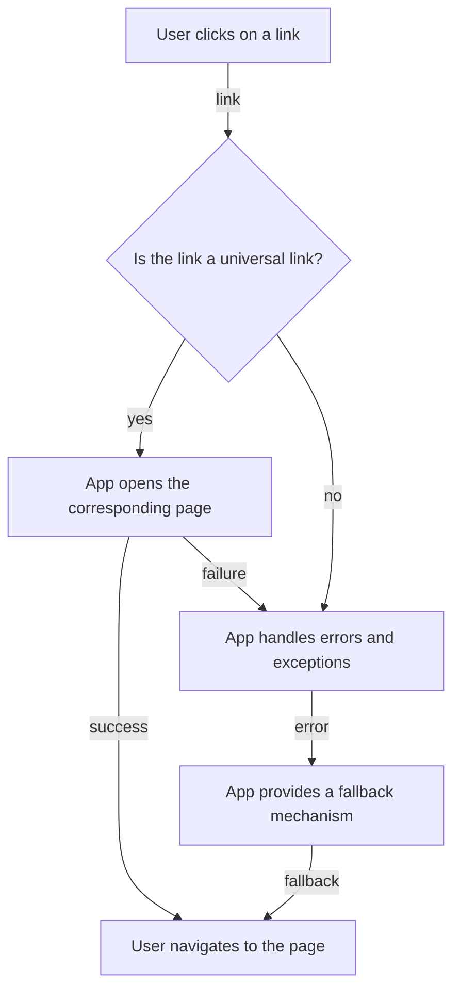

## Introduction
**Deep linking** is a technique used in mobile development to link to a specific page or section within a mobile app, rather than just opening the app's homepage. This allows users to navigate directly to a specific piece of content or functionality within the app, improving the overall user experience. **Universal links**, on the other hand, are a type of deep link that can open a specific page or section within a mobile app on both Android and iOS devices. In this section, we will explore the importance of deep linking and universal links, their real-world relevance, and why every engineer needs to know about them.

Deep linking and universal links are essential for mobile development because they enable seamless navigation between different sections of an app and between the app and the web. For example, a user may click on a link to a product page on an e-commerce website, and the link can open the corresponding page within the app, allowing the user to purchase the product directly. This improves the user experience and increases conversion rates.

> **Note:** Deep linking and universal links are not limited to e-commerce apps. They can be used in any type of app where navigation to a specific page or section is required, such as social media, news, or productivity apps.

## Core Concepts
To understand deep linking and universal links, it is essential to familiarize yourself with the following core concepts:

* **Intent**: An intent is a messaging object that is used to request an action from an app component. In Android, intents are used to start activities, services, and broadcast receivers.
* **URI**: A URI (Uniform Resource Identifier) is a string that identifies a resource, such as a webpage or a specific page within an app.
* **URL scheme**: A URL scheme is a prefix that is added to a URL to identify the protocol used to access the resource. For example, `http` or `https` are URL schemes.
* **Universal link**: A universal link is a type of deep link that can open a specific page or section within a mobile app on both Android and iOS devices.

> **Warning:** When implementing deep linking and universal links, it is crucial to handle errors and exceptions properly to avoid crashes or unexpected behavior.

## How It Works Internally
To understand how deep linking and universal links work internally, let's break down the process step by step:

1. **User clicks on a link**: The user clicks on a link to a specific page or section within an app.
2. **App checks if the link is a universal link**: The app checks if the link is a universal link by verifying the URL scheme and the domain.
3. **App opens the corresponding page**: If the link is a universal link, the app opens the corresponding page or section within the app.
4. **App handles errors and exceptions**: The app handles any errors or exceptions that may occur during the process.

> **Tip:** To improve the user experience, it is essential to handle errors and exceptions properly and provide a fallback mechanism in case the link is not a universal link.

## Code Examples
Here are three complete and runnable code examples that demonstrate deep linking and universal links:

### Example 1: Basic Deep Linking
```java
// AndroidManifest.xml
<activity
    android:name=".MainActivity"
    android:exported="true" >
    <intent-filter>
        <action android:name="android.intent.action.VIEW" />
        <category android:name="android.intent.category.DEFAULT" />
        <category android:name="android.intent.category.BROWSABLE" />
        <data
            android:host="example.com"
            android:pathPrefix="/product/"
            android:scheme="https" />
    </intent-filter>
</activity>

// MainActivity.java
@Override
protected void onCreate(Bundle savedInstanceState) {
    super.onCreate(savedInstanceState);
    // Get the intent that started the activity
    Intent intent = getIntent();
    // Check if the intent is a deep link
    if (intent.getAction().equals(Intent.ACTION_VIEW)) {
        // Get the URI from the intent
        Uri uri = intent.getData();
        // Handle the deep link
        handleDeepLink(uri);
    }
}

// handleDeepLink method
private void handleDeepLink(Uri uri) {
    // Get the product ID from the URI
    String productId = uri.getLastPathSegment();
    // Open the product page
    Intent productIntent = new Intent(this, ProductActivity.class);
    productIntent.putExtra("product_id", productId);
    startActivity(productIntent);
}
```

### Example 2: Universal Links
```swift
// AppDelegate.swift
func application(_ application: UIApplication, continue userActivity: NSUserActivity, restorationHandler: @escaping ([UIUserActivityRestoring]?) -> Void) -> Bool {
    // Check if the user activity is a universal link
    if let url = userActivity.webpageUrl {
        // Handle the universal link
        handleUniversalLink(url)
        return true
    }
    return false
}

// handleUniversalLink method
func handleUniversalLink(_ url: URL) {
    // Get the product ID from the URL
    let productId = url.lastPathComponent
    // Open the product page
    let productViewController = ProductViewController(productID: productId)
    let navigationController = UINavigationController(rootViewController: productViewController)
    self.window?.rootViewController = navigationController
}
```

### Example 3: Advanced Deep Linking
```kotlin
// AndroidManifest.xml
<activity
    android:name=".MainActivity"
    android:exported="true" >
    <intent-filter>
        <action android:name="android.intent.action.VIEW" />
        <category android:name="android.intent.category.DEFAULT" />
        <category android:name="android.intent.category.BROWSABLE" />
        <data
            android:host="example.com"
            android:pathPrefix="/product/"
            android:scheme="https" />
    </intent-filter>
</activity>

// MainActivity.kt
override fun onCreate(savedInstanceState: Bundle?) {
    super.onCreate(savedInstanceState)
    // Get the intent that started the activity
    val intent = intent
    // Check if the intent is a deep link
    if (intent.action == Intent.ACTION_VIEW) {
        // Get the URI from the intent
        val uri = intent.data
        // Handle the deep link
        handleDeepLink(uri)
    }
}

// handleDeepLink method
private fun handleDeepLink(uri: Uri?) {
    // Get the product ID from the URI
    val productId = uri?.lastPathSegment
    // Open the product page
    val productIntent = Intent(this, ProductActivity::class.java)
    productIntent.putExtra("product_id", productId)
    startActivity(productIntent)
}
```

## Visual Diagram

The diagram illustrates the process of deep linking and universal links, from the user clicking on a link to the app opening the corresponding page or handling errors and exceptions.

## Comparison
| Approach | Time Complexity | Space Complexity | Pros | Cons | Best For |
| --- | --- | --- | --- | --- | --- |
| Deep Linking | O(1) | O(1) | Allows navigation to a specific page or section within an app | Limited to a single app | E-commerce apps, social media apps |
| Universal Links | O(1) | O(1) | Allows navigation to a specific page or section within an app on both Android and iOS devices | Requires additional setup and configuration | Cross-platform apps, apps with complex navigation |
| Intent Filters | O(n) | O(n) | Allows filtering of intents based on specific criteria | Can be complex to implement and maintain | Apps with multiple activities and services |
| URI Schemes | O(1) | O(1) | Allows identification of resources using a specific scheme | Limited to a single scheme | Apps with custom URI schemes |

## Real-world Use Cases
Here are three real-world use cases for deep linking and universal links:

1. **E-commerce apps**: E-commerce apps like Amazon and eBay use deep linking and universal links to navigate users to specific product pages or sections within the app.
2. **Social media apps**: Social media apps like Facebook and Instagram use deep linking and universal links to navigate users to specific pages or sections within the app, such as a user's profile page or a specific post.
3. **News apps**: News apps like The New York Times and CNN use deep linking and universal links to navigate users to specific articles or sections within the app.

> **Interview:** Can you explain the difference between deep linking and universal links? How would you implement deep linking in an Android app?

## Common Pitfalls
Here are four common pitfalls to watch out for when implementing deep linking and universal links:

1. **Incorrect intent filters**: Incorrectly configured intent filters can prevent deep links from working properly.
2. **Insufficient error handling**: Failing to handle errors and exceptions properly can lead to crashes or unexpected behavior.
3. **Inconsistent URI schemes**: Using inconsistent URI schemes can make it difficult to identify resources and navigate to specific pages or sections within an app.
4. **Lack of testing**: Failing to test deep links and universal links thoroughly can lead to bugs and issues that are difficult to debug.

> **Warning:** When implementing deep linking and universal links, it is essential to test thoroughly and handle errors and exceptions properly to avoid crashes or unexpected behavior.

## Interview Tips
Here are three common interview questions related to deep linking and universal links, along with tips for answering them:

1. **What is the difference between deep linking and universal links?**: Be prepared to explain the difference between deep linking and universal links, including the benefits and limitations of each approach.
2. **How would you implement deep linking in an Android app?**: Be prepared to explain the steps involved in implementing deep linking in an Android app, including configuring intent filters and handling errors and exceptions.
3. **How would you troubleshoot issues with deep links and universal links?**: Be prepared to explain your approach to troubleshooting issues with deep links and universal links, including testing and debugging techniques.

> **Tip:** When answering interview questions related to deep linking and universal links, be sure to provide specific examples and explain your thought process and approach to solving problems.

## Key Takeaways
Here are ten key takeaways to remember about deep linking and universal links:

* **Deep linking allows navigation to a specific page or section within an app**.
* **Universal links allow navigation to a specific page or section within an app on both Android and iOS devices**.
* **Intent filters are used to filter intents based on specific criteria**.
* **URI schemes are used to identify resources using a specific scheme**.
* **Deep linking and universal links require proper error handling and testing**.
* **Inconsistent URI schemes can make it difficult to identify resources and navigate to specific pages or sections within an app**.
* **Lack of testing can lead to bugs and issues that are difficult to debug**.
* **Deep linking and universal links can improve the user experience and increase conversion rates**.
* **Deep linking and universal links are essential for mobile development and should be considered when designing and implementing mobile apps**.
* **Proper implementation of deep linking and universal links requires a thorough understanding of the underlying concepts and technologies**.

> **Note:** By following these key takeaways and best practices, you can ensure that your mobile app provides a seamless and intuitive user experience, and that deep links and universal links are properly implemented and tested.