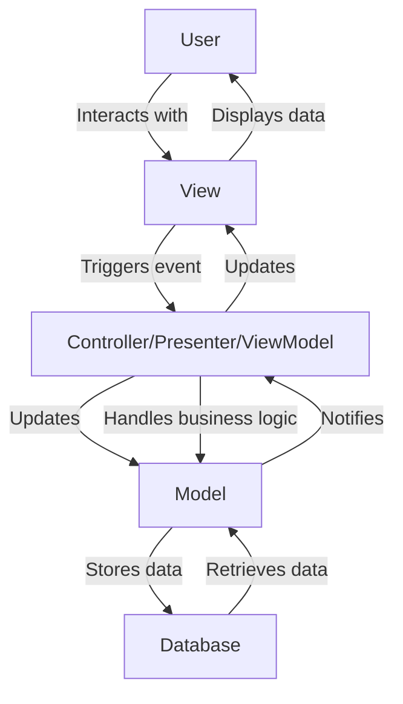

## Introduction
The Model-View-Controller (MVC), Model-View-Presenter (MVP), and Model-View-ViewModel (MVVM) patterns are architectural patterns used in mobile app development to separate the application logic into three interconnected components. These patterns help to decouple the application logic, making it easier to maintain, test, and extend. In this section, we will explore the importance of these patterns, their real-world relevance, and why every mobile developer should understand them.

> **Note:** Understanding these patterns is crucial for building scalable, maintainable, and testable mobile applications.

MVC, MVP, and MVVM patterns are widely used in mobile app development because they provide a clear separation of concerns, making it easier to manage complex application logic. These patterns help to reduce coupling between components, making it easier to modify or replace individual components without affecting the rest of the application.

## Core Concepts
The core concepts of MVC, MVP, and MVVM patterns are as follows:

* **Model**: Represents the data and business logic of the application.
* **View**: Represents the user interface of the application.
* **Controller/Presenter/ViewModel**: Acts as an intermediary between the Model and View, handling user input, updating the Model, and updating the View.

> **Warning:** A common mistake is to confuse the Controller/Presenter/ViewModel with the Model, leading to a tight coupling between the application logic and the user interface.

The key terminology for these patterns is:

* **MVC**: Model-View-Controller, where the Controller handles user input, updates the Model, and updates the View.
* **MVP**: Model-View-Presenter, where the Presenter acts as an intermediary between the Model and View, handling user input and updating the Model and View.
* **MVVM**: Model-View-ViewModel, where the ViewModel acts as an intermediary between the Model and View, handling user input and updating the Model and View.

## How It Works Internally
The internal mechanics of MVC, MVP, and MVVM patterns can be broken down into the following steps:

1. The user interacts with the View, triggering an event.
2. The event is handled by the Controller/Presenter/ViewModel, which updates the Model.
3. The Model notifies the Controller/Presenter/ViewModel of any changes.
4. The Controller/Presenter/ViewModel updates the View based on the changes to the Model.

> **Tip:** To improve performance, use a caching mechanism to reduce the number of times the Model is updated.

The time complexity of these patterns depends on the specific implementation, but in general, the time complexity is O(1) for updating the Model and O(n) for updating the View, where n is the number of elements in the View.

## Code Examples
### Example 1: Basic MVC Implementation in Swift
```swift
// Model
class User {
    var name: String
    var age: Int
    
    init(name: String, age: Int) {
        self.name = name
        self.age = age
    }
}

// View
class UserView: UIView {
    var nameLabel: UILabel
    var ageLabel: UILabel
    
    init() {
        nameLabel = UILabel()
        ageLabel = UILabel()
        super.init(frame: .zero)
        setupUI()
    }
    
    required init?(coder: NSCoder) {
        fatalError("init(coder:) has not been implemented")
    }
    
    func setupUI() {
        // Setup UI components
    }
}

// Controller
class UserController {
    var user: User
    var view: UserView
    
    init(user: User, view: UserView) {
        self.user = user
        self.view = view
    }
    
    func updateView() {
        view.nameLabel.text = user.name
        view.ageLabel.text = String(user.age)
    }
}

let user = User(name: "John", age: 30)
let view = UserView()
let controller = UserController(user: user, view: view)
controller.updateView()
```

### Example 2: MVP Implementation in Java
```java
// Model
public class User {
    private String name;
    private int age;
    
    public User(String name, int age) {
        this.name = name;
        this.age = age;
    }
    
    public String getName() {
        return name;
    }
    
    public int getAge() {
        return age;
    }
}

// View
public interface UserView {
    void setName(String name);
    void setAge(int age);
}

// Presenter
public class UserPresenter {
    private User user;
    private UserView view;
    
    public UserPresenter(User user, UserView view) {
        this.user = user;
        this.view = view;
    }
    
    public void updateView() {
        view.setName(user.getName());
        view.setAge(user.getAge());
    }
}

// Activity
public class UserActivity extends AppCompatActivity implements UserView {
    private UserPresenter presenter;
    
    @Override
    protected void onCreate(Bundle savedInstanceState) {
        super.onCreate(savedInstanceState);
        User user = new User("John", 30);
        presenter = new UserPresenter(user, this);
        presenter.updateView();
    }
    
    @Override
    public void setName(String name) {
        // Update UI component
    }
    
    @Override
    public void setAge(int age) {
        // Update UI component
    }
}
```

### Example 3: MVVM Implementation in Kotlin
```kotlin
// Model
data class User(val name: String, val age: Int)

// ViewModel
class UserViewModel(private val user: User) {
    val name: String = user.name
    val age: Int = user.age
    
    fun updateName(newName: String) {
        // Update user name
    }
    
    fun updateAge(newAge: Int) {
        // Update user age
    }
}

// View
class UserView(private val viewModel: UserViewModel) {
    private val nameLabel: TextView
    private val ageLabel: TextView
    
    init {
        // Initialize UI components
    }
    
    fun updateUI() {
        nameLabel.text = viewModel.name
        ageLabel.text = viewModel.age.toString()
    }
}

// Activity
class UserActivity : AppCompatActivity() {
    private lateinit var viewModel: UserViewModel
    private lateinit var view: UserView
    
    override fun onCreate(savedInstanceState: Bundle?) {
        super.onCreate(savedInstanceState)
        val user = User("John", 30)
        viewModel = UserViewModel(user)
        view = UserView(viewModel)
        view.updateUI()
    }
}
```

## Visual Diagram


The diagram illustrates the flow of data and events between the User, View, Controller/Presenter/ViewModel, Model, and Database.

## Comparison
| Pattern | Time Complexity | Space Complexity | Pros | Cons | Best For |
| --- | --- | --- | --- | --- | --- |
| MVC | O(1) | O(n) | Easy to implement, flexible | Tight coupling between components | Small-scale applications |
| MVP | O(1) | O(n) | Decouples View and Model, easy to test | More complex than MVC, requires more code | Medium-scale applications |
| MVVM | O(1) | O(n) | Decouples View and Model, easy to test, two-way data binding | More complex than MVC, requires more code | Large-scale applications |

## Real-world Use Cases
1. **Instagram**: Uses a variation of the MVP pattern to separate the application logic into three interconnected components.
2. **Uber**: Uses a combination of MVC and MVVM patterns to manage the complexity of their application.
3. **Facebook**: Uses a custom architecture that combines elements of MVC, MVP, and MVVM patterns to manage their large-scale application.

## Common Pitfalls
1. **Tight coupling between components**: A common mistake is to confuse the Controller/Presenter/ViewModel with the Model, leading to a tight coupling between the application logic and the user interface.
2. **Overusing the Controller/Presenter/ViewModel**: Another common mistake is to overuse the Controller/Presenter/ViewModel, leading to a complex and hard-to-maintain application.
3. **Not using a caching mechanism**: Failing to use a caching mechanism can lead to poor performance and slow loading times.
4. **Not handling errors properly**: Not handling errors properly can lead to crashes and a poor user experience.

## Interview Tips
1. **What is the difference between MVC, MVP, and MVVM patterns?**: A strong answer would explain the differences between the patterns, including the role of the Controller/Presenter/ViewModel and the level of decoupling between components.
2. **How do you handle errors in an MVVM application?**: A strong answer would explain the importance of handling errors properly, including using try-catch blocks and displaying error messages to the user.
3. **How do you optimize the performance of an MVP application?**: A strong answer would explain the importance of using a caching mechanism, reducing the number of requests to the Model, and optimizing the View.

## Key Takeaways
* **MVC, MVP, and MVVM patterns are used to separate the application logic into three interconnected components**.
* **The Controller/Presenter/ViewModel acts as an intermediary between the Model and View**.
* **Decoupling between components is crucial for maintaining a scalable and testable application**.
* **Using a caching mechanism can improve performance and reduce loading times**.
* **Handling errors properly is crucial for providing a good user experience**.
* **Optimizing the performance of an application requires reducing the number of requests to the Model and optimizing the View**.
* **MVC, MVP, and MVVM patterns have different time and space complexities, and the choice of pattern depends on the specific requirements of the application**.
* **Understanding the differences between MVC, MVP, and MVVM patterns is crucial for building scalable and maintainable applications**.