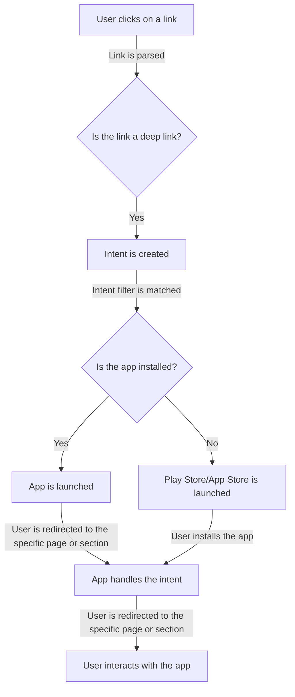

## Introduction
**Deep Linking** is a technique used in mobile app development to enable users to navigate to a specific page or section within an app from a URL or a link. This is particularly useful when a user clicks on a link from an email, social media, or a web page, and is redirected to the relevant page within the app, rather than the app's home screen. Deep linking is essential for providing a seamless user experience, as it allows users to access specific content within an app without having to navigate through the app's menu system. In this section, we will explore the core concepts of deep linking, its implementation, and its relevance in real-world scenarios.

> **Note:** Deep linking is not limited to mobile apps; it can also be used in web development to enable users to navigate to specific pages or sections within a website.

## Core Concepts
To understand deep linking, it's essential to grasp the following core concepts:
* **URI Schemes**: A URI scheme is a string that identifies the protocol used to access a resource. In the context of deep linking, URI schemes are used to identify the app and the specific page or section to navigate to.
* **Intent Filters**: Intent filters are used in Android to declare the types of intents that an app can handle. In the context of deep linking, intent filters are used to declare the URI schemes and actions that an app can handle.
* **Universal Links**: Universal links are a type of deep link that allows users to navigate to a specific page or section within an app on iOS devices.
* **App Links**: App links are a type of deep link that allows users to navigate to a specific page or section within an app on Android devices.

> **Warning:** Failing to properly implement deep linking can result in a poor user experience, as users may be redirected to the app's home screen instead of the intended page or section.

## How It Works Internally
Deep linking works by using a combination of URI schemes, intent filters, and app links. Here's a step-by-step breakdown of how it works:
1. **User clicks on a link**: The user clicks on a link from an email, social media, or a web page.
2. **Link is parsed**: The link is parsed to determine the URI scheme and the specific page or section to navigate to.
3. **Intent is created**: An intent is created with the URI scheme and the specific page or section to navigate to.
4. **Intent filter is matched**: The intent filter is matched with the app's declared intent filters to determine if the app can handle the intent.
5. **App is launched**: If the app can handle the intent, it is launched, and the user is redirected to the specific page or section.

> **Tip:** To properly implement deep linking, it's essential to declare the correct URI schemes and intent filters in the app's manifest file.

## Code Examples
Here are three complete and runnable code examples that demonstrate deep linking:
### Example 1: Basic Deep Linking (Android)
```java
// AndroidManifest.xml
<activity
    android:name=".MainActivity"
    android:exported="true" >
    <intent-filter>
        <action android:name="android.intent.action.VIEW" />
        <category android:name="android.intent.category.DEFAULT" />
        <category android:name="android.intent.category.BROWSABLE" />
        <data
            android:host="example.com"
            android:pathPrefix="/deep-link"
            android:scheme="https" />
    </intent-filter>
</activity>
```

### Example 2: Universal Links (iOS)
```swift
// AppDelegate.swift
func application(_ application: UIApplication, continue userActivity: NSUserActivity, restorationHandler: @escaping ([UIUserActivityRestoring]?) -> Void) -> Bool {
    if let url = userActivity.webpageUrl {
        // Handle the URL
        print("Received URL: \(url)")
        return true
    }
    return false
}
```

### Example 3: App Links (Android)
```java
// MainActivity.java
public class MainActivity extends AppCompatActivity {
    @Override
    protected void onCreate(Bundle savedInstanceState) {
        super.onCreate(savedInstanceState);
        // Get the intent
        Intent intent = getIntent();
        // Check if the intent is an app link
        if (intent.getAction() == Intent.ACTION_VIEW) {
            // Handle the app link
            Uri data = intent.getData();
            // Get the parameters
            String param1 = data.getQueryParameter("param1");
            String param2 = data.getQueryParameter("param2");
            // Do something with the parameters
            Log.d("MainActivity", "Received parameters: param1=\(param1), param2=\(param2)")
        }
    }
}
```

## Visual Diagram

The diagram illustrates the flow of deep linking, from the user clicking on a link to the app handling the intent.

## Comparison
| Approach | Time Complexity | Space Complexity | Pros | Cons | Best For |
| --- | --- | --- | --- | --- | --- |
| URI Schemes | O(1) | O(1) | Easy to implement, compatible with most devices | Limited flexibility, may not work with all browsers | Simple deep linking scenarios |
| Intent Filters | O(1) | O(1) | Flexible, compatible with most devices | May require additional configuration, may not work with all browsers | Complex deep linking scenarios |
| Universal Links | O(1) | O(1) | Compatible with iOS devices, provides a seamless user experience | Requires additional configuration, may not work with all browsers | iOS-specific deep linking scenarios |
| App Links | O(1) | O(1) | Compatible with Android devices, provides a seamless user experience | Requires additional configuration, may not work with all browsers | Android-specific deep linking scenarios |

## Real-world Use Cases
Here are three real-world use cases for deep linking:
1. **Facebook**: Facebook uses deep linking to enable users to navigate to specific pages or sections within the app from a link.
2. **Instagram**: Instagram uses deep linking to enable users to navigate to specific pages or sections within the app from a link.
3. **Uber**: Uber uses deep linking to enable users to navigate to specific pages or sections within the app from a link, such as requesting a ride.

> **Interview:** Can you explain how deep linking works? How would you implement deep linking in an app?

## Common Pitfalls
Here are four common pitfalls to avoid when implementing deep linking:
1. **Incorrect URI schemes**: Using incorrect URI schemes can result in the app not being launched.
2. **Incorrect intent filters**: Using incorrect intent filters can result in the app not handling the intent.
3. **Insufficient testing**: Insufficient testing can result in the app not working as expected.
4. **Not handling edge cases**: Not handling edge cases, such as the app not being installed, can result in a poor user experience.

## Interview Tips
Here are three common interview questions related to deep linking, along with weak and strong answers:
1. **What is deep linking?**
Weak answer: Deep linking is a technique used to navigate to a specific page or section within an app.
Strong answer: Deep linking is a technique used to navigate to a specific page or section within an app, using a combination of URI schemes, intent filters, and app links. It provides a seamless user experience by allowing users to access specific content within an app without having to navigate through the app's menu system.
2. **How do you implement deep linking in an app?**
Weak answer: I would use a library or a framework to implement deep linking.
Strong answer: I would use a combination of URI schemes, intent filters, and app links to implement deep linking. I would declare the correct URI schemes and intent filters in the app's manifest file, and handle the intent in the app's activity or fragment.
3. **What are the benefits of deep linking?**
Weak answer: Deep linking provides a seamless user experience.
Strong answer: Deep linking provides a seamless user experience, increases user engagement, and improves conversion rates. It also allows apps to provide a more personalized experience, by navigating users to specific content within the app.

## Key Takeaways
Here are ten key takeaways to remember when implementing deep linking:
* **Use the correct URI schemes**: Use the correct URI schemes to ensure that the app is launched.
* **Use the correct intent filters**: Use the correct intent filters to ensure that the app handles the intent.
* **Handle edge cases**: Handle edge cases, such as the app not being installed, to provide a seamless user experience.
* **Test thoroughly**: Test the app thoroughly to ensure that it works as expected.
* **Use a combination of URI schemes, intent filters, and app links**: Use a combination of URI schemes, intent filters, and app links to implement deep linking.
* **Declare the correct URI schemes and intent filters in the app's manifest file**: Declare the correct URI schemes and intent filters in the app's manifest file to ensure that the app is launched and handles the intent.
* **Handle the intent in the app's activity or fragment**: Handle the intent in the app's activity or fragment to provide a seamless user experience.
* **Use a library or framework to simplify the implementation**: Use a library or framework to simplify the implementation of deep linking.
* **Consider using universal links or app links**: Consider using universal links or app links to provide a seamless user experience on iOS and Android devices.
* **Monitor and analyze the app's performance**: Monitor and analyze the app's performance to identify areas for improvement and optimize the deep linking implementation.