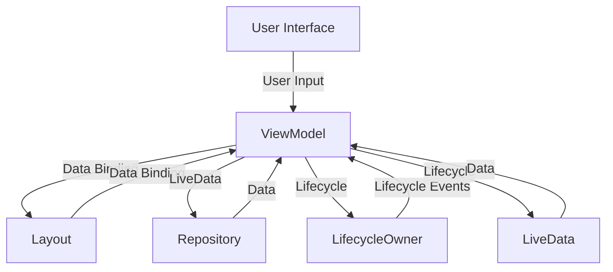

## Introduction
Developing responsive Android applications is crucial for providing a seamless user experience. The Android Jetpack architecture is a set of libraries and guidelines that help developers build robust, scalable, and maintainable apps. In this section, we will explore the importance of responsive Android development, the role of Jetpack architecture, and its real-world relevance. 
> **Note:** Responsiveness is not just about fast loading times, but also about ensuring that the app remains interactive and responsive to user input, even when performing complex operations.

The Android Jetpack architecture is a collection of libraries and guidelines that help developers build high-quality apps. It provides a set of tools and best practices for building responsive, scalable, and maintainable apps. The Jetpack architecture is designed to help developers simplify their code, reduce bugs, and improve the overall user experience. 
> **Tip:** By following the Jetpack architecture guidelines, developers can ensure that their apps are responsive, efficient, and easy to maintain.

Real-world relevance is essential in Android development. Companies like Google, Facebook, and Instagram rely on responsive Android apps to provide a seamless user experience. For instance, the Google Maps app uses the Jetpack architecture to provide a responsive and interactive experience, even when performing complex operations like route calculation and map rendering. 
> **Warning:** Failing to prioritize responsiveness can lead to poor user reviews, low engagement, and ultimately, a loss of revenue.

## Core Concepts
The Jetpack architecture is based on several core concepts, including:
* **Model-View-ViewModel (MVVM) pattern**: This pattern separates the app's logic into three interconnected components: the model, view, and view model. The model represents the data and business logic, the view represents the user interface, and the view model acts as an intermediary between the two.
* **Lifecycle-aware components**: These components are designed to handle the app's lifecycle events, such as creation, start, resume, pause, stop, and destruction. 
* **Data binding**: This feature allows developers to bind data to the user interface, reducing the need for manual updates and improving the overall responsiveness of the app.

> **Interview:** When asked about the Jetpack architecture, be sure to mention the MVVM pattern, lifecycle-aware components, and data binding as key concepts.

## How It Works Internally
The Jetpack architecture works internally by providing a set of libraries and guidelines that help developers build responsive, scalable, and maintainable apps. The architecture is based on the following components:
1. **ViewModel**: The view model acts as an intermediary between the model and view, providing a layer of abstraction and decoupling the two components. 
2. **LiveData**: LiveData is a lifecycle-aware data holder that provides a way to observe changes to the data and update the user interface accordingly.
3. **Repository**: The repository acts as a single source of truth for the app's data, providing a layer of abstraction and decoupling the data from the business logic.

The Jetpack architecture works by providing a set of tools and guidelines that help developers simplify their code, reduce bugs, and improve the overall user experience. The architecture is designed to be flexible and scalable, allowing developers to build complex and responsive apps.

## Code Examples
### Example 1: Basic MVVM Pattern
```java
// ViewModel
public class UserViewModel extends ViewModel {
    private MutableLiveData<User> user;

    public UserViewModel() {
        user = new MutableLiveData<>();
    }

    public LiveData<User> getUser() {
        return user;
    }

    public void setUser(User user) {
        this.user.setValue(user);
    }
}

// Activity
public class UserActivity extends AppCompatActivity {
    private UserViewModel viewModel;

    @Override
    protected void onCreate(Bundle savedInstanceState) {
        super.onCreate(savedInstanceState);
        viewModel = new ViewModelProvider(this).get(UserViewModel.class);
        viewModel.getUser().observe(this, user -> {
            // Update the user interface
        });
    }
}
```
### Example 2: Real-World Pattern with Data Binding
```java
// Layout
<?xml version="1.0" encoding="utf-8"?>
<layout xmlns:android="http://schemas.android.com/apk/res/android"
    xmlns:app="http://schemas.android.com/apk/res-auto">
    <data>
        <variable
            name="viewModel"
            type="com.example.UserViewModel" />
    </data>
    <LinearLayout
        android:layout_width="match_parent"
        android:layout_height="match_parent"
        android:orientation="vertical">
        <TextView
            android:layout_width="wrap_content"
            android:layout_height="wrap_content"
            android:text="@{viewModel.user.name}" />
    </LinearLayout>
</layout>

// Activity
public class UserActivity extends AppCompatActivity {
    private UserViewModel viewModel;

    @Override
    protected void onCreate(Bundle savedInstanceState) {
        super.onCreate(savedInstanceState);
        DataBindingUtil.setContentView(this, R.layout.activity_user);
        viewModel = new ViewModelProvider(this).get(UserViewModel.class);
        binding.setViewModel(viewModel);
    }
}
```
### Example 3: Advanced Usage with LiveData and Repository
```java
// Repository
public class UserRepository {
    private MutableLiveData<List<User>> users;

    public UserRepository() {
        users = new MutableLiveData<>();
    }

    public LiveData<List<User>> getUsers() {
        return users;
    }

    public void loadUsers() {
        // Load users from the database or network
        users.setValue(users);
    }
}

// ViewModel
public class UserViewModel extends ViewModel {
    private UserRepository repository;
    private MutableLiveData<List<User>> users;

    public UserViewModel(UserRepository repository) {
        this.repository = repository;
        users = new MutableLiveData<>();
    }

    public LiveData<List<User>> getUsers() {
        return users;
    }

    public void loadUsers() {
        repository.loadUsers();
        users.setValue(repository.getUsers().getValue());
    }
}

// Activity
public class UserActivity extends AppCompatActivity {
    private UserViewModel viewModel;

    @Override
    protected void onCreate(Bundle savedInstanceState) {
        super.onCreate(savedInstanceState);
        viewModel = new ViewModelProvider(this).get(UserViewModel.class);
        viewModel.getUsers().observe(this, users -> {
            // Update the user interface
        });
        viewModel.loadUsers();
    }
}
```
## Visual Diagram

The diagram illustrates the core components of the Jetpack architecture, including the user interface, view model, layout, repository, and lifecycle owner. The diagram shows how the components interact with each other, including the flow of data and lifecycle events.

## Comparison
| Approach | Time Complexity | Space Complexity | Pros | Cons | Best For |
|----------|----------------|-----------------|------|------|----------|
| MVVM Pattern | O(1) | O(1) | Separation of concerns, easy to test | Steeper learning curve | Complex, data-driven apps |
| MVP Pattern | O(1) | O(1) | Easy to implement, simple to understand | Tight coupling between presenter and view | Simple, non-data driven apps |
| MVC Pattern | O(1) | O(1) | Easy to implement, simple to understand | Tight coupling between controller and view | Simple, non-data driven apps |
| Jetpack Architecture | O(1) | O(1) | Provides a set of libraries and guidelines for building responsive, scalable, and maintainable apps | Steeper learning curve | Complex, data-driven apps |

## Real-world Use Cases
1. **Google Maps**: The Google Maps app uses the Jetpack architecture to provide a responsive and interactive experience, even when performing complex operations like route calculation and map rendering.
2. **Facebook**: The Facebook app uses the Jetpack architecture to provide a seamless user experience, including features like data binding and lifecycle-aware components.
3. **Instagram**: The Instagram app uses the Jetpack architecture to provide a responsive and interactive experience, including features like data binding and lifecycle-aware components.

## Common Pitfalls
1. **Tight Coupling**: Tight coupling between components can make the app difficult to maintain and scale. 
2. **Complexity**: Overly complex architecture can make the app difficult to understand and maintain. 
3. **Performance Issues**: Poorly optimized code can lead to performance issues, including slow loading times and unresponsive interfaces.

## Interview Tips
1. **What is the Jetpack architecture?**: Be sure to mention the MVVM pattern, lifecycle-aware components, and data binding as key concepts.
2. **How does the Jetpack architecture work?**: Explain the flow of data and lifecycle events between components.
3. **What are the benefits of using the Jetpack architecture?**: Mention the separation of concerns, easy testing, and scalability as key benefits.

## Key Takeaways
* The Jetpack architecture is a set of libraries and guidelines for building responsive, scalable, and maintainable apps.
* The MVVM pattern is a key concept in the Jetpack architecture, providing a separation of concerns and easy testing.
* Lifecycle-aware components are essential for handling the app's lifecycle events and providing a responsive user experience.
* Data binding is a powerful feature that reduces the need for manual updates and improves the overall responsiveness of the app.
* The Jetpack architecture is designed to be flexible and scalable, allowing developers to build complex and responsive apps.
* The Jetpack architecture provides a set of tools and guidelines for simplifying code, reducing bugs, and improving the overall user experience.