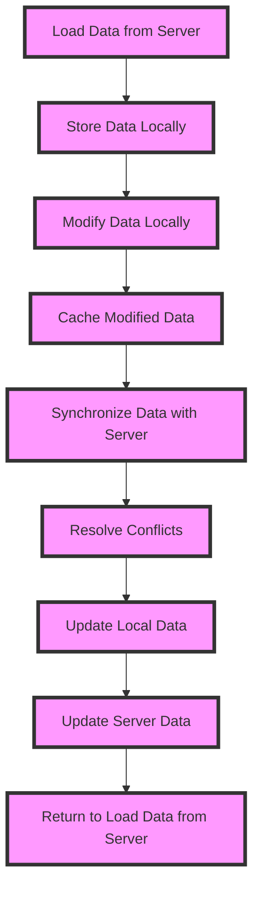

## Introduction
Offline-first systems are designed to provide a seamless user experience even when the network connection is slow, unreliable, or completely absent. This approach is crucial for mobile applications, as users often encounter areas with poor or no internet connectivity. **Offline-first development** prioritizes local data storage and caching, allowing the app to function normally even without a network connection. Real-world relevance can be seen in apps like Google Maps, which allows users to download maps for offline use, or Instagram, which caches posts and comments for offline viewing. Every engineer needs to know how to design and implement offline-first systems to ensure their apps remain usable and engaging in all scenarios.

## Core Concepts
To understand offline-first systems, it's essential to grasp the following key concepts:
- **Data synchronization**: The process of ensuring that data stored locally on the device is consistent with the data stored on the server.
- **Caching**: Storing frequently accessed data in a local storage system to reduce the need for network requests.
- **Local storage**: Storing data locally on the device, such as in a database or file system.
- **Network connectivity**: The ability of the device to connect to the internet or a local network.
- **Conflict resolution**: The process of resolving conflicts that arise when data is modified both locally and on the server.

> **Tip:** When designing an offline-first system, it's essential to consider the trade-offs between data consistency, latency, and network usage.

## How It Works Internally
Offline-first systems work by storing data locally on the device and synchronizing it with the server when the network connection is available. Here's a step-by-step breakdown of the process:
1. **Initial data load**: The app loads data from the server and stores it locally on the device.
2. **Local data modifications**: The user makes changes to the data locally on the device.
3. **Caching**: The app caches the modified data to reduce the need for network requests.
4. **Network connectivity**: The device connects to the internet or a local network.
5. **Data synchronization**: The app synchronizes the local data with the server, resolving any conflicts that may have arisen.
6. **Conflict resolution**: The app resolves conflicts that arise when data is modified both locally and on the server.

> **Warning:** Failing to properly handle conflicts can lead to data inconsistencies and errors.

## Code Examples
### Example 1: Basic Offline-first System
```javascript
// Import required libraries
const Realm = require('realm');

// Define the schema for the local database
const schema = {
  name: 'offlineData',
  properties: {
    id: 'int',
    name: 'string',
    description: 'string',
  },
};

// Initialize the local database
const realm = new Realm({ schema });

// Load data from the server and store it locally
fetch('https://example.com/data')
  .then(response => response.json())
  .then(data => {
    realm.write(() => {
      data.forEach(item => {
        realm.create('offlineData', item);
      });
    });
  });

// Modify data locally and cache it
const modifyData = () => {
  realm.write(() => {
    const item = realm.objects('offlineData').filtered('id = 1')[0];
    item.name = 'New Name';
  });
};

// Synchronize data with the server
const synchronizeData = () => {
  fetch('https://example.com/data', {
    method: 'POST',
    headers: {
      'Content-Type': 'application/json',
    },
    body: JSON.stringify(realm.objects('offlineData')),
  })
    .then(response => response.json())
    .then(data => {
      realm.write(() => {
        data.forEach(item => {
          const existingItem = realm.objects('offlineData').filtered('id = ' + item.id)[0];
          if (existingItem) {
            existingItem.name = item.name;
            existingItem.description = item.description;
          } else {
            realm.create('offlineData', item);
          }
        });
      });
    });
};
```

### Example 2: Real-world Offline-first System
```java
// Import required libraries
import android.content.Context;
import android.database.sqlite.SQLiteDatabase;
import android.database.sqlite.SQLiteOpenHelper;

// Define the schema for the local database
public class OfflineDatabase extends SQLiteOpenHelper {
  private static final String DATABASE_NAME = "offline_data.db";
  private static final int DATABASE_VERSION = 1;

  public OfflineDatabase(Context context) {
    super(context, DATABASE_NAME, null, DATABASE_VERSION);
  }

  @Override
  public void onCreate(SQLiteDatabase db) {
    db.execSQL("CREATE TABLE offline_data (_id INTEGER PRIMARY KEY, name TEXT, description TEXT)");
  }

  @Override
  public void onUpgrade(SQLiteDatabase db, int oldVersion, int newVersion) {
    // Handle database upgrades
  }
}

// Load data from the server and store it locally
public void load_data_from_server() {
  // Use Retrofit or OkHttp to load data from the server
  Call<List<OfflineData>> call = apiService.getOfflineData();
  call.enqueue(new Callback<List<OfflineData>>() {
    @Override
    public void onResponse(Call<List<OfflineData>> call, Response<List<OfflineData>> response) {
      // Store data locally in the database
      OfflineDatabase db = new OfflineDatabase(context);
      db.getWritableDatabase().beginTransaction();
      try {
        for (OfflineData item : response.body()) {
          db.getWritableDatabase().insert("offline_data", null, item.toContentValues());
        }
        db.getWritableDatabase().setTransactionSuccessful();
      } finally {
        db.getWritableDatabase().endTransaction();
      }
    }

    @Override
    public void onFailure(Call<List<OfflineData>> call, Throwable t) {
      // Handle failure
    }
  });
}

// Modify data locally and cache it
public void modify_data_locally() {
  // Use the local database to modify data
  OfflineDatabase db = new OfflineDatabase(context);
  db.getWritableDatabase().beginTransaction();
  try {
    // Modify data locally
    db.getWritableDatabase().update("offline_data", values, "_id = ?", new String[] { "1" });
    db.getWritableDatabase().setTransactionSuccessful();
  } finally {
    db.getWritableDatabase().endTransaction();
  }
}

// Synchronize data with the server
public void synchronize_data_with_server() {
  // Use Retrofit or OkHttp to synchronize data with the server
  Call<List<OfflineData>> call = apiService.synchronizeOfflineData();
  call.enqueue(new Callback<List<OfflineData>>() {
    @Override
    public void onResponse(Call<List<OfflineData>> call, Response<List<OfflineData>> response) {
      // Update local data with server data
      OfflineDatabase db = new OfflineDatabase(context);
      db.getWritableDatabase().beginTransaction();
      try {
        for (OfflineData item : response.body()) {
          db.getWritableDatabase().update("offline_data", item.toContentValues(), "_id = ?", new String[] { String.valueOf(item.getId()) });
        }
        db.getWritableDatabase().setTransactionSuccessful();
      } finally {
        db.getWritableDatabase().endTransaction();
      }
    }

    @Override
    public void onFailure(Call<List<OfflineData>> call, Throwable t) {
      // Handle failure
    }
  });
}
```

### Example 3: Advanced Offline-first System with Conflict Resolution
```python
# Import required libraries
import sqlite3
from typing import List

# Define the schema for the local database
class OfflineDatabase:
  def __init__(self, db_name: str):
    self.conn = sqlite3.connect(db_name)
    self.cursor = self.conn.cursor()
    self.cursor.execute("CREATE TABLE IF NOT EXISTS offline_data (id INTEGER PRIMARY KEY, name TEXT, description TEXT)")

  def load_data_from_server(self):
    # Load data from the server using HTTP requests
    response = requests.get("https://example.com/data")
    data = response.json()
    self.cursor.executemany("INSERT INTO offline_data (id, name, description) VALUES (?, ?, ?)", data)
    self.conn.commit()

  def modify_data_locally(self, id: int, name: str, description: str):
    # Modify data locally
    self.cursor.execute("UPDATE offline_data SET name = ?, description = ? WHERE id = ?", (name, description, id))
    self.conn.commit()

  def synchronize_data_with_server(self):
    # Synchronize data with the server
    local_data = self.cursor.execute("SELECT * FROM offline_data").fetchall()
    server_data = requests.get("https://example.com/data").json()
    for local_item in local_data:
      for server_item in server_data:
        if local_item[0] == server_item[0]:
          # Conflict resolution
          if local_item[1] != server_item[1] or local_item[2] != server_item[2]:
            # Resolve conflict by merging changes
            merged_name = local_item[1] + " " + server_item[1]
            merged_description = local_item[2] + " " + server_item[2]
            self.cursor.execute("UPDATE offline_data SET name = ?, description = ? WHERE id = ?", (merged_name, merged_description, local_item[0]))
            self.conn.commit()
          break
    self.conn.close()

# Create an instance of the OfflineDatabase class
db = OfflineDatabase("offline_data.db")

# Load data from the server
db.load_data_from_server()

# Modify data locally
db.modify_data_locally(1, "New Name", "New Description")

# Synchronize data with the server
db.synchronize_data_with_server()
```

## Visual Diagram

This diagram illustrates the workflow of an offline-first system, from loading data from the server to resolving conflicts and updating local and server data.

## Comparison
| Approach | Time Complexity | Space Complexity | Pros | Cons | Best For |
| --- | --- | --- | --- | --- | --- |
| **Offline-first** | O(1) | O(n) | Provides a seamless user experience, reduces network requests | Requires complex conflict resolution, increases storage requirements | Mobile applications with frequent network disruptions |
| **Online-first** | O(n) | O(1) | Simple to implement, reduces storage requirements | Provides a poor user experience, increases network requests | Web applications with reliable network connections |
| **Hybrid** | O(n) | O(n) | Balances user experience and storage requirements | Increases complexity, requires careful tuning | Applications with varying network conditions |
| **Cache-only** | O(1) | O(n) | Reduces network requests, provides fast access to data | Does not handle conflicts, increases storage requirements | Applications with infrequent data updates |

> **Interview:** Can you explain the trade-offs between offline-first and online-first approaches to data synchronization?

## Real-world Use Cases
1. **Google Maps**: Allows users to download maps for offline use, providing a seamless navigation experience even without a network connection.
2. **Instagram**: Caches posts and comments for offline viewing, allowing users to browse their feed even without a network connection.
3. **Facebook**: Uses a hybrid approach to data synchronization, balancing user experience and storage requirements.
4. **Trello**: Uses an offline-first approach to data synchronization, providing a seamless user experience even without a network connection.
5. **Dropbox**: Uses a cache-only approach to data synchronization, reducing network requests and providing fast access to data.

## Common Pitfalls
1. **Failing to handle conflicts**: Conflicts can arise when data is modified both locally and on the server. Failing to handle these conflicts can lead to data inconsistencies and errors.
2. **Not considering storage requirements**: Offline-first systems require careful consideration of storage requirements, as they can increase storage needs.
3. **Not optimizing network requests**: Offline-first systems can reduce network requests, but careful optimization is still required to minimize network usage.
4. **Not providing a seamless user experience**: Offline-first systems should provide a seamless user experience, even without a network connection.

> **Warning:** Failing to handle conflicts can lead to data inconsistencies and errors.

## Interview Tips
1. **Be prepared to explain the trade-offs between offline-first and online-first approaches**: Interviewers may ask you to explain the pros and cons of each approach.
2. **Showcase your understanding of conflict resolution**: Interviewers may ask you to describe how you would handle conflicts in an offline-first system.
3. **Demonstrate your knowledge of storage requirements**: Interviewers may ask you to estimate the storage requirements for an offline-first system.
4. **Highlight your experience with network optimization**: Interviewers may ask you to describe how you would optimize network requests in an offline-first system.

## Key Takeaways
* **Offline-first systems prioritize local data storage and caching**: This approach provides a seamless user experience, even without a network connection.
* **Conflict resolution is crucial in offline-first systems**: Conflicts can arise when data is modified both locally and on the server.
* **Storage requirements must be carefully considered**: Offline-first systems can increase storage needs.
* **Network optimization is still required**: Offline-first systems can reduce network requests, but careful optimization is still required.
* **A seamless user experience is essential**: Offline-first systems should provide a seamless user experience, even without a network connection.
* **Hybrid approaches can balance user experience and storage requirements**: Hybrid approaches can balance the pros and cons of offline-first and online-first approaches.
* **Cache-only approaches can reduce network requests**: Cache-only approaches can reduce network requests, but may not handle conflicts.
* **Online-first approaches are simple to implement**: Online-first approaches are simple to implement, but provide a poor user experience.
* **Time complexity and space complexity are important considerations**: Time complexity and space complexity are important considerations when designing an offline-first system.