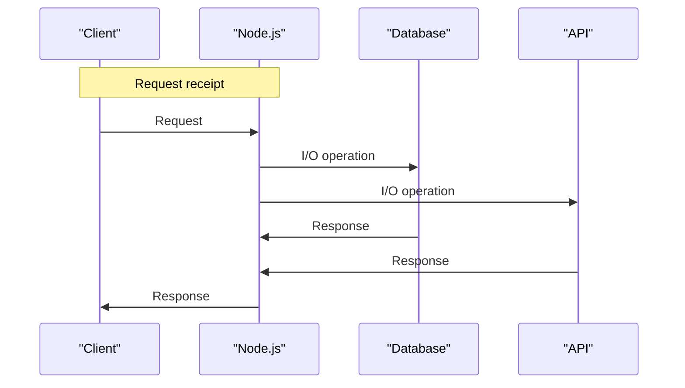

## Introduction
**Node.js** is a JavaScript runtime built on Chrome's V8 JavaScript engine that allows developers to create scalable and high-performance server-side applications. One of the key benefits of Node.js is its ability to handle **I/O-bound tasks** efficiently, making it an ideal choice for real-time web applications, microservices, and APIs. In this section, we will explore the benefits of using Node.js for I/O-bound tasks, its real-world relevance, and why every engineer needs to know this.

> **Note:** I/O-bound tasks refer to operations that involve waiting for input/output operations to complete, such as reading from a database, making API calls, or handling network requests.

Node.js is designed to handle I/O-bound tasks efficiently by using an **event-driven, non-blocking I/O model**. This allows Node.js to handle multiple requests concurrently, making it an ideal choice for real-time web applications. In production, Node.js is used by companies like Netflix, LinkedIn, and PayPal to handle high-traffic and high-concurrency workloads.

## Core Concepts
To understand how Node.js handles I/O-bound tasks efficiently, we need to understand some core concepts:

* **Event-driven programming**: Node.js uses an event-driven programming model, where the application responds to events, such as network requests or file I/O completion.
* **Non-blocking I/O**: Node.js uses non-blocking I/O operations, which allow the application to continue executing other tasks while waiting for I/O operations to complete.
* **Async callbacks**: Node.js uses async callbacks to handle the completion of I/O operations.
* **Promises**: Node.js also supports promises, which provide a way to handle async operations in a more synchronous way.

> **Tip:** Understanding these core concepts is crucial to writing efficient and scalable Node.js applications.

## How It Works Internally
To understand how Node.js handles I/O-bound tasks internally, let's take a step-by-step look at the process:

1. **Request receipt**: Node.js receives a request from a client, such as a web browser or another server.
2. **Event loop**: The request is passed to the event loop, which is responsible for handling all I/O operations.
3. **I/O operation**: The event loop initiates the I/O operation, such as reading from a database or making an API call.
4. **Non-blocking I/O**: The I/O operation is performed in a non-blocking manner, allowing the event loop to continue executing other tasks.
5. **Callback**: When the I/O operation completes, a callback is executed to handle the result.

> **Warning:** If not implemented correctly, async callbacks can lead to **callback hell**, making the code difficult to read and maintain.

## Code Examples
Here are three complete and runnable examples that demonstrate the use of Node.js for I/O-bound tasks:

### Example 1: Basic I/O-bound task
```javascript
const fs = require('fs');

// Read a file asynchronously
fs.readFile('example.txt', (err, data) => {
  if (err) {
    console.error(err);
  } else {
    console.log(data.toString());
  }
});
```
### Example 2: Real-world I/O-bound task
```javascript
const express = require('express');
const app = express();

// Handle a GET request
app.get('/users', (req, res) => {
  // Simulate a database query
  const users = [];
  for (let i = 0; i < 100; i++) {
    users.push({ id: i, name: `User ${i}` });
  }
  res.json(users);
});

app.listen(3000, () => {
  console.log('Server listening on port 3000');
});
```
### Example 3: Advanced I/O-bound task with promises
```javascript
const axios = require('axios');

// Make a GET request using promises
axios.get('https://jsonplaceholder.typicode.com/todos/1')
  .then((response) => {
    console.log(response.data);
  })
  .catch((error) => {
    console.error(error);
  });
```
## Visual Diagram

> **Note:** This diagram illustrates the flow of I/O operations in a Node.js application.

## Comparison
| Approach | Time Complexity | Space Complexity | Pros | Cons | Best For |
| --- | --- | --- | --- | --- | --- |
| Sync I/O | O(1) | O(1) | Simple to implement | Blocking | Small-scale applications |
| Async Callbacks | O(1) | O(1) | Non-blocking | Callback hell | I/O-bound tasks |
| Promises | O(1) | O(1) | Simplifies async code | Overhead | Complex async operations |
| Async/Await | O(1) | O(1) | Simplifies async code | Limited browser support | Modern Node.js applications |

## Real-world Use Cases
Here are three real-world use cases for Node.js:

* **Netflix**: Uses Node.js to handle high-traffic and high-concurrency workloads for its streaming service.
* **LinkedIn**: Uses Node.js to handle real-time updates and notifications for its social network.
* **PayPal**: Uses Node.js to handle high-volume payment processing and transaction handling.

## Common Pitfalls
Here are four common mistakes to avoid when using Node.js for I/O-bound tasks:

* **Callback hell**: Not handling async callbacks correctly can lead to callback hell, making the code difficult to read and maintain.
* **Blocking I/O**: Using blocking I/O operations can lead to performance issues and slow down the application.
* **Not handling errors**: Not handling errors correctly can lead to application crashes and data corruption.
* **Not using async/await**: Not using async/await can make the code more difficult to read and maintain.

> **Tip:** Use async/await to simplify async code and avoid callback hell.

## Interview Tips
Here are three common interview questions for Node.js and their answers:

* **What is the difference between sync and async I/O?**: Sync I/O is blocking, while async I/O is non-blocking. Async I/O is better suited for I/O-bound tasks.
* **How do you handle errors in Node.js?**: Use try-catch blocks and error handling mechanisms like callbacks and promises to handle errors correctly.
* **What is the purpose of the event loop in Node.js?**: The event loop is responsible for handling all I/O operations in Node.js, making it an essential component of the Node.js runtime.

> **Interview:** Be prepared to answer questions about Node.js fundamentals, such as the event loop, async I/O, and error handling.

## Key Takeaways
Here are ten key takeaways to remember:

* Node.js is designed for I/O-bound tasks and uses an event-driven, non-blocking I/O model.
* Async callbacks, promises, and async/await are used to handle I/O operations.
* The event loop is responsible for handling all I/O operations in Node.js.
* Node.js is used by companies like Netflix, LinkedIn, and PayPal for high-traffic and high-concurrency workloads.
* Sync I/O is blocking, while async I/O is non-blocking.
* Error handling is crucial in Node.js, and try-catch blocks and error handling mechanisms should be used.
* The event loop is an essential component of the Node.js runtime.
* Node.js has a large ecosystem of packages and modules that can be used to simplify development.
* Node.js is a popular choice for real-time web applications, microservices, and APIs.
* Understanding Node.js fundamentals, such as the event loop, async I/O, and error handling, is essential for building scalable and high-performance applications.