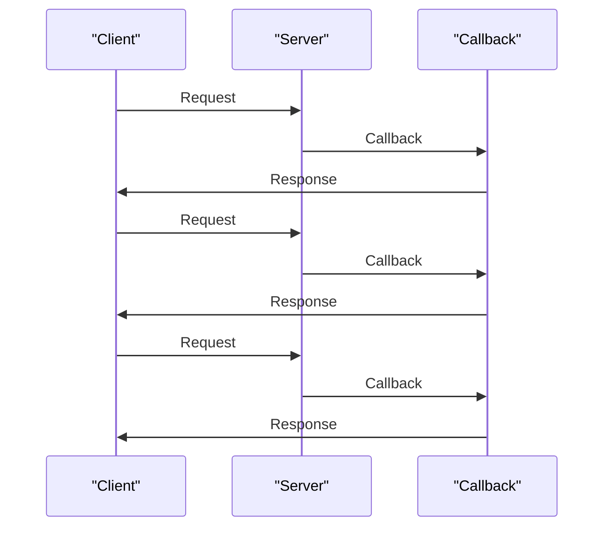

## Introduction
**Callback Hell**, also known as **Pyramid of Doom**, is a phenomenon that occurs when dealing with asynchronous code in Node.js. It refers to the situation where a series of nested callbacks are used to handle asynchronous operations, leading to a deeply nested and hard-to-read code structure. This can result in code that is difficult to maintain, debug, and understand. In this section, we will explore the concept of Callback Hell, its causes, and its consequences. We will also discuss how **async/await** can be used to mitigate this issue.

> **Note:** Callback Hell is not unique to Node.js, but it is particularly prevalent in this ecosystem due to the asynchronous nature of the language.

## Core Concepts
To understand Callback Hell, we need to grasp the concept of **asynchronous programming**. Asynchronous programming refers to the practice of writing code that can execute multiple tasks concurrently, without blocking the execution of other tasks. In Node.js, this is achieved through the use of **callbacks**, which are functions that are passed as arguments to other functions and are executed when a specific operation is complete.

The key terminology related to Callback Hell includes:

* **Callback**: a function that is passed as an argument to another function and is executed when a specific operation is complete.
* **Asynchronous programming**: the practice of writing code that can execute multiple tasks concurrently, without blocking the execution of other tasks.
* **Async/await**: a syntax sugar on top of Promises that allows writing asynchronous code that is easier to read and maintain.

> **Warning:** Callback Hell can lead to code that is difficult to maintain, debug, and understand. It can also result in performance issues, such as memory leaks and slow execution.

## How It Works Internally
When a callback is passed to a function, it is stored in memory and executed when the function is complete. This can lead to a situation where multiple callbacks are nested inside each other, creating a deeply nested code structure. This can result in a number of issues, including:

* **Memory leaks**: when callbacks are not properly cleaned up, they can remain in memory, causing memory leaks and performance issues.
* **Slow execution**: when callbacks are nested too deeply, they can cause slow execution and performance issues.

To mitigate these issues, **async/await** can be used. Async/await is a syntax sugar on top of Promises that allows writing asynchronous code that is easier to read and maintain. It works by creating a Promise that is resolved when the asynchronous operation is complete, and then using the `await` keyword to pause the execution of the code until the Promise is resolved.

## Code Examples
### Example 1: Basic Callback
```javascript
// basic callback example
function asyncOperation(callback) {
  // simulate an asynchronous operation
  setTimeout(() => {
    callback(null, 'result');
  }, 1000);
}

// use the callback
asyncOperation((err, result) => {
  if (err) {
    console.error(err);
  } else {
    console.log(result);
  }
});
```
This example demonstrates a basic callback. The `asyncOperation` function takes a callback as an argument and executes it when the asynchronous operation is complete.

### Example 2: Callback Hell
```javascript
// callback hell example
function asyncOperation1(callback) {
  // simulate an asynchronous operation
  setTimeout(() => {
    callback(null, 'result1');
  }, 1000);
}

function asyncOperation2(callback) {
  // simulate an asynchronous operation
  setTimeout(() => {
    callback(null, 'result2');
  }, 1000);
}

function asyncOperation3(callback) {
  // simulate an asynchronous operation
  setTimeout(() => {
    callback(null, 'result3');
  }, 1000);
}

// use the callbacks
asyncOperation1((err, result1) => {
  if (err) {
    console.error(err);
  } else {
    asyncOperation2((err, result2) => {
      if (err) {
        console.error(err);
      } else {
        asyncOperation3((err, result3) => {
          if (err) {
            console.error(err);
          } else {
            console.log(result1, result2, result3);
          }
        });
      }
    });
  }
});
```
This example demonstrates Callback Hell. The `asyncOperation1`, `asyncOperation2`, and `asyncOperation3` functions are nested inside each other, creating a deeply nested code structure.

### Example 3: Async/Await
```javascript
// async/await example
async function asyncOperation1() {
  // simulate an asynchronous operation
  return new Promise((resolve, reject) => {
    setTimeout(() => {
      resolve('result1');
    }, 1000);
  });
}

async function asyncOperation2() {
  // simulate an asynchronous operation
  return new Promise((resolve, reject) => {
    setTimeout(() => {
      resolve('result2');
    }, 1000);
  });
}

async function asyncOperation3() {
  // simulate an asynchronous operation
  return new Promise((resolve, reject) => {
    setTimeout(() => {
      resolve('result3');
    }, 1000);
  });
}

// use async/await
async function main() {
  try {
    const result1 = await asyncOperation1();
    const result2 = await asyncOperation2();
    const result3 = await asyncOperation3();
    console.log(result1, result2, result3);
  } catch (err) {
    console.error(err);
  }
}

main();
```
This example demonstrates the use of async/await. The `asyncOperation1`, `asyncOperation2`, and `asyncOperation3` functions return Promises that are resolved when the asynchronous operations are complete. The `main` function uses the `await` keyword to pause the execution of the code until the Promises are resolved.

## Visual Diagram

This diagram illustrates the flow of a callback-based system. The client sends a request to the server, which executes the request and passes a callback to the client. The client then executes the callback and receives the response.

## Comparison
| Approach | Time Complexity | Space Complexity | Pros | Cons | Best For |
| --- | --- | --- | --- | --- | --- |
| Callbacks | O(1) | O(1) | Lightweight, easy to implement | Difficult to read and maintain, prone to Callback Hell | Simple asynchronous operations |
| Promises | O(1) | O(1) | Easier to read and maintain than callbacks, supports chaining | Can be slower than callbacks, requires more memory | Complex asynchronous operations |
| Async/Await | O(1) | O(1) | Easiest to read and maintain, supports try-catch blocks | Requires Node.js 7.6 or later, can be slower than callbacks | Complex asynchronous operations, error handling |
| Observables | O(1) | O(1) | Supports reactive programming, easy to cancel | Steeper learning curve, requires more memory | Real-time data streams, reactive programming |

> **Tip:** When choosing an approach, consider the complexity of the asynchronous operation and the trade-offs between readability, maintainability, and performance.

## Real-world Use Cases
1. **Netflix**: Netflix uses async/await to handle asynchronous operations in their Node.js backend. This allows them to write more readable and maintainable code, and to handle errors more effectively.
2. **Uber**: Uber uses Promises to handle asynchronous operations in their Node.js backend. This allows them to write more complex asynchronous code and to handle errors more effectively.
3. **Airbnb**: Airbnb uses Observables to handle real-time data streams in their Node.js backend. This allows them to write more reactive code and to handle errors more effectively.

## Common Pitfalls
1. **Not handling errors**: One common pitfall is not handling errors properly. This can lead to crashes and unexpected behavior.
2. **Not using try-catch blocks**: Another common pitfall is not using try-catch blocks to handle errors. This can lead to crashes and unexpected behavior.
3. **Not canceling asynchronous operations**: Not canceling asynchronous operations can lead to memory leaks and performance issues.
4. **Not using async/await**: Not using async/await can lead to Callback Hell and make the code more difficult to read and maintain.

> **Warning:** Not handling errors properly can lead to crashes and unexpected behavior. Always use try-catch blocks and handle errors properly.

## Interview Tips
1. **What is Callback Hell?**: The interviewer may ask you to explain what Callback Hell is and how to mitigate it.
2. **How do you handle errors in asynchronous code?**: The interviewer may ask you to explain how you handle errors in asynchronous code and how you use try-catch blocks.
3. **What is the difference between Promises and async/await?**: The interviewer may ask you to explain the difference between Promises and async/await and when to use each.

> **Interview:** Be prepared to explain the trade-offs between different approaches and how to handle errors in asynchronous code.

## Key Takeaways
* **Callbacks can lead to Callback Hell**: Callbacks can lead to deeply nested code structures that are difficult to read and maintain.
* **Promises can mitigate Callback Hell**: Promises can make asynchronous code easier to read and maintain, but can be slower and require more memory.
* **Async/await is a syntax sugar on top of Promises**: Async/await can make asynchronous code easier to read and maintain, and supports try-catch blocks.
* **Observables support reactive programming**: Observables can make asynchronous code more reactive and easier to handle real-time data streams.
* **Error handling is crucial in asynchronous code**: Error handling is crucial in asynchronous code to prevent crashes and unexpected behavior.
* **Try-catch blocks are essential for error handling**: Try-catch blocks are essential for error handling in asynchronous code to prevent crashes and unexpected behavior.
* **Async/await requires Node.js 7.6 or later**: Async/await requires Node.js 7.6 or later to work properly.
* **Promises can be slower than callbacks**: Promises can be slower than callbacks due to the overhead of creating and resolving Promises.
* **Observables require more memory**: Observables require more memory due to the overhead of creating and managing Observables.