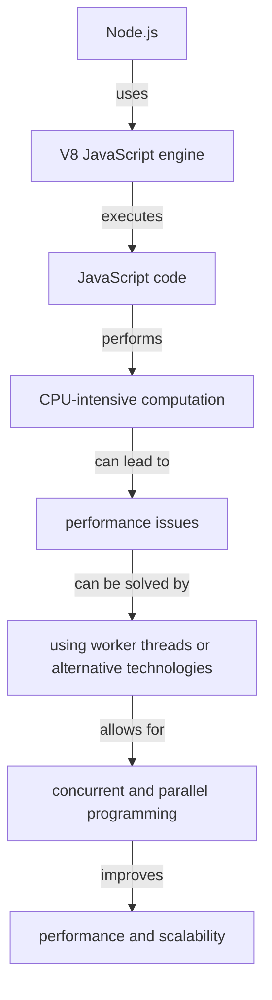

## Introduction
Node.js is a popular JavaScript runtime environment that has gained widespread adoption in recent years. However, despite its many advantages, Node.js is not ideal for CPU-heavy computation. In this section, we will explore why Node.js is not well-suited for CPU-intensive tasks and what alternatives are available.

Node.js is built on top of the V8 JavaScript engine, which is designed for fast and efficient execution of JavaScript code. However, V8 is not optimized for CPU-heavy computation, and Node.js is therefore not the best choice for tasks that require intense CPU usage. This is because Node.js is designed for I/O-bound operations, such as handling multiple concurrent connections, reading and writing files, and interacting with databases.

> **Note:** Node.js is perfect for real-time web applications, RESTful APIs, and microservices, but it's not the best fit for CPU-intensive tasks like scientific computing, data compression, or video processing.

Real-world relevance: many companies, such as Netflix, LinkedIn, and PayPal, use Node.js in production for their web applications and APIs. However, for CPU-heavy computation, they often use alternative technologies like Go, Rust, or worker threads.

## Core Concepts
To understand why Node.js is not ideal for CPU-heavy computation, we need to delve into some core concepts:

* **Event-driven I/O**: Node.js uses an event-driven I/O model, which allows it to handle multiple concurrent connections and I/O operations efficiently.
* **Single-threaded**: Node.js is single-threaded, meaning that it runs on a single thread and uses asynchronous I/O operations to handle concurrency.
* **V8 JavaScript engine**: Node.js is built on top of the V8 JavaScript engine, which is designed for fast and efficient execution of JavaScript code.

> **Warning:** Node.js is not suitable for CPU-intensive tasks because it can lead to performance issues and even crashes.

Key terminology:

* **CPU-bound**: a task that spends most of its time executing CPU instructions, such as scientific computing or data compression.
* **I/O-bound**: a task that spends most of its time waiting for I/O operations to complete, such as reading and writing files or interacting with databases.

## How It Works Internally
To understand why Node.js is not ideal for CPU-heavy computation, let's take a look at how it works internally:

1. **Event loop**: Node.js uses an event loop to handle asynchronous I/O operations and concurrency.
2. **V8 JavaScript engine**: The V8 JavaScript engine executes JavaScript code and provides a runtime environment for Node.js.
3. **Libuv**: Libuv is a cross-platform library that provides a unified API for I/O operations, such as file I/O, network I/O, and process management.

> **Tip:** To improve performance in Node.js, use async/await and Promises to handle concurrency and I/O operations.

## Code Examples
Here are three complete and runnable code examples that demonstrate the limitations of Node.js for CPU-heavy computation:

### Example 1: Basic usage
```javascript
// Calculate the sum of an array of numbers
function calculateSum(arr) {
  let sum = 0;
  for (let i = 0; i < arr.length; i++) {
    sum += arr[i];
  }
  return sum;
}

const arr = [1, 2, 3, 4, 5];
console.log(calculateSum(arr));
```
This example calculates the sum of an array of numbers using a simple for loop. However, for large arrays, this can be slow and CPU-intensive.

### Example 2: Real-world pattern
```javascript
// Use a worker thread to perform CPU-intensive computation
const { Worker } = require('worker_threads');

function calculateSum(arr) {
  return new Promise((resolve, reject) => {
    const worker = new Worker('./worker.js', { workerData: arr });
    worker.on('message', (sum) => {
      resolve(sum);
    });
    worker.on('error', (err) => {
      reject(err);
    });
  });
}

const arr = [1, 2, 3, 4, 5];
calculateSum(arr).then((sum) => {
  console.log(sum);
});
```
This example uses a worker thread to perform CPU-intensive computation, such as calculating the sum of a large array of numbers.

### Example 3: Advanced usage
```go
// Use Go to perform CPU-intensive computation
package main

import (
	"fmt"
	"runtime"
)

func calculateSum(arr []int) int {
	sum := 0
	for _, num := range arr {
		sum += num
	}
	return sum
}

func main() {
	arr := []int{1, 2, 3, 4, 5}
	sum := calculateSum(arr)
	fmt.Println(sum)
	runtime.GC() // Force garbage collection
}
```
This example uses Go to perform CPU-intensive computation, such as calculating the sum of a large array of numbers. Go is a better choice for CPU-heavy computation because it is designed for concurrent and parallel programming.

> **Interview:** Can you explain why Node.js is not suitable for CPU-intensive tasks? How would you handle CPU-heavy computation in a Node.js application?

## Visual Diagram

This diagram illustrates the relationship between Node.js, the V8 JavaScript engine, and CPU-intensive computation. It also shows how using worker threads or alternative technologies can improve performance and scalability.

## Comparison
| Approach | Time Complexity | Space Complexity | Pros | Cons | Best For |
| --- | --- | --- | --- | --- | --- |
| Node.js | O(n) | O(n) | Fast and efficient for I/O-bound operations, easy to use | Not suitable for CPU-intensive tasks, can lead to performance issues | Real-time web applications, RESTful APIs, microservices |
| Worker threads | O(n) | O(n) | Allows for concurrent and parallel programming, improves performance and scalability | Can be complex to use, requires additional resources | CPU-intensive tasks, such as scientific computing or data compression |
| Go | O(n) | O(n) | Designed for concurrent and parallel programming, fast and efficient | Steeper learning curve, not as widely adopted as Node.js | CPU-intensive tasks, such as scientific computing or data compression |
| Rust | O(n) | O(n) | Designed for systems programming, fast and efficient, provides memory safety guarantees | Steeper learning curve, not as widely adopted as Node.js | Systems programming, such as building operating systems or file systems |

## Real-world Use Cases
Here are three real-world use cases for Node.js and alternative technologies:

1. **Netflix**: Netflix uses Node.js for its web application and API, but uses alternative technologies like Go and Rust for CPU-intensive tasks like video processing and data compression.
2. **LinkedIn**: LinkedIn uses Node.js for its web application and API, but uses worker threads to perform CPU-intensive tasks like data processing and analysis.
3. **PayPal**: PayPal uses Node.js for its web application and API, but uses alternative technologies like Go and Rust for CPU-intensive tasks like payment processing and risk analysis.

## Common Pitfalls
Here are four common pitfalls to avoid when using Node.js and alternative technologies:

1. **Not using worker threads for CPU-intensive tasks**: This can lead to performance issues and crashes.
2. **Not using alternative technologies for CPU-intensive tasks**: This can lead to performance issues and crashes.
3. **Not optimizing code for performance**: This can lead to slow and inefficient code.
4. **Not using concurrent and parallel programming techniques**: This can lead to slow and inefficient code.

> **Warning:** Not using worker threads or alternative technologies for CPU-intensive tasks can lead to performance issues and crashes.

## Interview Tips
Here are three common interview questions and tips for answering them:

1. **Can you explain why Node.js is not suitable for CPU-intensive tasks?**: Answer by explaining that Node.js is designed for I/O-bound operations and is not optimized for CPU-intensive tasks.
2. **How would you handle CPU-heavy computation in a Node.js application?**: Answer by explaining that you would use worker threads or alternative technologies like Go or Rust.
3. **Can you explain the difference between Node.js and Go?**: Answer by explaining that Node.js is designed for I/O-bound operations, while Go is designed for concurrent and parallel programming.

> **Tip:** Practice answering common interview questions and be prepared to explain your thought process and design decisions.

## Key Takeaways
Here are ten key takeaways to remember:

* Node.js is not suitable for CPU-intensive tasks.
* Worker threads and alternative technologies like Go and Rust can be used for CPU-intensive tasks.
* Node.js is designed for I/O-bound operations.
* Go and Rust are designed for concurrent and parallel programming.
* Optimizing code for performance is important.
* Using concurrent and parallel programming techniques can improve performance and scalability.
* Node.js is widely adopted and has a large ecosystem.
* Go and Rust have a steeper learning curve, but provide memory safety guarantees and are designed for systems programming.
* Using the right tool for the job is important.
* Practicing and preparing for common interview questions can help you succeed in technical interviews.