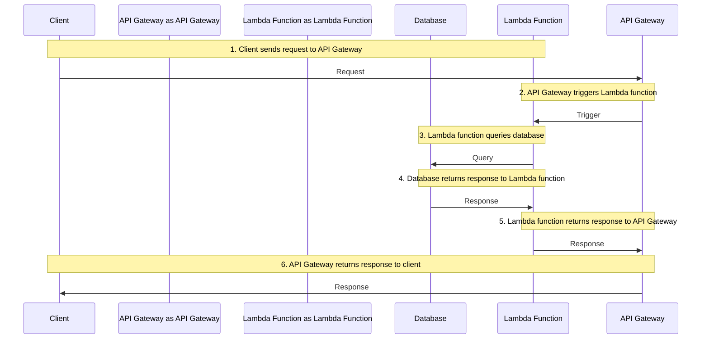

## Introduction
**Serverless functions** are a cloud computing model where developers can write and deploy code without worrying about the underlying infrastructure. This approach has gained popularity in recent years due to its scalability, cost-effectiveness, and ease of use. In this section, we will explore what serverless functions are, why they matter, and their real-world relevance.

Serverless functions are often used in conjunction with other cloud services, such as API gateways, databases, and storage solutions. They can be triggered by various events, including HTTP requests, changes to database records, or scheduled tasks. This makes them an ideal choice for building scalable and event-driven applications.

> **Note:** Serverless functions are not a replacement for traditional server-based applications, but rather a complementary approach that can help reduce costs and improve scalability.

## Core Concepts
To understand serverless functions, it's essential to grasp some key concepts:

* **Function-as-a-Service (FaaS)**: A cloud computing model where developers can write and deploy code without worrying about the underlying infrastructure.
* **Event-driven programming**: A programming paradigm where code is executed in response to specific events or triggers.
* **Stateless**: Serverless functions do not maintain state between invocations, which makes them easier to scale and manage.
* **Cold start**: The time it takes for a serverless function to start executing after a period of inactivity.

> **Warning:** Be aware of the cold start issue, as it can impact the performance of your serverless functions. This can be mitigated by using techniques such as keeping functions warm or using a caching layer.

## How It Works Internally
Here's a step-by-step breakdown of how serverless functions work internally:

1. **Code deployment**: Developers write and deploy code to a serverless platform, such as AWS Lambda or Cloudflare Workers.
2. **Event trigger**: An event is triggered, such as an HTTP request or a change to a database record.
3. **Function invocation**: The serverless platform invokes the deployed code, passing in any relevant event data.
4. **Execution**: The code executes, using any necessary resources such as memory or storage.
5. **Response**: The code returns a response, which is then sent back to the event trigger.

> **Tip:** Use a logging mechanism to monitor the execution of your serverless functions, as this can help with debugging and performance optimization.

## Code Examples
Here are three complete and runnable code examples, demonstrating basic usage, real-world patterns, and advanced usage:

### Example 1: Basic Usage (AWS Lambda)
```javascript
// Import the AWS SDK
const AWS = require('aws-sdk');

// Define the Lambda function handler
exports.handler = async (event) => {
  // Log the event data
  console.log(event);

  // Return a response
  return {
    statusCode: 200,
    body: 'Hello, world!',
  };
};
```

### Example 2: Real-world Pattern (Vercel)
```javascript
// Import the Next.js API route
import { NextApiRequest, NextApiResponse } from 'next';

// Define the API route handler
const handler = async (req: NextApiRequest, res: NextApiResponse) => {
  // Log the request data
  console.log(req.body);

  // Return a response
  return res.status(200).json({ message: 'Hello, world!' });
};

// Export the API route handler
export default handler;
```

### Example 3: Advanced Usage (Cloudflare Workers)
```javascript
// Import the Cloudflare Workers API
const { Worker, Router } = require('cloudflare-workers');

// Define the worker script
const worker = new Worker({
  async fetch(request) {
    // Log the request data
    console.log(request);

    // Return a response
    return new Response('Hello, world!', {
      headers: {
        'Content-Type': 'text/plain',
      },
    });
  },
});

// Export the worker script
export default worker;
```

## Visual Diagram

This diagram illustrates the flow of a serverless function, from the client's request to the API gateway, to the Lambda function, and finally to the database.

## Comparison
Here's a comparison table of popular serverless platforms:

| Platform | Time Complexity | Space Complexity | Pros | Cons | Best For |
| --- | --- | --- | --- | --- | --- |
| AWS Lambda | O(1) | O(n) | Scalable, secure, and reliable | Cold start issue, vendor lock-in | Real-time data processing, event-driven applications |
| Vercel | O(1) | O(n) | Fast and scalable, supports Next.js | Limited support for other frameworks | Serverless web applications, Next.js development |
| Cloudflare Workers | O(1) | O(n) | Fast and scalable, supports edge computing | Limited support for other languages | Edge computing, real-time data processing |

> **Interview:** Be prepared to answer questions about the trade-offs between different serverless platforms, such as scalability, security, and vendor lock-in.

## Real-world Use Cases
Here are three real-world examples of serverless functions in production:

1. **Netflix**: Uses AWS Lambda for real-time data processing and analytics.
2. **Airbnb**: Uses Vercel for serverless web applications and Next.js development.
3. **Dropbox**: Uses Cloudflare Workers for edge computing and real-time data processing.

## Common Pitfalls
Here are four common mistakes to avoid when using serverless functions:

1. **Not handling errors properly**: Failing to catch and handle errors can lead to unexpected behavior and poor user experience.
2. **Not optimizing performance**: Failing to optimize performance can lead to increased latency and costs.
3. **Not securing data**: Failing to secure data can lead to security breaches and data loss.
4. **Not monitoring and logging**: Failing to monitor and log serverless functions can make it difficult to debug and optimize performance.

> **Warning:** Be aware of the potential pitfalls of serverless functions, and take steps to avoid them.

## Interview Tips
Here are three common interview questions related to serverless functions, along with weak and strong answers:

1. **What are the benefits of using serverless functions?**
	* Weak answer: "Serverless functions are scalable and cost-effective."
	* Strong answer: "Serverless functions offer a range of benefits, including scalability, cost-effectiveness, and ease of use. They also enable developers to focus on writing code, rather than managing infrastructure."
2. **How do you handle errors in serverless functions?**
	* Weak answer: "I use try-catch blocks to catch errors."
	* Strong answer: "I use a combination of try-catch blocks, error logging, and monitoring to handle errors in serverless functions. I also make sure to test and validate my code thoroughly to prevent errors from occurring in the first place."
3. **What are some common use cases for serverless functions?**
	* Weak answer: "Serverless functions are used for real-time data processing and analytics."
	* Strong answer: "Serverless functions are used for a range of use cases, including real-time data processing and analytics, serverless web applications, and edge computing. They are also well-suited for event-driven applications, such as processing user requests or responding to changes in a database."

## Key Takeaways
Here are ten key takeaways to remember when using serverless functions:

* **Serverless functions are scalable and cost-effective**: They offer a range of benefits, including scalability, cost-effectiveness, and ease of use.
* **Serverless functions are event-driven**: They are triggered by specific events or triggers, such as HTTP requests or changes to a database.
* **Serverless functions are stateless**: They do not maintain state between invocations, which makes them easier to scale and manage.
* **Serverless functions have a cold start issue**: This can impact performance, but can be mitigated using techniques such as keeping functions warm or using a caching layer.
* **Serverless functions require careful error handling**: Failing to catch and handle errors can lead to unexpected behavior and poor user experience.
* **Serverless functions require optimization for performance**: Failing to optimize performance can lead to increased latency and costs.
* **Serverless functions require security and data protection**: Failing to secure data can lead to security breaches and data loss.
* **Serverless functions require monitoring and logging**: Failing to monitor and log serverless functions can make it difficult to debug and optimize performance.
* **Serverless functions are well-suited for real-time data processing and analytics**: They offer a range of benefits, including scalability, cost-effectiveness, and ease of use.
* **Serverless functions are well-suited for serverless web applications and edge computing**: They offer a range of benefits, including scalability, cost-effectiveness, and ease of use.