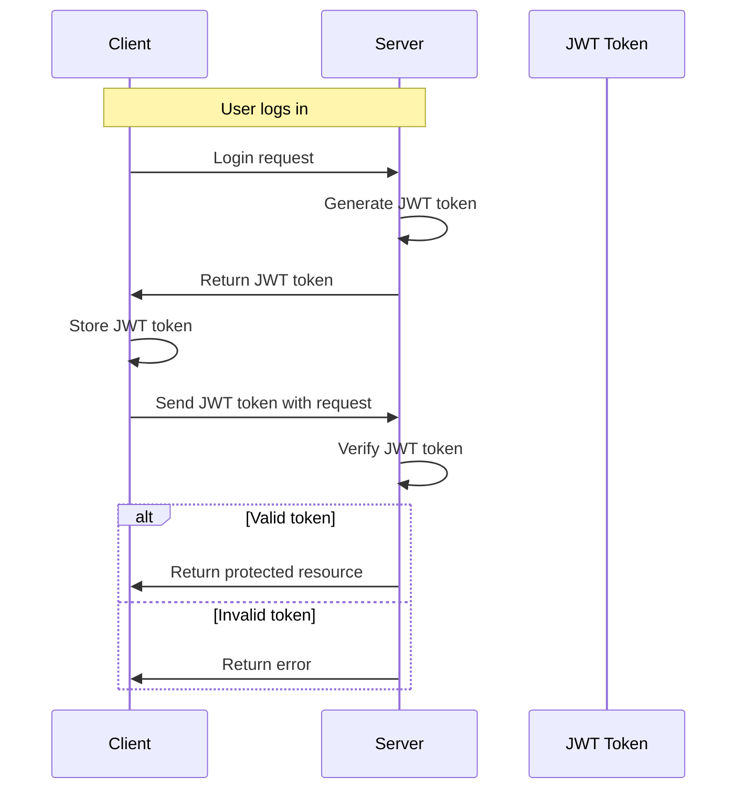

## Introduction
JSON Web Tokens (JWT) are an open standard for securely transmitting information between parties, typically used for authentication and authorization in web applications. The JWT structure consists of three main parts: **Header**, **Payload**, and **Signature**. In this section, we will delve into the world of JWT, exploring its significance, real-world relevance, and importance for every engineer to understand.

JWT is widely used in modern web development due to its compact and URL-safe nature, making it an ideal choice for authentication and authorization. Its structure allows for the secure transmission of claims, such as user identity, permissions, and authentication data, between parties. Understanding JWT is crucial for any engineer working on web applications, as it provides a robust and secure way to manage user authentication and authorization.

> **Note:** JWT is not encrypted, but rather encoded, which means that the data can be read by anyone. Therefore, sensitive information should not be stored in the payload.

## Core Concepts
To grasp the concept of JWT, it's essential to understand the following key terminology:

* **Header**: The header contains the algorithm used for signing the token, such as **HS256** (HMAC SHA256) or **RS256** (RSA signature with SHA256).
* **Payload**: The payload, also known as the claim set, contains the actual data being transmitted, such as user identity, permissions, or authentication data.
* **Signature**: The signature is generated by signing the header and payload with a secret key, ensuring the token's integrity and authenticity.

Mental models and analogies can help solidify the understanding of JWT. Consider a JWT as a secure, digital passport that contains the user's identity and permissions. The header is like the passport's cover, indicating the type of passport and the algorithm used to secure it. The payload is the passport's contents, containing the user's personal information and permissions. The signature is like the passport's official stamp, verifying the authenticity of the passport and its contents.

## How It Works Internally
When a user logs in to a web application, the server generates a JWT token by following these steps:

1. **Create the header**: The server creates the header, specifying the algorithm used for signing the token.
2. **Create the payload**: The server creates the payload, adding the user's identity, permissions, and other relevant data.
3. **Generate the signature**: The server signs the header and payload with a secret key, generating the signature.
4. **Return the JWT token**: The server returns the JWT token to the client, which can then be used for authentication and authorization.

Under-the-hood mechanics involve the use of cryptographic algorithms, such as HMAC SHA256 or RSA, to generate the signature. The server uses a secret key to sign the header and payload, ensuring the token's integrity and authenticity.

## Code Examples
Here are three complete and runnable examples of JWT in Node.js:

### Example 1: Basic JWT Generation
```javascript
const jwt = require('jsonwebtoken');
const secretKey = 'mysecretkey';

const payload = {
  userId: 1,
  username: 'johnDoe',
};

const token = jwt.sign(payload, secretKey, { algorithm: 'HS256' });
console.log(token);
```

### Example 2: JWT Verification
```javascript
const jwt = require('jsonwebtoken');
const secretKey = 'mysecretkey';

const token = 'your_jwt_token_here';
jwt.verify(token, secretKey, (err, decoded) => {
  if (err) {
    console.log('Invalid token');
  } else {
    console.log(decoded);
  }
});
```

### Example 3: Advanced JWT Usage with Refresh Tokens
```javascript
const jwt = require('jsonwebtoken');
const secretKey = 'mysecretkey';
const refreshSecretKey = 'myrefreshsecretkey';

const payload = {
  userId: 1,
  username: 'johnDoe',
};

const token = jwt.sign(payload, secretKey, { algorithm: 'HS256', expiresIn: '1h' });
const refreshToken = jwt.sign(payload, refreshSecretKey, { algorithm: 'HS256', expiresIn: '30d' });

console.log(token);
console.log(refreshToken);
```

## Visual Diagram

This diagram illustrates the flow of JWT token generation, verification, and usage in a web application.

## Comparison
| Approach | Time Complexity | Space Complexity | Pros | Cons | Best For |
| --- | --- | --- | --- | --- | --- |
| HS256 | O(1) | O(1) | Fast, secure | Limited key size | Small-scale applications |
| RS256 | O(n) | O(n) | Secure, scalable | Slow, complex | Large-scale applications |
| JWT with Refresh Tokens | O(1) | O(1) | Secure, convenient | Complex, requires additional storage | Applications with high security requirements |
| Session-based Authentication | O(1) | O(n) | Simple, familiar | Limited scalability, insecure | Small-scale applications with low security requirements |

## Real-world Use Cases
JWT is widely used in various industries and companies, such as:

* **Google**: Uses JWT for authentication and authorization in its APIs and services.
* **Facebook**: Uses JWT for authentication and authorization in its APIs and services.
* **Amazon**: Uses JWT for authentication and authorization in its APIs and services, such as Amazon Cognito.

## Common Pitfalls
Here are some common mistakes to avoid when using JWT:

* **Insecure secret key**: Using an insecure secret key can compromise the security of the JWT token.
* **Insufficient token expiration**: Failing to set a suitable expiration time for the JWT token can lead to security issues.
* **Incorrect algorithm usage**: Using an incorrect algorithm, such as HS256 for large-scale applications, can lead to performance issues.
* **Inadequate error handling**: Failing to handle errors properly can lead to security vulnerabilities.

> **Warning:** Never use an insecure secret key or hardcode it in your code.

## Interview Tips
Here are some common interview questions related to JWT:

* **What is JWT, and how does it work?**: A strong answer should explain the structure of JWT, its components, and its workflow.
* **How do you handle JWT token expiration?**: A strong answer should explain the importance of setting a suitable expiration time and how to handle token renewal.
* **What are the differences between HS256 and RS256?**: A strong answer should explain the differences in terms of security, performance, and scalability.

> **Interview:** Be prepared to explain the trade-offs between different algorithms and approaches, as well as how to handle common pitfalls and security concerns.

## Key Takeaways
Here are the key takeaways from this section:

* **JWT structure**: Header, Payload, and Signature.
* **Algorithm usage**: HS256, RS256, and other algorithms.
* **Token expiration**: Set a suitable expiration time to ensure security.
* **Error handling**: Handle errors properly to prevent security vulnerabilities.
* **Scalability**: Consider scalability when choosing an algorithm or approach.
* **Security**: Use secure secret keys and handle security concerns properly.
* **Best practices**: Follow best practices for JWT usage, such as using refresh tokens and handling token renewal.
* **Common pitfalls**: Avoid common mistakes, such as insecure secret keys and insufficient token expiration.
* **Time complexity**: Consider the time complexity of different algorithms and approaches.
* **Space complexity**: Consider the space complexity of different algorithms and approaches.