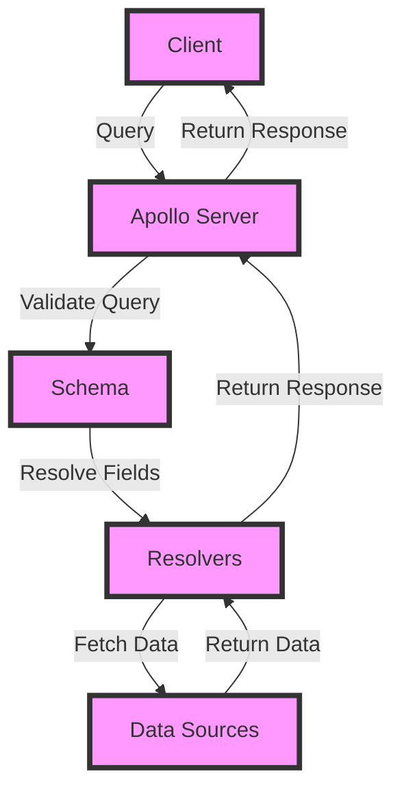

## Introduction
**GraphQL** is a query language for APIs that allows for more flexibility and efficiency in fetching data. It was developed by Facebook in 2015 and has since become a popular alternative to traditional RESTful APIs. **Apollo Server** is a popular implementation of GraphQL that provides a scalable and production-ready solution for building GraphQL APIs. In this section, we will explore the basics of GraphQL and Apollo Server, and why they matter in real-world applications.

> **Note:** GraphQL is not a replacement for RESTful APIs, but rather a complementary approach that can be used to improve the performance and flexibility of data fetching.

Real-world relevance: GraphQL and Apollo Server are used in production by many companies, including Facebook, GitHub, and Pinterest. They are particularly useful in applications that require complex data fetching, such as social media platforms, e-commerce websites, and mobile apps.

## Core Concepts
The core concepts of GraphQL and Apollo Server include:

* **Schema**: The schema defines the types of data that can be fetched and the relationships between them. It is the foundation of a GraphQL API and is used to validate queries and mutations.
* **Resolvers**: Resolvers are functions that are responsible for fetching the data for a specific field in the schema. They can be used to fetch data from databases, APIs, or other data sources.
* **Context**: The context is an object that is passed to each resolver and provides information about the current request, such as the user's authentication details and the request headers.

> **Tip:** When defining a schema, it's a good idea to use a modular approach, where each module defines a specific set of types and resolvers. This makes it easier to maintain and extend the schema over time.

Key terminology:

* **Query**: A query is a request to fetch data from the GraphQL API. It can include multiple fields and can be used to fetch data from multiple types.
* **Mutation**: A mutation is a request to update or delete data in the GraphQL API. It can include multiple fields and can be used to update or delete data from multiple types.
* **Subscription**: A subscription is a request to receive real-time updates from the GraphQL API. It can be used to receive updates when data is updated or deleted.

## How It Works Internally
Here's a step-by-step overview of how GraphQL and Apollo Server work internally:

1. **Schema Definition**: The schema is defined using the GraphQL schema definition language (SDL). The schema defines the types of data that can be fetched and the relationships between them.
2. **Resolver Registration**: Resolvers are registered with the schema using the `resolver` function. Each resolver is responsible for fetching the data for a specific field in the schema.
3. **Context Creation**: The context is created for each request and is passed to each resolver. The context provides information about the current request, such as the user's authentication details and the request headers.
4. **Query Parsing**: The query is parsed and validated against the schema. If the query is invalid, an error is returned to the client.
5. **Resolver Execution**: The resolvers are executed in order to fetch the data for the query. Each resolver is responsible for fetching the data for a specific field in the query.
6. **Response Generation**: The response is generated by combining the data from each resolver. The response is then returned to the client.

> **Warning:** When defining resolvers, it's a good idea to use a try-catch block to handle any errors that may occur during execution. This ensures that the client receives a valid response even if an error occurs.

## Code Examples
Here are three complete and runnable examples of using GraphQL and Apollo Server:

**Example 1: Basic Schema**
```javascript
const { ApolloServer } = require('apollo-server');
const { gql } = require('graphql-tag');

const typeDefs = gql`
  type Book {
    title: String
    author: String
  }

  type Query {
    books: [Book]
  }
`;

const resolvers = {
  Query: {
    books: () => [
      { title: 'Book 1', author: 'Author 1' },
      { title: 'Book 2', author: 'Author 2' },
    ],
  },
};

const server = new ApolloServer({ typeDefs, resolvers });

server.listen().then(({ url }) => {
  console.log(`Server listening on ${url}`);
});
```
**Example 2: Real-World Schema**
```javascript
const { ApolloServer } = require('apollo-server');
const { gql } = require('graphql-tag');
const mongoose = require('mongoose');

mongoose.connect('mongodb://localhost/books', { useNewUrlParser: true, useUnifiedTopology: true });

const Book = mongoose.model('Book', {
  title: String,
  author: String,
});

const typeDefs = gql`
  type Book {
    id: ID
    title: String
    author: String
  }

  type Query {
    books: [Book]
  }

  type Mutation {
    createBook(title: String, author: String): Book
  }
`;

const resolvers = {
  Query: {
    books: async () => {
      const books = await Book.find();
      return books;
    },
  },
  Mutation: {
    createBook: async (parent, { title, author }) => {
      const book = new Book({ title, author });
      await book.save();
      return book;
    },
  },
};

const server = new ApolloServer({ typeDefs, resolvers });

server.listen().then(({ url }) => {
  console.log(`Server listening on ${url}`);
});
```
**Example 3: Advanced Schema**
```javascript
const { ApolloServer } = require('apollo-server');
const { gql } = require('graphql-tag');
const mongoose = require('mongoose');

mongoose.connect('mongodb://localhost/books', { useNewUrlParser: true, useUnifiedTopology: true });

const Book = mongoose.model('Book', {
  title: String,
  author: String,
});

const typeDefs = gql`
  type Book {
    id: ID
    title: String
    author: String
  }

  type Query {
    books: [Book]
  }

  type Mutation {
    createBook(title: String, author: String): Book
    updateBook(id: ID, title: String, author: String): Book
    deleteBook(id: ID): Book
  }

  type Subscription {
    newBook: Book
  }
`;

const resolvers = {
  Query: {
    books: async () => {
      const books = await Book.find();
      return books;
    },
  },
  Mutation: {
    createBook: async (parent, { title, author }) => {
      const book = new Book({ title, author });
      await book.save();
      return book;
    },
    updateBook: async (parent, { id, title, author }) => {
      const book = await Book.findByIdAndUpdate(id, { title, author }, { new: true });
      return book;
    },
    deleteBook: async (parent, { id }) => {
      const book = await Book.findByIdAndDelete(id);
      return book;
    },
  },
  Subscription: {
    newBook: {
      subscribe: () => {
        return Book.watch();
      },
    },
  },
};

const server = new ApolloServer({ typeDefs, resolvers });

server.listen().then(({ url }) => {
  console.log(`Server listening on ${url}`);
});
```
## Visual Diagram

The diagram illustrates the flow of a query from the client to the Apollo Server, and how the server resolves the query using the schema and resolvers.

> **Interview:** Can you explain the difference between a query and a mutation in GraphQL? How do you handle errors in resolvers?

## Comparison
| Approach | Time Complexity | Space Complexity | Pros | Cons | Best For |
| --- | --- | --- | --- | --- | --- |
| RESTful API | O(1) | O(1) | Simple, widely adopted | Limited flexibility, tight coupling | Simple CRUD operations |
| GraphQL | O(n) | O(n) | Flexible, scalable | Complex, steep learning curve | Complex data fetching, real-time updates |
| Apollo Server | O(n) | O(n) | Scalable, production-ready | Complex, requires expertise | Large-scale GraphQL APIs |
| Relay | O(n) | O(n) | Scalable, optimized | Complex, requires expertise | Large-scale GraphQL APIs with complex caching requirements |

## Real-world Use Cases
Here are three real-world use cases for GraphQL and Apollo Server:

* **Facebook**: Facebook uses GraphQL to power its mobile app, which has over 2 billion monthly active users. The app uses GraphQL to fetch data from multiple sources, including the Facebook graph and external APIs.
* **GitHub**: GitHub uses GraphQL to power its web app, which has over 40 million users. The app uses GraphQL to fetch data from multiple sources, including the GitHub graph and external APIs.
* **Pinterest**: Pinterest uses GraphQL to power its web app, which has over 300 million users. The app uses GraphQL to fetch data from multiple sources, including the Pinterest graph and external APIs.

> **Tip:** When implementing GraphQL in a real-world application, it's a good idea to start with a simple schema and gradually add complexity as needed. This helps to avoid overwhelming the development team and ensures that the schema is well-maintained over time.

## Common Pitfalls
Here are four common pitfalls to watch out for when using GraphQL and Apollo Server:

* **Over-fetching**: Over-fetching occurs when a client requests more data than it needs, which can lead to performance issues and increased latency.
* **Under-fetching**: Under-fetching occurs when a client requests less data than it needs, which can lead to additional requests and increased latency.
* **Incorrect schema design**: Incorrect schema design can lead to performance issues, data inconsistencies, and maintenance headaches.
* **Lack of error handling**: Lack of error handling can lead to unexpected behavior, errors, and security vulnerabilities.

> **Warning:** When implementing error handling in resolvers, it's a good idea to use a try-catch block to catch any errors that may occur during execution. This ensures that the client receives a valid response even if an error occurs.

## Interview Tips
Here are three common interview questions for GraphQL and Apollo Server, along with sample answers:

* **What is the difference between a query and a mutation in GraphQL?**
	+ Weak answer: "A query is used to fetch data, while a mutation is used to update data."
	+ Strong answer: "A query is used to fetch data, while a mutation is used to update or delete data. Mutations can also be used to perform complex operations, such as creating a new user or updating a user's profile."
* **How do you handle errors in resolvers?**
	+ Weak answer: "I use a try-catch block to catch any errors that may occur during execution."
	+ Strong answer: "I use a try-catch block to catch any errors that may occur during execution. I also make sure to log the error and return a valid response to the client, even if an error occurs. Additionally, I use error handling mechanisms such as GraphQL's built-in error handling to provide more detailed error messages and to prevent errors from propagating to the client."
* **What is the purpose of the context in Apollo Server?**
	+ Weak answer: "The context is used to pass data between resolvers."
	+ Strong answer: "The context is used to pass data between resolvers, as well as to provide information about the current request, such as the user's authentication details and the request headers. The context can also be used to perform authentication and authorization checks, and to log information about the request."

## Key Takeaways
Here are ten key takeaways to remember when using GraphQL and Apollo Server:

* **GraphQL is a query language for APIs**: GraphQL is a query language that allows for more flexibility and efficiency in fetching data.
* **Apollo Server is a popular implementation of GraphQL**: Apollo Server is a popular implementation of GraphQL that provides a scalable and production-ready solution for building GraphQL APIs.
* **The schema is the foundation of a GraphQL API**: The schema defines the types of data that can be fetched and the relationships between them.
* **Resolvers are responsible for fetching data**: Resolvers are functions that are responsible for fetching the data for a specific field in the schema.
* **The context provides information about the current request**: The context provides information about the current request, such as the user's authentication details and the request headers.
* **Error handling is crucial in resolvers**: Error handling is crucial in resolvers to ensure that the client receives a valid response even if an error occurs.
* **GraphQL has a steep learning curve**: GraphQL has a steep learning curve, but it provides a flexible and efficient way to fetch data.
* **Apollo Server provides a scalable solution**: Apollo Server provides a scalable solution for building GraphQL APIs, but it requires expertise and maintenance.
* **Real-world use cases include Facebook, GitHub, and Pinterest**: Real-world use cases include Facebook, GitHub, and Pinterest, which use GraphQL to power their mobile and web apps.
* **Common pitfalls include over-fetching, under-fetching, and incorrect schema design**: Common pitfalls include over-fetching, under-fetching, and incorrect schema design, which can lead to performance issues, data inconsistencies, and maintenance headaches.