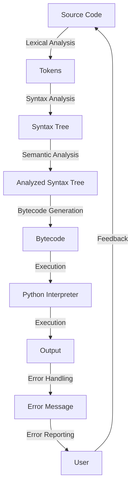

## Introduction
Python is a high-level, interpreted programming language that has gained immense popularity in recent years due to its **readable**, **clean syntax**, and **beginner-friendly** nature. Python's simplicity and ease of use make it an ideal language for beginners, while its versatility and extensive libraries make it a favorite among experienced developers. In this overview, we will delve into the world of Python, exploring its core concepts, internal mechanics, and real-world applications. 
> **Note:** Python's simplicity is a major factor in its widespread adoption, with many top companies, including Google, Facebook, and Instagram, using it in their production environments.

## Core Concepts
Python's core concepts are built around the idea of **objects**, which are instances of **classes**. A class is a blueprint or a template that defines the properties and behavior of an object. Python's core concepts include:
* **Variables**: Used to store and manipulate data.
* **Data Types**: Python has several built-in data types, including **integers**, **floats**, **strings**, **lists**, **tuples**, and **dictionaries**.
* **Control Structures**: Used to control the flow of a program, including **if-else statements**, **for loops**, and **while loops**.
* **Functions**: Used to encapsulate code and promote reusability.
> **Tip:** Understanding Python's core concepts is crucial for any aspiring developer, as they form the foundation of the language.

## How It Works Internally
When you run a Python program, the following steps occur:
1. **Lexical Analysis**: The source code is broken down into individual tokens, such as keywords, identifiers, and literals.
2. **Syntax Analysis**: The tokens are parsed into a syntax tree, which represents the program's structure.
3. **Semantic Analysis**: The syntax tree is analyzed for semantic errors, such as type mismatches and undefined variables.
4. **Bytecode Generation**: The analyzed syntax tree is converted into bytecode, which is platform-independent.
5. **Execution**: The bytecode is executed by the Python interpreter, which performs the actual computation.
> **Warning:** Python's dynamic typing can lead to type errors at runtime if not properly handled.

## Code Examples
### Example 1: Basic Python Program
```python
# Define a function to greet the user
def greet(name: str) -> None:
    """Prints a personalized greeting message."""
    print(f"Hello, {name}!")

# Call the function with a name
greet("John")
```
### Example 2: Real-World Pattern (To-Do List App)
```python
# Define a TodoItem class
class TodoItem:
    def __init__(self, title: str, description: str) -> None:
        """Initializes a TodoItem instance."""
        self.title = title
        self.description = description
        self.done = False

# Define a TodoList class
class TodoList:
    def __init__(self) -> None:
        """Initializes a TodoList instance."""
        self.items = []

    def add_item(self, item: TodoItem) -> None:
        """Adds a TodoItem to the list."""
        self.items.append(item)

    def display_items(self) -> None:
        """Displays all TodoItems in the list."""
        for item in self.items:
            print(f"{item.title}: {item.description} ({'Done' if item.done else 'Not Done'})")

# Create a TodoList and add some items
todo_list = TodoList()
todo_list.add_item(TodoItem("Buy milk", "Get 2 liters of milk from the store"))
todo_list.add_item(TodoItem("Walk the dog", "Take the dog for a 30-minute walk"))
todo_list.display_items()
```
### Example 3: Advanced Usage (Decorator Pattern)
```python
# Define a decorator function
def timer_decorator(func):
    """A decorator that measures the execution time of a function."""
    import time
    def wrapper(*args, **kwargs):
        start_time = time.time()
        result = func(*args, **kwargs)
        end_time = time.time()
        print(f"Execution time: {end_time - start_time} seconds")
        return result
    return wrapper

# Apply the decorator to a function
@timer_decorator
def example_function():
    """A function that simulates some work."""
    import time
    time.sleep(2)

# Call the decorated function
example_function()
```
> **Interview:** Can you explain the difference between a class and an object in Python? A class is a blueprint or template, while an object is an instance of that class.

## Visual Diagram

The diagram illustrates the internal mechanics of the Python interpreter, from lexical analysis to execution and error handling.

## Comparison
| Approach | Time Complexity | Space Complexity | Pros | Cons | Best For |
| --- | --- | --- | --- | --- | --- |
| **Dynamic Typing** | O(1) | O(1) | Flexible, easy to use | Error-prone, slow | Rapid prototyping, development |
| **Static Typing** | O(1) | O(1) | Safe, efficient | Verbose, inflexible | Large-scale applications, systems programming |
| **Just-In-Time (JIT) Compilation** | O(n) | O(n) | Fast, efficient | Complex, platform-dependent | High-performance applications, games |
| **Ahead-Of-Time (AOT) Compilation** | O(n) | O(n) | Fast, secure | Complex, platform-dependent | Embedded systems, mobile apps |

## Real-world Use Cases
1. **Instagram**: Instagram's backend is built using Python, with a focus on scalability and performance.
2. **Pinterest**: Pinterest's web scraper is built using Python, with a focus on flexibility and ease of use.
3. **Dropbox**: Dropbox's file synchronization algorithm is built using Python, with a focus on efficiency and reliability.

## Common Pitfalls
1. **Type Errors**: Python's dynamic typing can lead to type errors at runtime if not properly handled.
```python
# Wrong way
def add(a, b):
    return a + b

# Right way
def add(a: int, b: int) -> int:
    return a + b
```
2. **Memory Leaks**: Python's garbage collector can lead to memory leaks if not properly managed.
```python
# Wrong way
import os
os.system("ls -l")

# Right way
import subprocess
subprocess.run(["ls", "-l"])
```
3. **Infinite Loops**: Python's loops can lead to infinite loops if not properly terminated.
```python
# Wrong way
while True:
    print("Hello, world!")

# Right way
i = 0
while i < 10:
    print("Hello, world!")
    i += 1
```
4. **Uncaught Exceptions**: Python's exceptions can lead to uncaught exceptions if not properly handled.
```python
# Wrong way
def divide(a, b):
    return a / b

# Right way
def divide(a: int, b: int) -> float:
    try:
        return a / b
    except ZeroDivisionError:
        return float("inf")
```
> **Warning:** Uncaught exceptions can lead to crashes and data loss.

## Interview Tips
1. **What is the difference between a list and a tuple in Python?**
	* Weak answer: "A list is mutable, while a tuple is immutable."
	* Strong answer: "A list is a mutable collection of items, while a tuple is an immutable collection of items. Lists are defined using square brackets `[]`, while tuples are defined using parentheses `()`. Lists are more flexible and can be modified after creation, while tuples are more efficient and cannot be modified after creation."
2. **How do you handle errors in Python?**
	* Weak answer: "I use try-except blocks to catch exceptions."
	* Strong answer: "I use try-except blocks to catch exceptions, and I also use logging to track errors and monitor system performance. I also use error handling mechanisms such as `try`-`except`-`finally` blocks to ensure that resources are properly released and cleaned up."
3. **What is the purpose of the `self` parameter in Python classes?**
	* Weak answer: "The `self` parameter is used to access instance variables."
	* Strong answer: "The `self` parameter is a reference to the current instance of the class and is used to access instance variables and methods. It is a convention in Python to use `self` as the first parameter in instance methods, and it is automatically passed in when a method is called on an instance of the class."

## Key Takeaways
* Python is a high-level, interpreted programming language with a focus on readability and ease of use.
* Python's core concepts include variables, data types, control structures, functions, and classes.
* Python's internal mechanics include lexical analysis, syntax analysis, semantic analysis, bytecode generation, and execution.
* Python's dynamic typing can lead to type errors at runtime if not properly handled.
* Python's garbage collector can lead to memory leaks if not properly managed.
* Python's loops can lead to infinite loops if not properly terminated.
* Python's exceptions can lead to uncaught exceptions if not properly handled.
* Understanding Python's core concepts, internal mechanics, and best practices is crucial for any aspiring developer.
* Python is widely used in real-world applications, including web development, data analysis, machine learning, and more.
* Python's simplicity, flexibility, and ease of use make it an ideal language for beginners and experienced developers alike.
> **Tip:** Mastering Python's core concepts, internal mechanics, and best practices is key to becoming a proficient Python developer.