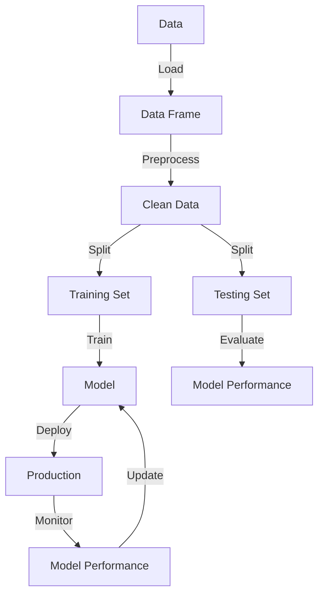

## Introduction
Python is a high-level, interpreted programming language that has become the largest ecosystem for **Data Science**, **Machine Learning (ML)**, and **Artificial Intelligence (AI)**. Its simplicity, flexibility, and extensive libraries make it an ideal choice for beginners and experts alike. With its vast collection of libraries and frameworks, Python provides a comprehensive platform for data analysis, visualization, and modeling. In this overview, we will delve into the core concepts, internal mechanics, and practical applications of Python in the field of Data Science, ML, and AI.

> **Note:** Python's simplicity and ease of use have made it a popular choice among data scientists and machine learning engineers, allowing them to focus on complex problem-solving rather than getting bogged down in low-level details.

## Core Concepts
To get started with Python for Data Science, ML, and AI, it's essential to understand the core concepts and key terminology.

* **Data Science**: The process of extracting insights and knowledge from data using various techniques, such as statistical modeling, machine learning, and data visualization.
* **Machine Learning (ML)**: A subset of AI that involves training algorithms to learn from data and make predictions or decisions.
* **Artificial Intelligence (AI)**: A broader field that encompasses ML, natural language processing, computer vision, and other areas focused on creating intelligent systems.
* **Libraries and Frameworks**: Python's extensive collection of libraries, such as **NumPy**, **Pandas**, **scikit-learn**, and **TensorFlow**, provide efficient and effective tools for data analysis, modeling, and visualization.

> **Tip:** Familiarize yourself with the most commonly used libraries and frameworks to streamline your workflow and improve productivity.

## How It Works Internally
Python's internal mechanics are designed to provide a seamless and efficient experience for data scientists and machine learning engineers.

1. **Memory Management**: Python uses a private heap to manage memory, which eliminates the need for manual memory allocation and deallocation.
2. **Execution Model**: Python's execution model is based on a **bytecode interpreter**, which compiles Python code into bytecode and then executes it line by line.
3. **Libraries and Extensions**: Python's extensive collection of libraries and extensions provides a wide range of functionalities, from data analysis and visualization to machine learning and deep learning.

> **Warning:** Python's dynamic typing and lack of memory safety features can lead to memory leaks and performance issues if not managed properly.

## Code Examples
Here are three complete and runnable examples that demonstrate the basics of Python for Data Science, ML, and AI:

### Example 1: Basic Data Analysis with Pandas
```python
import pandas as pd

# Load a sample dataset
data = {'Name': ['John', 'Mary', 'David'], 
        'Age': [25, 31, 42]}
df = pd.DataFrame(data)

# Print the first few rows of the dataset
print(df.head())
```

### Example 2: Machine Learning with scikit-learn
```python
from sklearn.datasets import load_iris
from sklearn.model_selection import train_test_split
from sklearn.linear_model import LogisticRegression

# Load the iris dataset
iris = load_iris()
X = iris.data
y = iris.target

# Split the dataset into training and testing sets
X_train, X_test, y_train, y_test = train_test_split(X, y, test_size=0.2, random_state=42)

# Train a logistic regression model
model = LogisticRegression()
model.fit(X_train, y_train)

# Evaluate the model's performance
accuracy = model.score(X_test, y_test)
print(f"Accuracy: {accuracy:.2f}")
```

### Example 3: Deep Learning with TensorFlow
```python
import tensorflow as tf
from tensorflow.keras.datasets import mnist
from tensorflow.keras.models import Sequential
from tensorflow.keras.layers import Dense, Dropout, Flatten
from tensorflow.keras.layers import Conv2D, MaxPooling2D

# Load the MNIST dataset
(X_train, y_train), (X_test, y_test) = mnist.load_data()

# Normalize the input data
X_train = X_train.astype('float32') / 255
X_test = X_test.astype('float32') / 255

# Define a convolutional neural network (CNN) model
model = Sequential()
model.add(Conv2D(32, (3, 3), activation='relu', input_shape=(28, 28, 1)))
model.add(MaxPooling2D((2, 2)))
model.add(Flatten())
model.add(Dense(128, activation='relu'))
model.add(Dropout(0.2))
model.add(Dense(10, activation='softmax'))

# Compile the model
model.compile(optimizer='adam', loss='sparse_categorical_crossentropy', metrics=['accuracy'])

# Train the model
model.fit(X_train, y_train, epochs=10, batch_size=128, validation_data=(X_test, y_test))
```

## Visual Diagram

This diagram illustrates the data science workflow, from loading and preprocessing data to training and deploying a model.

> **Interview:** Can you walk me through the data science workflow and explain the importance of each step?

## Comparison
| Approach | Time Complexity | Space Complexity | Pros | Cons | Best For |
| --- | --- | --- | --- | --- | --- |
| **Scikit-learn** | O(n) | O(n) | Easy to use, wide range of algorithms | Limited scalability | Small to medium-sized datasets |
| **TensorFlow** | O(n^2) | O(n^2) | Highly scalable, flexible | Steep learning curve | Large-scale deep learning projects |
| **PyTorch** | O(n) | O(n) | Dynamic computation graph, rapid prototyping | Limited support for parallelization | Rapid prototyping and research |
| **Keras** | O(n) | O(n) | High-level API, easy to use | Limited control over low-level details | Beginners and small-scale projects |

## Real-world Use Cases
1. **Google**: Uses Python for data analysis and machine learning in various applications, including Google Search and Google Ads.
2. **Netflix**: Employs Python for data science and engineering tasks, such as personalized recommendations and content optimization.
3. **Airbnb**: Utilizes Python for data analysis and machine learning to optimize pricing, demand forecasting, and customer segmentation.

> **Tip:** Familiarize yourself with real-world use cases to gain a deeper understanding of the practical applications of Python in Data Science, ML, and AI.

## Common Pitfalls
1. **Memory Leaks**: Failing to properly manage memory can lead to performance issues and crashes.
2. **Overfitting**: Models that are too complex can result in overfitting, which can be mitigated by regularization techniques.
3. **Data Quality**: Poor data quality can significantly impact model performance, emphasizing the importance of data preprocessing and cleaning.
4. **Model Deployment**: Failing to properly deploy models can result in suboptimal performance, highlighting the need for careful model serving and monitoring.

> **Warning:** Be aware of these common pitfalls to avoid costly mistakes and ensure the success of your Data Science, ML, and AI projects.

## Interview Tips
1. **What is your experience with Python for Data Science, ML, and AI?**: Be prepared to discuss your experience with Python and its applications in Data Science, ML, and AI.
2. **How do you approach data preprocessing and cleaning?**: Explain your approach to data preprocessing and cleaning, highlighting your understanding of data quality and its impact on model performance.
3. **Can you walk me through your experience with machine learning algorithms?**: Discuss your experience with various machine learning algorithms, including their strengths, weaknesses, and applications.

> **Interview:** Can you explain the differences between supervised, unsupervised, and reinforcement learning?

## Key Takeaways
* **Python is a versatile language** for Data Science, ML, and AI, offering a wide range of libraries and frameworks.
* **Data quality is crucial** for model performance, emphasizing the importance of data preprocessing and cleaning.
* **Model deployment and monitoring** are essential for ensuring the success of Data Science, ML, and AI projects.
* **Scikit-learn and TensorFlow** are popular libraries for machine learning, offering a wide range of algorithms and tools.
* **PyTorch and Keras** are popular frameworks for deep learning, providing dynamic computation graphs and high-level APIs.
* **Real-world use cases** demonstrate the practical applications of Python in Data Science, ML, and AI, highlighting its importance in various industries.
* **Common pitfalls** can be avoided by being aware of memory leaks, overfitting, data quality, and model deployment issues.
* **Interview preparation** involves discussing experience with Python, data preprocessing, machine learning algorithms, and model deployment.