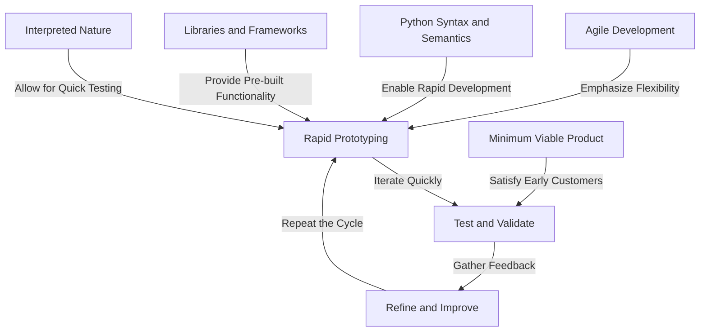

## Introduction
Rapid prototyping and development speed are crucial aspects of software development that enable developers to quickly test and validate their ideas. **Rapid prototyping** refers to the process of creating a working model or prototype of a product or system in a short amount of time. This approach allows developers to **iterate quickly**, **test assumptions**, and **validate ideas** before investing significant time and resources into a project. In the context of Python development, rapid prototyping is particularly important due to the language's **high-level syntax**, **extensive libraries**, and **large community**. In this study guide, we will explore the benefits of rapid prototyping and development speed, including how to leverage Python's strengths to accelerate the development process.


## Core Concepts
To understand the benefits of rapid prototyping and development speed, it's essential to grasp the following core concepts:

*   **Prototyping**: The process of creating a working model or prototype of a product or system.
*   **Development Speed**: The rate at which developers can design, implement, and test software.
*   **Agile Development**: An iterative and incremental approach to software development that emphasizes flexibility, collaboration, and rapid delivery.
*   **Minimum Viable Product (MVP)**: A product or system that has just enough features to satisfy early customers and provide feedback for future development.

> **Note:** Rapid prototyping and development speed are closely related to agile development methodologies, which emphasize flexibility, collaboration, and rapid delivery.


## How It Works Internally
Rapid prototyping and development speed in Python rely on several internal mechanics:

1.  **Syntax and Semantics**: Python's high-level syntax and semantics enable developers to write code quickly and efficiently.
2.  **Libraries and Frameworks**: Python's extensive collection of libraries and frameworks provides developers with pre-built functionality, reducing the need to write custom code.
3.  **Interpreted Nature**: Python's interpreted nature allows developers to write and test code quickly, without the need for compilation.

Here's an example of how Python's syntax and semantics facilitate rapid prototyping:
```python
# Define a simple class
class Person:
    def __init__(self, name, age):
        self.name = name
        self.age = age

    def greet(self):
        print(f"Hello, my name is {self.name} and I'm {self.age} years old.")

# Create an instance of the class
person = Person("John", 30)

# Call the greet method
person.greet()
```
> **Tip:** Leverage Python's built-in data structures, such as lists and dictionaries, to simplify data manipulation and processing.


## Code Examples
Here are three code examples that demonstrate rapid prototyping and development speed in Python:

### Example 1: Basic Calculator
```python
# Define a simple calculator function
def calculator(num1, num2, operator):
    if operator == "+":
        return num1 + num2
    elif operator == "-":
        return num1 - num2
    elif operator == "*":
        return num1 * num2
    elif operator == "/":
        if num2 != 0:
            return num1 / num2
        else:
            return "Error: Division by zero"

# Test the calculator function
print(calculator(10, 2, "+"))  # Output: 12
print(calculator(10, 2, "-"))  # Output: 8
print(calculator(10, 2, "*"))  # Output: 20
print(calculator(10, 2, "/"))  # Output: 5.0
```
### Example 2: To-Do List App
```python
# Define a To-Do List class
class ToDoList:
    def __init__(self):
        self.tasks = []

    def add_task(self, task):
        self.tasks.append(task)

    def remove_task(self, task):
        if task in self.tasks:
            self.tasks.remove(task)

    def print_tasks(self):
        for task in self.tasks:
            print(task)

# Create an instance of the To-Do List class
todo_list = ToDoList()

# Add tasks to the list
todo_list.add_task("Buy groceries")
todo_list.add_task("Do laundry")
todo_list.add_task("Clean the house")

# Print the tasks
todo_list.print_tasks()
```
### Example 3: Web Scraper
```python
# Import the required libraries
import requests
from bs4 import BeautifulSoup

# Define a web scraper function
def web_scraper(url):
    # Send a GET request to the URL
    response = requests.get(url)

    # Parse the HTML content using BeautifulSoup
    soup = BeautifulSoup(response.content, "html.parser")

    # Find all the links on the page
    links = soup.find_all("a")

    # Print the links
    for link in links:
        print(link.get("href"))

# Test the web scraper function
web_scraper("https://www.google.com")
```
> **Warning:** Be cautious when using web scraping, as it may violate the terms of service of some websites.


## Visual Diagram

The diagram illustrates the rapid prototyping process, including the iteration cycle, agile development, and the role of Python's syntax, libraries, and interpreted nature.


## Comparison
| Approach | Time Complexity | Space Complexity | Pros | Cons | Best For |
| --- | --- | --- | --- | --- | --- |
| Rapid Prototyping | O(1) | O(1) | Fast development, quick feedback | Limited functionality, may not be scalable | Small projects, proof-of-concepts |
| Agile Development | O(n) | O(n) | Flexible, collaborative, rapid delivery | Requires significant planning, may be complex | Medium-sized projects, teams |
| Waterfall Method | O(n) | O(n) | Predictable, easy to manage | Inflexible, slow delivery | Large projects, bureaucratic organizations |
| Minimum Viable Product | O(1) | O(1) | Fast development, early customer feedback | Limited functionality, may not be scalable | Small projects, startups |
> **Interview:** What are the benefits and drawbacks of rapid prototyping, and how does it relate to agile development?


## Real-world Use Cases
Here are three real-world examples of rapid prototyping and development speed:

1.  **Dropbox**: Dropbox used rapid prototyping to develop its cloud storage service. The company created a simple prototype in just a few weeks, which allowed them to test and validate their idea quickly.
2.  **Airbnb**: Airbnb used rapid prototyping to develop its online marketplace for short-term rentals. The company created a simple prototype in just a few days, which allowed them to test and validate their idea quickly.
3.  **Instagram**: Instagram used rapid prototyping to develop its photo-sharing app. The company created a simple prototype in just a few weeks, which allowed them to test and validate their idea quickly.

> **Tip:** Use rapid prototyping to test and validate your ideas quickly, and then refine and improve them based on feedback.


## Common Pitfalls
Here are four common pitfalls to avoid when using rapid prototyping and development speed:

1.  **Insufficient Testing**: Failing to test and validate your prototype thoroughly can lead to bugs and errors.
2.  **Poor Design**: Failing to design your prototype with scalability and maintainability in mind can lead to difficulties in the future.
3.  **Inadequate Feedback**: Failing to gather feedback from users and stakeholders can lead to a lack of understanding of the product's requirements.
4.  **Over-Engineering**: Failing to keep your prototype simple and focused can lead to over-engineering and unnecessary complexity.

Here's an example of how to avoid insufficient testing:
```python
# Define a simple function
def add_numbers(num1, num2):
    return num1 + num2

# Test the function
print(add_numbers(10, 2))  # Output: 12
print(add_numbers(-10, 2))  # Output: -8
print(add_numbers(10, -2))  # Output: 8
```
> **Warning:** Be cautious when using rapid prototyping, as it may lead to over-engineering or insufficient testing if not done correctly.


## Interview Tips
Here are three common interview questions related to rapid prototyping and development speed:

1.  **What are the benefits and drawbacks of rapid prototyping?**
    *   Weak answer: "Rapid prototyping is fast and allows for quick feedback."
    *   Strong answer: "Rapid prototyping allows for quick development, testing, and validation of ideas, but it may lead to limited functionality and scalability issues if not done correctly."
2.  **How do you ensure that your prototype is scalable and maintainable?**
    *   Weak answer: "I use agile development methodologies."
    *   Strong answer: "I design my prototype with scalability and maintainability in mind, using modular code, flexible data structures, and robust testing."
3.  **What role does feedback play in the rapid prototyping process?**
    *   Weak answer: "Feedback is important, but it's not essential."
    *   Strong answer: "Feedback is crucial in the rapid prototyping process, as it allows us to validate our ideas, identify areas for improvement, and refine our prototype to meet the needs of our users and stakeholders."

> **Interview:** Can you describe a situation where you used rapid prototyping to develop a product or feature, and what were the results?


## Key Takeaways
Here are ten key takeaways related to rapid prototyping and development speed:

*   Rapid prototyping allows for quick development, testing, and validation of ideas.
*   Agile development methodologies emphasize flexibility, collaboration, and rapid delivery.
*   Minimum viable products (MVPs) satisfy early customers and provide feedback for future development.
*   Python's syntax, libraries, and interpreted nature facilitate rapid development and prototyping.
*   Insufficient testing, poor design, inadequate feedback, and over-engineering are common pitfalls to avoid.
*   Rapid prototyping is best suited for small projects, proof-of-concepts, and startups.
*   Agile development is best suited for medium-sized projects, teams, and organizations.
*   Waterfall methods are best suited for large projects, bureaucratic organizations, and predictable environments.
*   Feedback is crucial in the rapid prototyping process, allowing for validation, improvement, and refinement.
*   Rapid prototyping and development speed require a deep understanding of the product's requirements, the market, and the users.

> **Tip:** Use rapid prototyping and development speed to accelerate your development process, but be cautious of common pitfalls and ensure that you test and validate your ideas thoroughly.