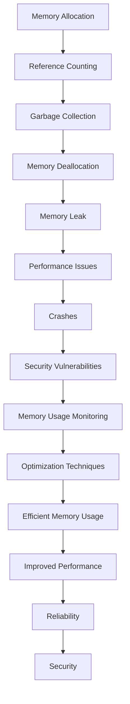

## Introduction
High memory usage is a common issue in software development, particularly in applications that require large amounts of data processing or storage. **Memory management** is a critical aspect of programming, and understanding its importance is essential for building efficient and scalable systems. In this topic, we will explore the drawbacks of high memory usage, its causes, and strategies for mitigating it. We will focus on the Python programming language, which is widely used in various domains, including data science, web development, and scientific computing.

> **Note:** Memory usage is a critical factor in determining the performance and reliability of an application. High memory usage can lead to slow performance, crashes, and even security vulnerabilities.

## Core Concepts
To understand the drawbacks of high memory usage, we need to define some key terms:

* **Memory**: The amount of RAM (Random Access Memory) available to a program.
* **Memory allocation**: The process of assigning memory to a program or a variable.
* **Memory deallocation**: The process of releasing memory back to the system.
* **Memory leak**: A situation where memory is allocated but not released, causing memory usage to increase over time.

> **Warning:** Memory leaks can be difficult to detect and can cause significant performance issues if left unchecked.

## How It Works Internally
In Python, memory management is handled by the **Python Memory Manager**, which is responsible for allocating and deallocating memory for Python objects. The memory manager uses a combination of algorithms and data structures to manage memory, including:

1. **Reference counting**: A mechanism that keeps track of the number of references to an object. When the reference count reaches zero, the object is deallocated.
2. **Garbage collection**: A mechanism that periodically scans the heap for unreachable objects and deallocates them.

Here is an example of how memory allocation works in Python:
```python
import sys

# Create a list with 1000 elements
my_list = [i for i in range(1000)]

# Print the memory usage of the list
print(sys.getsizeof(my_list))  # Output: 8448
```
> **Tip:** Use the `sys.getsizeof()` function to get the memory usage of a Python object.

## Code Examples
Here are three examples of Python code that demonstrate high memory usage:

### Example 1: Basic Memory Allocation
```python
import sys

# Create a list with 1000 elements
my_list = [i for i in range(1000)]

# Print the memory usage of the list
print(sys.getsizeof(my_list))  # Output: 8448

# Append 1000 more elements to the list
my_list.extend([i for i in range(1000)])

# Print the updated memory usage of the list
print(sys.getsizeof(my_list))  # Output: 16896
```
### Example 2: Memory Leak
```python
import sys

# Create a list to store references to objects
my_list = []

# Create 1000 objects and append them to the list
for i in range(1000):
    obj = object()
    my_list.append(obj)

# Print the memory usage of the list
print(sys.getsizeof(my_list))  # Output: 8448

# Delete the objects, but not the references
del obj

# Print the updated memory usage of the list
print(sys.getsizeof(my_list))  # Output: 8448 (no change)
```
### Example 3: Efficient Memory Usage
```python
import sys

# Create a generator expression to generate 1000 elements
my_gen = (i for i in range(1000))

# Print the memory usage of the generator
print(sys.getsizeof(my_gen))  # Output: 120

# Iterate over the generator and print the elements
for elem in my_gen:
    print(elem)
```
> **Interview:** Can you explain the difference between a list and a generator in terms of memory usage?

## Visual Diagram

The diagram illustrates the flow of memory allocation, reference counting, garbage collection, and memory deallocation. It also shows the potential consequences of high memory usage, including performance issues, crashes, and security vulnerabilities.

## Comparison
| Approach | Time Complexity | Space Complexity | Pros | Cons | Best For |
| --- | --- | --- | --- | --- | --- |
| List | O(1) | O(n) | Fast lookup, insertion, and deletion | High memory usage | Small datasets |
| Generator | O(1) | O(1) | Low memory usage, efficient iteration | Slow lookup, insertion, and deletion | Large datasets |
| Array | O(1) | O(n) | Fast lookup, insertion, and deletion | Fixed size, high memory usage | Fixed-size datasets |
| Linked List | O(1) | O(n) | Efficient insertion and deletion, low memory usage | Slow lookup | Dynamic datasets |

## Real-world Use Cases
Here are three real-world examples of high memory usage:

1. **Data Science**: Data scientists often work with large datasets that require significant memory to process. For example, a data scientist working with a dataset of 100 million records may require 100 GB of memory to perform data analysis.
2. **Web Development**: Web applications that handle large amounts of user data, such as social media platforms, may require high memory usage to store and process user information.
3. **Scientific Computing**: Scientific simulations, such as climate modeling or fluid dynamics, may require high memory usage to store and process large amounts of data.

> **Note:** High memory usage can be mitigated by using efficient data structures, optimizing algorithms, and leveraging distributed computing techniques.

## Common Pitfalls
Here are four common pitfalls that can lead to high memory usage:

1. **Memory Leaks**: Failing to release memory allocated to objects can cause memory leaks, leading to high memory usage.
2. **Inefficient Data Structures**: Using inefficient data structures, such as lists or arrays, can lead to high memory usage.
3. **Unnecessary Computation**: Performing unnecessary computations or storing unnecessary data can lead to high memory usage.
4. **Lack of Optimization**: Failing to optimize algorithms or data structures can lead to high memory usage.

> **Warning:** High memory usage can be difficult to detect and diagnose, especially in complex systems.

## Interview Tips
Here are three common interview questions related to high memory usage:

1. **What is the difference between a list and a generator in terms of memory usage?**
	* Weak answer: "A list is a collection of elements, while a generator is a function that yields elements."
	* Strong answer: "A list stores all elements in memory, while a generator yields elements on-the-fly, using significantly less memory."
2. **How would you optimize a function to reduce memory usage?**
	* Weak answer: "I would use a more efficient algorithm or data structure."
	* Strong answer: "I would profile the function to identify memory-intensive operations, and then optimize those operations using techniques such as caching, memoization, or distributed computing."
3. **What are some common causes of memory leaks in Python?**
	* Weak answer: "Memory leaks can occur when objects are not properly released."
	* Strong answer: "Memory leaks can occur when objects are not properly released, such as when using circular references, or when using libraries that do not properly manage memory, such as some C extensions."

## Key Takeaways
Here are ten key takeaways related to high memory usage:

* High memory usage can lead to performance issues, crashes, and security vulnerabilities.
* Memory management is critical in programming, and understanding its importance is essential for building efficient and scalable systems.
* Python's memory manager uses reference counting and garbage collection to manage memory.
* Lists and arrays can lead to high memory usage, while generators and iterators can reduce memory usage.
* Memory leaks can occur when objects are not properly released.
* Optimization techniques, such as caching and memoization, can reduce memory usage.
* Distributed computing techniques, such as parallel processing and distributed memory, can reduce memory usage.
* Profiling and debugging tools can help identify memory-intensive operations and optimize them.
* Efficient data structures, such as dictionaries and sets, can reduce memory usage.
* Understanding the trade-offs between memory usage and performance is critical in building efficient and scalable systems.