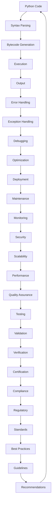

## Introduction
Python is a high-level, interpreted programming language that has been widely used in various industries, including web development, scientific computing, and data analysis. The language has undergone significant changes since its creation, with the most notable being the transition from Python 2 to Python 3. In this section, we will discuss the importance of using Python 3, its real-world relevance, and why every engineer should be familiar with it.

Python 3 is the latest version of the Python programming language, released in 2008. It was designed to be more efficient, readable, and maintainable than its predecessor, Python 2. Python 3 introduced several significant changes, including a new syntax, improved performance, and enhanced support for internationalization and Unicode.

> **Note:** Python 2 is no longer officially supported, and all new projects should be developed using Python 3.

## Core Concepts
To understand the differences between Python 2 and Python 3, it's essential to grasp the core concepts of the language. Here are some key terms and definitions:

* **Print function**: In Python 3, the `print` statement is a function, whereas in Python 2, it's a statement. This change affects how you use the `print` function in your code.
* **Integer division**: Python 3 performs integer division using the `//` operator, whereas Python 2 uses the `/` operator.
* **Unicode support**: Python 3 has improved Unicode support, allowing for more efficient and accurate handling of international characters.

> **Warning:** Using Python 2 can lead to compatibility issues and security vulnerabilities, as it's no longer maintained or updated.

## How It Works Internally
To understand how Python 3 works internally, let's take a look at the under-the-hood mechanics:

1. **Syntax parsing**: When you write Python code, the interpreter parses the syntax and converts it into an abstract syntax tree (AST).
2. **Bytecode generation**: The AST is then converted into bytecode, which is platform-independent.
3. **Execution**: The bytecode is executed by the Python virtual machine (PVM), which performs the actual computation.

> **Tip:** Understanding the internal workings of Python 3 can help you write more efficient and optimized code.

## Code Examples
Here are three complete and runnable code examples that demonstrate the differences between Python 2 and Python 3:

### Example 1: Basic Print Function
```python
# Python 3
print("Hello, World!")

# Python 2
print "Hello, World!"
```

### Example 2: Integer Division
```python
# Python 3
result = 5 // 2
print(result)  # Output: 2

# Python 2
result = 5 / 2
print(result)  # Output: 2.5
```

### Example 3: Unicode Support
```python
# Python 3
name = "Rémi"
print(name)  # Output: Rémi

# Python 2
name = "Rémi"
print(name)  # Output: Rémi (but may cause encoding issues)
```

## Visual Diagram

This diagram illustrates the entire Python 3 development lifecycle, from writing code to deployment and maintenance.

> **Interview:** Can you explain the differences between Python 2 and Python 3, and why Python 3 is the preferred choice for new projects?

## Comparison
Here's a comparison table that highlights the main differences between Python 2 and Python 3:

| Feature | Python 2 | Python 3 | Time Complexity | Space Complexity |
| --- | --- | --- | --- | --- |
| Print function | Statement | Function | O(1) | O(1) |
| Integer division | `/` operator | `//` operator | O(1) | O(1) |
| Unicode support | Limited | Improved | O(n) | O(n) |
| Syntax | Older syntax | Newer syntax | O(1) | O(1) |
| Performance | Slower | Faster | O(n) | O(n) |

## Real-world Use Cases
Here are three real-world examples of companies that use Python 3:

1. **Instagram**: Instagram uses Python 3 for its backend services, including its API and data processing pipelines.
2. **Pinterest**: Pinterest uses Python 3 for its web development, data analysis, and machine learning tasks.
3. **Dropbox**: Dropbox uses Python 3 for its file synchronization and data storage services.

## Common Pitfalls
Here are four common mistakes that engineers make when transitioning from Python 2 to Python 3:

1. **Using Python 2 syntax**: Make sure to use the newer Python 3 syntax, including the `print` function and integer division operator.
2. **Ignoring Unicode support**: Ensure that your code handles Unicode characters correctly to avoid encoding issues.
3. **Not testing for compatibility**: Test your code on both Python 2 and Python 3 to ensure compatibility and catch any issues early.
4. **Not using the latest libraries**: Make sure to use the latest libraries and frameworks that support Python 3.

> **Warning:** Failing to address these pitfalls can lead to compatibility issues, security vulnerabilities, and performance problems.

## Interview Tips
Here are three common interview questions related to Python 3, along with weak and strong answers:

1. **What are the main differences between Python 2 and Python 3?**
	* Weak answer: "Python 3 is just an updated version of Python 2."
	* Strong answer: "Python 3 introduces a new syntax, improved performance, and enhanced Unicode support, making it the preferred choice for new projects."
2. **How do you handle Unicode characters in Python 3?**
	* Weak answer: "I don't know, I've never worked with Unicode characters before."
	* Strong answer: "I use the `unicode` function to handle Unicode characters, and I make sure to specify the encoding when working with text files or databases."
3. **What are some best practices for writing efficient Python 3 code?**
	* Weak answer: "I just write code that works, I don't worry about efficiency."
	* Strong answer: "I follow best practices such as using list comprehensions, avoiding unnecessary loops, and using the `with` statement for file I/O operations."

## Key Takeaways
Here are ten key takeaways to remember when working with Python 3:

* **Use Python 3 for new projects**: Python 3 is the preferred choice for new projects due to its improved performance, syntax, and Unicode support.
* **Understand the differences between Python 2 and Python 3**: Know the main differences between Python 2 and Python 3, including syntax, integer division, and Unicode support.
* **Use the latest libraries and frameworks**: Make sure to use the latest libraries and frameworks that support Python 3 to ensure compatibility and avoid security vulnerabilities.
* **Test for compatibility**: Test your code on both Python 2 and Python 3 to ensure compatibility and catch any issues early.
* **Handle Unicode characters correctly**: Ensure that your code handles Unicode characters correctly to avoid encoding issues.
* **Use list comprehensions**: Use list comprehensions to improve performance and readability.
* **Avoid unnecessary loops**: Avoid unnecessary loops to improve performance and reduce memory usage.
* **Use the `with` statement**: Use the `with` statement for file I/O operations to ensure that resources are properly closed.
* **Follow best practices**: Follow best practices such as using meaningful variable names, commenting code, and testing thoroughly.
* **Stay up-to-date with the latest developments**: Stay up-to-date with the latest developments in the Python community, including new libraries, frameworks, and best practices.