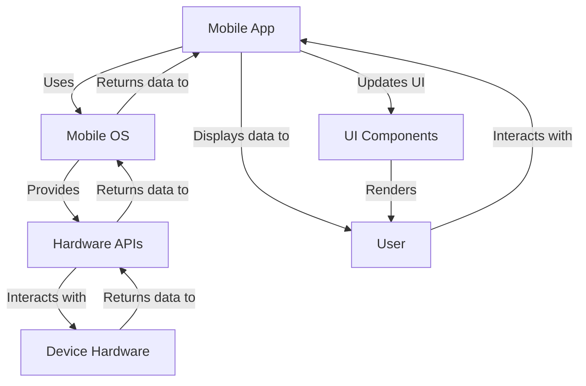

## Introduction
When deciding on the architecture for a new system or application, it's essential to consider the trade-offs and limitations of different approaches. In this overview, we'll explore when **not** to use certain technologies, focusing on mobile apps, high-performance systems, and frontend development. Understanding these limitations is crucial for making informed design decisions and avoiding common pitfalls. 
> **Note:** Recognizing the limitations of a technology is just as important as understanding its capabilities.

## Core Concepts
To appreciate when not to use a particular technology, we must first understand its core concepts and intended use cases. 
- **Mobile Apps**: Designed for mobile devices, these apps are typically built using native languages like Java or Swift, or cross-platform frameworks like React Native.
- **High-Performance Systems**: These systems require optimized hardware and software configurations to achieve maximum throughput and efficiency, often using languages like C++ or Rust.
- **Frontend Development**: Focused on the client-side of web development, frontend development involves creating user interfaces and experiences using HTML, CSS, and JavaScript.

## How It Works Internally
Let's dive deeper into how these technologies work internally:
- **Mobile Apps**: Mobile apps run on mobile operating systems like Android or iOS. They interact with the device's hardware through APIs and frameworks provided by the OS. For example, a mobile app might use the camera API to take a photo.
- **High-Performance Systems**: High-performance systems typically utilize multi-core processors, large amounts of RAM, and optimized algorithms to achieve high throughput. These systems often employ parallel processing and caching to minimize latency.
- **Frontend Development**: Frontend development involves creating web pages that run on the client-side, using web browsers as the execution environment. Web pages are built using HTML for structure, CSS for styling, and JavaScript for dynamic behavior.

## Code Examples
Here are three complete and runnable code examples demonstrating different scenarios:
### Example 1: Basic Mobile App (Android)
```java
// AndroidMainActivity.java
import androidx.appcompat.app.AppCompatActivity;
import android.os.Bundle;
import android.widget.TextView;

public class MainActivity extends AppCompatActivity {
    @Override
    protected void onCreate(Bundle savedInstanceState) {
        super.onCreate(savedInstanceState);
        setContentView(R.layout.activity_main);
        // Set a text view
        TextView textView = findViewById(R.id.textView);
        textView.setText("Hello, World!");
    }
}
```
### Example 2: High-Performance Computing (C++)
```cpp
// high_performance.cpp
#include <iostream>
#include <thread>
#include <vector>

void worker(int id) {
    // Simulate work
    for (int i = 0; i < 100000000; i++) {
        // Do something
    }
    std::cout << "Worker " << id << " finished" << std::endl;
}

int main() {
    // Create and start 4 worker threads
    std::vector<std::thread> threads;
    for (int i = 0; i < 4; i++) {
        threads.emplace_back(worker, i);
    }
    // Wait for all threads to finish
    for (auto& thread : threads) {
        thread.join();
    }
    return 0;
}
```
### Example 3: Frontend Development (JavaScript)
```javascript
// index.js
// Get an element by ID
const element = document.getElementById('myElement');

// Add an event listener
element.addEventListener('click', () => {
    // Handle the click event
    console.log('Clicked!');
});

// Set the element's text content
element.textContent = 'Click me!';
```
> **Tip:** Always consider the performance implications of your design choices, especially in high-performance systems.

## Visual Diagram

This diagram illustrates the interaction between a mobile app, the mobile OS, and the device hardware.

## Comparison
| Approach | Time Complexity | Space Complexity | Pros | Cons | Best For |
|----------|----------------|-----------------|------|------|----------|
| Mobile App | O(1) | O(n) | Native performance, direct hardware access | Limited platform support, high development cost | Games, productivity apps |
| High-Performance System | O(n log n) | O(n) | Scalability, parallel processing | Complex setup, high maintenance cost | Scientific simulations, data analytics |
| Frontend Development | O(1) | O(n) | Cross-platform, low development cost | Limited hardware access, security concerns | Web applications, progressive web apps |

## Real-world Use Cases
1. **Mobile App**: Instagram's mobile app is built using a combination of native and cross-platform technologies, allowing for a seamless user experience across different devices.
2. **High-Performance System**: Google's search engine relies on a high-performance system to index and retrieve web pages quickly, using a combination of parallel processing and caching.
3. **Frontend Development**: Facebook's web application is built using React, a popular frontend framework, to provide a responsive and interactive user experience.

> **Warning:** Using a mobile app approach for a high-performance system can lead to significant performance bottlenecks.

## Common Pitfalls
1. **Insufficient Testing**: Failing to test a mobile app on different devices and platforms can lead to compatibility issues and poor user experience.
2. **Inefficient Algorithms**: Using inefficient algorithms in a high-performance system can result in significant performance degradation and increased latency.
3. **Insecure Data Storage**: Storing sensitive data insecurely in a frontend application can lead to security vulnerabilities and data breaches.
```javascript
// Wrong way: storing sensitive data in plain text
const password = 'mysecretpassword';
// Right way: using a secure storage mechanism
const secureStorage = new SecureStorage();
secureStorage.store('password', 'mysecretpassword');
```
> **Interview:** When asked about common pitfalls in mobile app development, be sure to mention the importance of testing and security.

## Interview Tips
1. **What are the limitations of using a mobile app approach for a high-performance system?**
	* Weak answer: "I'm not sure."
	* Strong answer: "Using a mobile app approach for a high-performance system can lead to significant performance bottlenecks due to the limited hardware resources and overhead of the mobile OS."
2. **How would you optimize the performance of a frontend application?**
	* Weak answer: "I would use a lot of caching."
	* Strong answer: "I would use a combination of caching, parallel processing, and optimized algorithms to minimize latency and improve responsiveness."
3. **What are some common security concerns in frontend development?**
	* Weak answer: "I'm not sure."
	* Strong answer: "Some common security concerns in frontend development include cross-site scripting (XSS), cross-site request forgery (CSRF), and insecure data storage."

## Key Takeaways
* Mobile apps are best suited for native, device-specific applications with direct hardware access.
* High-performance systems require optimized hardware and software configurations to achieve maximum throughput and efficiency.
* Frontend development involves creating client-side web applications with HTML, CSS, and JavaScript, and is best suited for cross-platform, low-development-cost applications.
* Insufficient testing, inefficient algorithms, and insecure data storage are common pitfalls to avoid.
* Optimizing performance and security is crucial in frontend development.
* Using a mobile app approach for a high-performance system can lead to significant performance bottlenecks.
* Recognizing the limitations of a technology is just as important as understanding its capabilities.