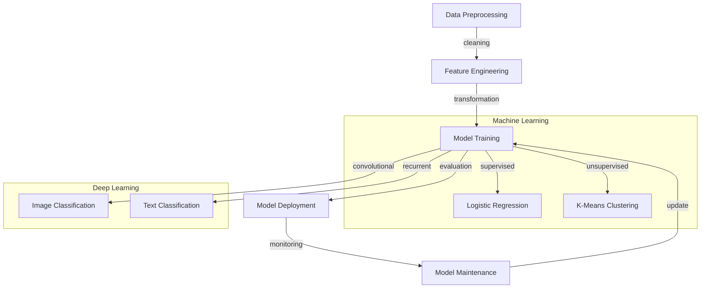

## Introduction
Data Science, Machine Learning, and AI are three interconnected fields that have revolutionized the way we approach complex problems in various industries. **Data Science** is the process of extracting insights from data using various techniques, including statistical analysis, machine learning, and data visualization. **Machine Learning** is a subset of data science that involves training algorithms to make predictions or decisions based on data. **AI**, or Artificial Intelligence, refers to the broader field of creating intelligent systems that can perform tasks that typically require human intelligence, such as reasoning, problem-solving, and learning. In this overview, we will explore the core concepts, internal mechanics, and real-world applications of these fields.

## Core Concepts
To understand the differences between Data Science, Machine Learning, and AI, it's essential to grasp the following key concepts:
* **Supervised Learning**: a type of machine learning where the algorithm is trained on labeled data to make predictions.
* **Unsupervised Learning**: a type of machine learning where the algorithm is trained on unlabeled data to identify patterns or relationships.
* **Deep Learning**: a subset of machine learning that involves the use of neural networks to analyze data.
* **Natural Language Processing (NLP)**: a field of AI that deals with the interaction between computers and human language.

> **Note:** Understanding the differences between these concepts is crucial for applying the right techniques to real-world problems.

## How It Works Internally
The internal mechanics of Data Science, Machine Learning, and AI involve complex algorithms and statistical models. Here's a step-by-step breakdown:
1. **Data Preprocessing**: cleaning, transforming, and preparing data for analysis.
2. **Model Training**: training a machine learning algorithm on the preprocessed data.
3. **Model Evaluation**: evaluating the performance of the trained model using metrics such as accuracy, precision, and recall.
4. **Model Deployment**: deploying the trained model in a production environment.

> **Warning:** Poor data quality can significantly impact the performance of machine learning models, leading to biased or inaccurate results.

## Code Examples
### Example 1: Basic Data Preprocessing
```python
import pandas as pd

# Load the dataset
data = pd.read_csv('data.csv')

# Handle missing values
data.fillna(data.mean(), inplace=True)

# Scale the data
from sklearn.preprocessing import StandardScaler
scaler = StandardScaler()
data[['feature1', 'feature2']] = scaler.fit_transform(data[['feature1', 'feature2']])
```
### Example 2: Supervised Learning with Scikit-Learn
```python
from sklearn.model_selection import train_test_split
from sklearn.linear_model import LogisticRegression
from sklearn.metrics import accuracy_score

# Split the data into training and testing sets
X_train, X_test, y_train, y_test = train_test_split(data.drop('target', axis=1), data['target'], test_size=0.2, random_state=42)

# Train a logistic regression model
model = LogisticRegression()
model.fit(X_train, y_train)

# Evaluate the model
y_pred = model.predict(X_test)
print('Accuracy:', accuracy_score(y_test, y_pred))
```
### Example 3: Deep Learning with TensorFlow
```python
import tensorflow as tf
from tensorflow.keras.models import Sequential
from tensorflow.keras.layers import Dense

# Define the model architecture
model = Sequential()
model.add(Dense(64, activation='relu', input_shape=(784,)))
model.add(Dense(32, activation='relu'))
model.add(Dense(10, activation='softmax'))

# Compile the model
model.compile(loss='categorical_crossentropy', optimizer='adam', metrics=['accuracy'])

# Train the model
model.fit(X_train, y_train, epochs=10, batch_size=128, validation_data=(X_test, y_test))
```
> **Tip:** Using pre-trained models and fine-tuning them for specific tasks can save time and improve performance.

## Visual Diagram

The diagram illustrates the workflow of data science, machine learning, and AI, from data preprocessing to model deployment and maintenance.

## Comparison
| Approach | Time Complexity | Space Complexity | Pros | Cons | Best For |
| --- | --- | --- | --- | --- | --- |
| Supervised Learning | O(n) | O(n) | High accuracy, easy to implement | Requires labeled data | Image classification, sentiment analysis |
| Unsupervised Learning | O(n^2) | O(n) | Can discover hidden patterns, no labeled data required | Difficult to evaluate, sensitive to hyperparameters | Customer segmentation, anomaly detection |
| Deep Learning | O(n^3) | O(n^2) | Can learn complex representations, state-of-the-art performance | Requires large amounts of data, computationally expensive | Natural language processing, speech recognition |
| Traditional Machine Learning | O(n) | O(n) | Fast, easy to implement | Limited capacity, prone to overfitting | Simple classification tasks, regression |

## Real-world Use Cases
1. **Netflix Recommendation System**: uses a combination of supervised and unsupervised learning to recommend TV shows and movies based on user behavior.
2. **Google Translate**: uses deep learning to translate text from one language to another.
3. **Amazon Alexa**: uses natural language processing to understand voice commands and respond accordingly.

> **Interview:** Can you explain the difference between supervised and unsupervised learning? How would you approach a problem that requires both?

## Common Pitfalls
1. **Overfitting**: when a model is too complex and performs well on the training data but poorly on new, unseen data.
2. **Underfitting**: when a model is too simple and fails to capture the underlying patterns in the data.
3. **Data Leakage**: when information from the test set is used to train the model, resulting in inflated performance metrics.
4. **Class Imbalance**: when one class has a significantly larger number of instances than the others, leading to biased models.

> **Warning:** Failing to address these pitfalls can result in poor model performance, biased results, and wasted resources.

## Interview Tips
1. **Be prepared to explain the basics**: of machine learning, deep learning, and data science.
2. **Practice whiteboarding**: to demonstrate your problem-solving skills and ability to communicate complex ideas.
3. **Showcase your projects**: to demonstrate your hands-on experience with machine learning and data science.

> **Tip:** Focus on building a strong foundation in the fundamentals, and practice applying them to real-world problems.

## Key Takeaways
* Data Science, Machine Learning, and AI are interconnected fields that require a deep understanding of the underlying concepts and techniques.
* **Supervised Learning** is useful for problems with labeled data, while **Unsupervised Learning** is useful for problems with unlabeled data.
* **Deep Learning** is a powerful tool for complex tasks, but requires large amounts of data and computational resources.
* **Model Evaluation** is crucial for ensuring the performance and reliability of machine learning models.
* **Data Preprocessing** is essential for preparing data for analysis and modeling.
* **Overfitting** and **Underfitting** are common pitfalls that can be addressed through regularization, early stopping, and hyperparameter tuning.
* **Class Imbalance** can be addressed through techniques such as oversampling, undersampling, and weighted loss functions.