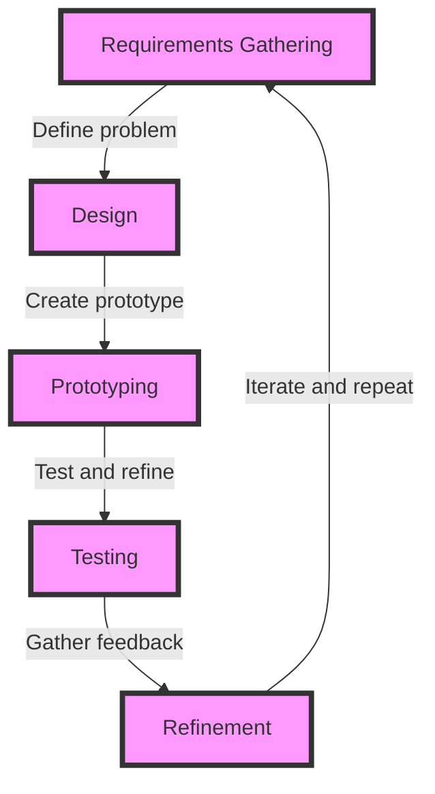

## Introduction
Rapid prototyping is a methodology used in software development that involves quickly creating a working model of a product or application to test and validate its feasibility, usability, and functionality. This approach allows developers to iterate and refine their design, gathering feedback from stakeholders and users, and making necessary adjustments before investing in a full-scale production. **Rapid prototyping** is essential in today's fast-paced and competitive tech industry, where time-to-market and adaptability are crucial for success. Every engineer should be familiar with rapid prototyping, as it enables them to quickly validate ideas, reduce development time, and improve overall product quality.

## Core Concepts
Rapid prototyping revolves around several key concepts:
- **Agile development**: an iterative and incremental approach to software development, emphasizing flexibility and rapid response to change.
- **Minimum Viable Product (MVP)**: a product with just enough features to satisfy early customers and provide feedback for future development.
- **Design thinking**: a problem-solving approach that involves empathy, ideation, prototyping, and testing to create innovative solutions.
- **Iterative development**: a process of repeating cycles of development, testing, and refinement to achieve the desired outcome.

## How It Works Internally
The rapid prototyping process typically involves the following steps:
1. **Requirements gathering**: identifying the problem, defining the project scope, and determining the key stakeholders.
2. **Design**: creating a high-level design of the product or application, including its architecture, user interface, and key features.
3. **Prototyping**: building a working model of the product or application, using tools and technologies that allow for rapid development and testing.
4. **Testing**: evaluating the prototype, gathering feedback from stakeholders and users, and identifying areas for improvement.
5. **Refinement**: refining the design and implementation based on the feedback received, and repeating the testing and refinement cycle until the desired outcome is achieved.

## Code Examples
### Example 1: Basic Prototyping with Python
```python
# Import the required libraries
import tkinter as tk
from tkinter import messagebox

# Create a simple GUI application
class Application(tk.Frame):
    def __init__(self, master=None):
        super().__init__(master)
        self.master = master
        self.pack()
        self.create_widgets()

    def create_widgets(self):
        self.hi_there = tk.Button(self)
        self.hi_there["text"] = "Hello World\n(click me)"
        self.hi_there["command"] = self.say_hi
        self.hi_there.pack(side="top")

        self.quit = tk.Button(self, text="QUIT", fg="red",
                              command=self.master.destroy)
        self.quit.pack(side="bottom")

    def say_hi(self):
        print("hi there, everyone!")
        messagebox.showinfo("Greetings", "Hello, World!")

root = tk.Tk()
app = Application(master=root)
app.mainloop()
```
This example demonstrates a basic GUI application built using Python's Tkinter library, which can be used as a starting point for rapid prototyping.

### Example 2: Prototyping a Web Application with Flask
```python
# Import the required libraries
from flask import Flask, render_template, request

# Create a simple web application
app = Flask(__name__)

# Define a route for the home page
@app.route("/")
def index():
    return render_template("index.html")

# Define a route for handling form submissions
@app.route("/submit", methods=["POST"])
def submit():
    name = request.form["name"]
    email = request.form["email"]
    return f"Hello, {name}! Your email is {email}."

if __name__ == "__main__":
    app.run()
```
This example demonstrates a basic web application built using Flask, which can be used as a starting point for rapid prototyping of web-based applications.

### Example 3: Prototyping a Machine Learning Model with Scikit-Learn
```python
# Import the required libraries
from sklearn.datasets import load_iris
from sklearn.model_selection import train_test_split
from sklearn.linear_model import LogisticRegression
from sklearn.metrics import accuracy_score

# Load the iris dataset
iris = load_iris()
X = iris.data
y = iris.target

# Split the dataset into training and testing sets
X_train, X_test, y_train, y_test = train_test_split(X, y, test_size=0.2, random_state=42)

# Train a logistic regression model
model = LogisticRegression()
model.fit(X_train, y_train)

# Evaluate the model
y_pred = model.predict(X_test)
accuracy = accuracy_score(y_test, y_pred)
print(f"Model accuracy: {accuracy:.2f}")
```
This example demonstrates a basic machine learning model built using Scikit-Learn, which can be used as a starting point for rapid prototyping of machine learning-based applications.

## Visual Diagram

This diagram illustrates the rapid prototyping process, highlighting the key steps involved and the iterative nature of the approach.

## Comparison
| Approach | Time Complexity | Space Complexity | Pros | Cons | Best For |
| --- | --- | --- | --- | --- | --- |
| Waterfall | O(n) | O(1) | Predictable, easy to manage | Inflexible, high risk of failure | Large-scale, well-defined projects |
| Agile | O(log n) | O(log n) | Flexible, adaptable, high-quality | High overhead, requires expertise | Small-scale, dynamic projects |
| Rapid Prototyping | O(1) | O(1) | Fast, flexible, low overhead | Limited scope, may not be suitable for complex projects | Small-scale, proof-of-concept projects |
| Design Thinking | O(n) | O(n) | Human-centered, innovative, effective | Time-consuming, requires expertise | Complex, human-centered projects |
| Iterative Development | O(log n) | O(log n) | Flexible, adaptable, high-quality | High overhead, requires expertise | Medium-scale, dynamic projects |

## Real-world Use Cases
1. **Google's self-driving car project**: Google used rapid prototyping to develop and test its self-driving car technology, iterating and refining the design based on feedback from users and stakeholders.
2. **Amazon's Alexa**: Amazon used rapid prototyping to develop and launch its Alexa virtual assistant, testing and refining the design based on user feedback and market trends.
3. **Dropbox's file sharing service**: Dropbox used rapid prototyping to develop and launch its file sharing service, iterating and refining the design based on user feedback and market trends.

## Common Pitfalls
1. **Insufficient testing**: Failing to test the prototype thoroughly can lead to incorrect assumptions and poor design decisions.
2. **Lack of feedback**: Failing to gather feedback from stakeholders and users can lead to a design that does not meet their needs.
3. **Inadequate refinement**: Failing to refine the design based on feedback and testing can lead to a poor-quality product.
4. **Over-engineering**: Over-engineering the prototype can lead to unnecessary complexity and delays.

> **Note:** Rapid prototyping is not a replacement for thorough testing and validation, but rather a complementary approach that can help reduce the risk of failure and improve the overall quality of the product.

## Interview Tips
1. **What is rapid prototyping, and how does it differ from traditional software development methodologies?**
	* Weak answer: "Rapid prototyping is a fast way of developing software."
	* Strong answer: "Rapid prototyping is an iterative and incremental approach to software development that involves quickly creating a working model of a product or application to test and validate its feasibility, usability, and functionality. It differs from traditional software development methodologies in that it emphasizes flexibility, adaptability, and rapid response to change."
2. **How do you handle feedback and refinement in a rapid prototyping process?**
	* Weak answer: "I just make changes based on what people say."
	* Strong answer: "I gather feedback from stakeholders and users, and then prioritize and refine the design based on that feedback, using techniques such as iterative development and design thinking to ensure that the product meets the needs of its users."
3. **What are some common pitfalls to avoid when using rapid prototyping, and how can you mitigate them?**
	* Weak answer: "I don't know, I just try to avoid mistakes."
	* Strong answer: "Some common pitfalls to avoid when using rapid prototyping include insufficient testing, lack of feedback, inadequate refinement, and over-engineering. To mitigate these risks, I use techniques such as thorough testing and validation, active feedback gathering, and iterative refinement, and I prioritize simplicity and flexibility in the design."

## Key Takeaways
* Rapid prototyping is an iterative and incremental approach to software development that involves quickly creating a working model of a product or application to test and validate its feasibility, usability, and functionality.
* Rapid prototyping emphasizes flexibility, adaptability, and rapid response to change.
* The rapid prototyping process involves requirements gathering, design, prototyping, testing, and refinement.
* Rapid prototyping can be used in a variety of contexts, including web development, machine learning, and human-centered design.
* Common pitfalls to avoid when using rapid prototyping include insufficient testing, lack of feedback, inadequate refinement, and over-engineering.
* Techniques such as iterative development, design thinking, and active feedback gathering can help mitigate these risks and improve the overall quality of the product.
* Rapid prototyping is not a replacement for thorough testing and validation, but rather a complementary approach that can help reduce the risk of failure and improve the overall quality of the product.