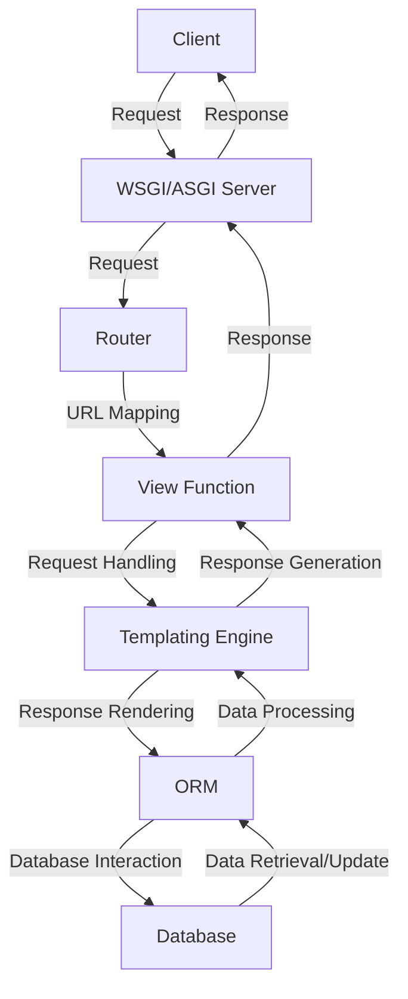

## Introduction
Web backends are the backbone of web applications, handling requests, processing data, and providing responses to clients. In the Python ecosystem, popular web backend frameworks include Django, FastAPI, and Flask. These frameworks enable developers to build scalable, efficient, and maintainable web applications. Understanding when to use each framework is crucial for making informed decisions about project architecture and ensuring the success of web development projects. 
> **Note:** When selecting a web backend framework, consider factors such as project complexity, performance requirements, and development team experience.

## Core Concepts
**Web backend frameworks** provide a set of tools and structures for building web applications. They handle tasks such as routing, templating, and database interactions, allowing developers to focus on writing application logic. Key terminology includes:
* **Routing**: mapping URLs to application endpoints
* **Templating**: rendering dynamic content using templates
* **ORM (Object-Relational Mapping)**: interacting with databases using Python objects
* **API (Application Programming Interface)**: defining interfaces for interacting with the application
> **Tip:** Familiarize yourself with the framework's core concepts and terminology to ensure effective use and communication with team members.

## How It Works Internally
When a client sends a request to the web application, the framework's **WSGI (Web Server Gateway Interface)** or **ASGI (Asynchronous Server Gateway Interface)** server receives the request and passes it to the framework's **router**. The router maps the URL to a specific **view function**, which handles the request and returns a response. The framework's **templating engine** renders the response using templates, and the **ORM** interacts with the database to retrieve or update data.
> **Warning:** Incorrectly configuring the WSGI or ASGI server can lead to performance issues and security vulnerabilities.

## Code Examples
### Example 1: Basic Django View
```python
# django/views.py
from django.http import HttpResponse

def hello_world(request):
    # Return a simple "Hello, World!" response
    return HttpResponse("Hello, World!")
```
### Example 2: FastAPI API Endpoint
```python
# fastapi/main.py
from fastapi import FastAPI
from pydantic import BaseModel

app = FastAPI()

class User(BaseModel):
    name: str
    email: str

@app.post("/users/")
def create_user(user: User):
    # Create a new user and return the user data
    return user
```
### Example 3: Flask RESTful API
```python
# flask/app.py
from flask import Flask, jsonify, request
from flask_restful import Api, Resource

app = Flask(__name__)
api = Api(app)

class User(Resource):
    def get(self, id):
        # Retrieve a user by ID and return the user data
        user = {"id": id, "name": "John Doe", "email": "johndoe@example.com"}
        return jsonify(user)

api.add_resource(User, "/users/<int:id>")
```
> **Interview:** Be prepared to explain the differences between these frameworks and provide examples of when to use each.

## Visual Diagram

This diagram illustrates the request-response flow in a web backend framework, from the client's initial request to the final response.

## Comparison
| Framework | Time Complexity | Space Complexity | Pros | Cons | Best For |
| --- | --- | --- | --- | --- | --- |
| Django | O(n) | O(n) | High-level abstraction, rapid development, robust security | Steep learning curve, monolithic architecture | Complex, data-driven applications |
| FastAPI | O(1) | O(1) | High-performance, asynchronous, modern design | Limited support for legacy systems, new framework | Real-time, API-driven applications |
| Flask | O(1) | O(1) | Lightweight, flexible, modular design | Limited support for complex applications, minimalistic | Small, prototyping applications |

## Real-world Use Cases
* **Instagram**: Built using Django, Instagram's web application handles massive traffic and provides a seamless user experience.
* **Netflix**: Utilizes FastAPI for its API gateway, providing high-performance and low-latency responses to client requests.
* **Pinterest**: Employs Flask for its web application, leveraging its lightweight and flexible design to handle high traffic and provide a responsive user experience.

## Common Pitfalls
* **Incorrectly configuring the WSGI/ASGI server**: Failing to properly configure the server can lead to performance issues and security vulnerabilities.
* **Insufficient error handling**: Neglecting to handle errors and exceptions can result in application crashes and poor user experience.
* **Inadequate database optimization**: Failing to optimize database interactions can lead to performance bottlenecks and data inconsistencies.
* **Insecure password storage**: Storing passwords insecurely can compromise user data and lead to security breaches.

## Interview Tips
* **What is the difference between Django and Flask?**: Be prepared to explain the differences in architecture, complexity, and use cases.
* **How do you handle errors and exceptions in a web application?**: Describe strategies for error handling, including try-except blocks, logging, and user feedback.
* **What is the purpose of an ORM in a web application?**: Explain the benefits of using an ORM, including database abstraction, security, and ease of use.

## Key Takeaways
* **Django is suitable for complex, data-driven applications**: Its high-level abstraction and robust security features make it an ideal choice for complex projects.
* **FastAPI is ideal for real-time, API-driven applications**: Its high-performance and asynchronous design make it perfect for applications requiring low-latency responses.
* **Flask is suitable for small, prototyping applications**: Its lightweight and flexible design make it an excellent choice for small projects and prototyping.
* **WSGI/ASGI server configuration is critical**: Proper configuration is essential for performance, security, and scalability.
* **Error handling and database optimization are crucial**: Neglecting these aspects can lead to application crashes, performance bottlenecks, and security vulnerabilities.